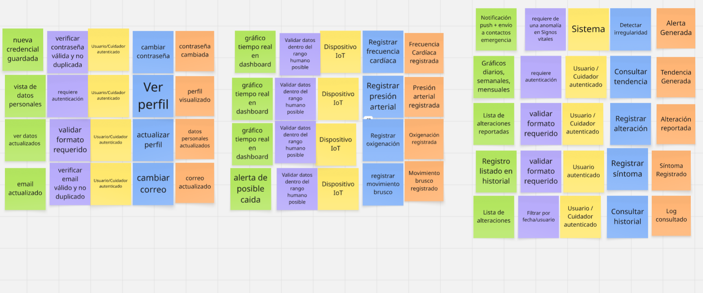

<h1 style="text-align: center;"> Informe del Trabajo Final </h1>
<h3 style="text-align: center;"> Universidad Peruana de Ciencias Aplicadas </h3>

<h5 style="text-align: center"> Área: Ingeniería de Software </h5>

<h5 style="text-align: center"> Curso: Desarrollo de Soluciones IoT </h5>
<h5 style="text-align: center"> Código del curso: 1ASI0572 </h5>
<h5 style="text-align: center"> NRC: 3428 </h5>

<h5 style="text-align: center"> Docente: Marco Antonio León Baca</h5>

<h5 style="text-align: center"> Startup: AlertaVital </h5>

<h5 style="text-align: center"> Producto: AlertaVital </h5>

## Team members:

  
|                Nombre                 |   Código   |
| :-----------------------------------: | :--------: |
| Bohorquez Lerzundi, Gerardo Sebastián | u202224149 |
|  Huanaco Huayta, Elizabeth Lucero   | u20211g522 |
|  Huapaya Cuevas, Anthony       | u202220235 |
|  Silva Tirado, Sebastian Valentino         | u20211g296 |
|     Uribe Quispe, Jesús Guillermo     | u202221876 |

           

<h5 style="text-align: center"> Ciclo 2025-20 </h5>

# Registro de Versiones del Informe

El objetivo de esta sección es resumir las modificaciones relevantes que se realizan al informe durante el ciclo de vida del proyecto. Esta sección inicia en una página nueva y se incluye un cuadro con la siguiente estructura:

| Versión | Fecha | Autor | Descripción de modificación |
| :-----: | :---: | :---: | --------------------------- |
|    TB1    |   21/09   |   Jesús Guillermo Uribe Quispe   | Se añadió el capítulo I, II, III y IV del proyecto.                         |
|TP | 10/10 | Jesús Guillermo Uribe Quispe | UX/UI Design, Software Development and Sprint 1 |

# Project Report Collaboration Insights

URL del repositorio para el reporte del proyecto:

**TP:**

  

  

Para el desarrollo del informe perteneciente a la entrega del trabajo parcial, se dividió la implementación de secciones de la siguiente forma para cada integrante del equipo:

| Integrante | Tareas Asignadas |
| ---------- | ---------------- |
| Bohórquez Lerzundi, Gerardo Sebastián |Solution UX / UI Design, Information Architecture, Systems |
| Huanaco Huayta, Elizabeth Lucero | UX/UI Mobile Design |
| Huapaya Cuevas, Anthony | UX/UI Mobile Design |
| Silva Tirado, Sebastián Valentino | Corrección de errores, Desarrollo App Web, UX / UI Web App Design |
| Uribe Quispe, Jesús Guillermo | Desarrollo Landing Page, UX/UI Design  |

  

**TB1**

  

  

Para el desarrollo del informe perteneciente a la entrega TB1, se dividió la implementación de secciones de la siguiente forma para cada integrante del equipo:

| Integrante | Tareas Asignadas |
| ---------- | ---------------- |
| Bohórquez Lerzundi, Gerardo Sebastián | Analisis competitivo, documentación de Bounded context, entrevistas |
| Huanaco Huayta, Elizabeth Lucero | Lean UX process, entrevistas, documentación de Bounded context, entrevistas|
| Huapaya Cuevas, Anthony | Lean UX process, entrevistas, documentación de Bounded context, entrevistas |
| Silva Tirado, Sebastián Valentino | Antecedentes y problemática, entrevistas, documentación de Bounded context, entrevistas, Impact Mapping |
| Uribe Quispe, Jesús Guillermo | User Stories, Product Backlog, EventStorming process, Software architecture |

**Github Collaboration Insights**

Github también presenta un timeline de las ramas principales y los procesos de merge a los que se han sometido. Todas las ramas se crearon tomando en cuenta el diseño de GitFlow para una buena organización cuando se usa un software de control de versiones.

Los integrantes son:

- Bohórquez Lerzundi, Gerardo Sebastián (Sebasbl562)
- Huanaco Huayta, Elizabeth Lucero (lucerohh)
- Huapaya Cuevas, Anthony (AnthonyHuapaya)
- Silva Tirado, Sebastián Valentino (SebasSilvaT)
- Uribe Quispe, Jesús Guillermo(JesusU27)

# Contenido

1. [**Capítulo I: Introducción.**](#1.)  
   1.1. [Startup Profile.](#1.1.)  
   1.1.1. [Descripción del startup.](#1.1.1.) 
   1.1.2.[Perfiles de los integrantes del equipo.](#1.1.2.) 
   1.2. [Solution Profile.](#1.2.) 
   1.2.1. [Antecedentes y Problemática.](#1.2.1.) 
   1.2.2. [Lean UX Process.](#1.2.2.) 
   1.2.2.1 [Lean UX Problem Statements.](#1.2.2.1.) 
   1.2.2.2. [Lean UX Assumptions.](#1.2.2.2.) 
   1.2.2.3 [Lean UX Hypothesis Statements.](#1.2.2.3.) 
   1.2.2.4 [Lean UX Canvas.](#1.2.2.4.) 
   1.3. [Segmentos objetivo.](#1.3.) 
2. [**Capítulo II: Requirements Elicitation & Analysis.**](#2.) 
   2.1. [Competidores.](#2.1.) 
   2.1.1. [Análisis competitivo.](#2.1.1.) 
   2.1.2. [Estrategias y tácticas frente a competidores.](#2.1.2.) 
   2.2. [Entrevistas.](#2.2.) 
   2.2.1. [Diseño de entrevistas.](#2.2.1.) 
   2.2.2. [Registro de entrevistas.](#2.2.2.) 
   2.2.3. [Análisis de entrevistas.](#2.2.3.) 
   2.3. [Needfinding.](#2.3.) 
   2.3.1. [User Personas.](#2.3.1.) 
   2.3.2. [User Task Matrix.](#2.3.2.) 
   2.3.3. [User Journey Mapping.](#2.3.3.) 
   2.3.4. [Empathy Mapping.](#2.3.4.) 
   2.4. [Big Picture EventStorming](#2.4.) 
   2.5. [Ubiquitous Language](#2.5.) 
3. [**Capítulo III: Requirements Specification.**](#3.) 
   3.1. [User Stories.](#3.1.) 
   3.2. [Impact Mapping.](#3.2.) 
   3.3. [Product Backlog.](#3.3.) 
4. [**Capítulo IV: Solution Software Design.**](#4.) 
   4.1. [Strategic-Level Domain-Driven Design.](#4.1.) 
   4.1.1. [Design-Level EventStorming.](#4.1.1.) 
   4.1.1.1. [Candidate Context Discovery.](#4.1.1.1.) 
   4.1.1.2. [Domain Message Flows Modeling.](#4.1.1.2.) 
   4.1.1.3. [Bounded Context Canvases.](#4.1.1.3.) 
   4.1.2. [Context Mapping.](#4.1.2.) 
   4.1.3. [Software Architecture.](#4.1.3.) 
   4.1.3.1. [Software Architecture System Landscape Diagram.](#4.1.3.1.) 
   4.1.3.2. [Software Architecture Context Level Diagrams.](#4.1.3.2.) 
   4.1.3.3. [Software Architecture Container Level Diagrams.](#4.1.3.3.) 
   4.1.3.4. [Software Architecture Deployment Diagrams.](#4.1.3.4.) 
   4.2. [Tactical-Level Domain-Driven Design.](#4.2.) 
   4.2.1. [Bounded Context: IAM.](#4.2.1.) 
   4.2.1.1. [Domain Layer.](#4.2.1.1.) 
   4.2.1.2. [Interface Layer.](#4.2.1.2.) 
   4.2.1.3. [Application Layer.](#4.2.1.3.) 
   4.2.1.4. [Infrastructure Layer.](#4.2.1.4.) 
   4.2.1.5. [Bounded Context Software Architecture Component Level Diagrams.](#4.2.1.5.) 
   4.2.1.6. [Bounded Context Software Architecture Code Level Diagrams.](#4.2.1.6.) 
   4.2.1.6.1. [Bounded Context Domain Layer Class Diagrams.](#4.2.1.6.1.) 
   4.2.1.6.2. [Bounded Context Database Design Diagram.](#4.2.1.6.2.) 
   4.2.2. [Bounded Context: Profile.](#4.2.2.) 
   4.2.2.1. [Domain Layer.](#4.2.2.1.) 
   4.2.2.2. [Interface Layer.](#4.2.2.2.) 
   4.2.2.3. [Application Layer.](#4.2.2.3.) 
   4.2.2.4. [Infrastructure Layer.](#4.2.2.4.) 
   4.2.2.5. [Bounded Context Software Architecture Component Level Diagrams.](#4.2.2.5.) 
   4.2.2.6. [Bounded Context Software Architecture Code Level Diagrams.](#4.2.2.6.) 
   4.2.2.6.1. [Bounded Context Domain Layer Class Diagrams.](#4.2.2.6.1.) 
   4.2.2.6.2. [Bounded Context Database Design Diagram.](#4.2.2.6.2.) 
   4.2.3. [Bounded Context: Health Tracking.](#4.2.3.) 
   4.2.3.1. [Domain Layer.](#4.2.3.1.) 
   4.2.3.2. [Interface Layer.](#4.2.3.2.) 
   4.2.3.3. [Application Layer.](#4.2.3.3.) 
   4.2.3.4. [Infrastructure Layer.](#4.2.3.4.) 
   4.2.3.5. [Bounded Context Software Architecture Component Level Diagrams.](#4.2.3.5.) 
   4.2.3.6. [Bounded Context Software Architecture Code Level Diagrams.](#4.2.3.6.) 
   4.2.3.6.1. [Bounded Context Domain Layer Class Diagrams.](#4.2.3.6.1.) 
   4.2.3.6.2. [Bounded Context Database Design Diagram.](#4.2.3.6.2.) 
   4.2.4. [Bounded Context: Monitoring.](#4.2.4.) 
   4.2.4.1. [Domain Layer.](#4.2.4.1.) 
   4.2.4.2. [Interface Layer.](#4.2.4.2.) 
   4.2.4.3. [Application Layer.](#4.2.4.3.) 
   4.2.4.4. [Infrastructure Layer.](#4.2.4.4.) 
   4.2.4.5. [Bounded Context Software Architecture Component Level Diagrams.](#4.2.4.5.) 
   4.2.4.6. [Bounded Context Software Architecture Code Level Diagrams.](#4.2.4.6.) 
   4.2.4.6.1. [Bounded Context Domain Layer Class Diagrams.](#4.2.4.6.1.) 
   4.2.4.6.2. [Bounded Context Database Design Diagram.](#4.2.4.6.2.) 
   4.2.5. [Bounded Context: <Bounded Context Name>.](#4.2.5.) 
   4.2.5.1. [Domain Layer.](#4.2.5.1.) 
   4.2.5.2. [Interface Layer.](#4.2.5.2.) 
   4.2.5.3. [Application Layer.](#4.2.5.3.) 
   4.2.5.4. [Infrastructure Layer.](#4.2.5.4.) 
   4.2.5.5. [Bounded Context Software Architecture Component Level Diagrams.](#4.2.5.5.) 
   4.2.5.6. [Bounded Context Software Architecture Code Level Diagrams.](#4.2.5.6.) 
   4.2.5.6.1. [Bounded Context Domain Layer Class Diagrams.](#4.2.5.6.1.) 
   4.2.5.6.2. [Bounded Context Database Design Diagram.](#4.2.5.6.2.) 
    4.2.6. [Bounded Context: Treatment Support](#4.2.6) 
   4.2.6.1. [Domain Layer.](#4.2.6.1.) 
   4.2.6.2. [Interface Layer.](#4.2.6.2.) 
   4.2.6.3. [Application Layer.](#4.2.6.3.) 
   4.2.6.4. [Infrastructure Layer.](#4.2.6.4.) 
   4.2.6.5. [Bounded Context Software Architecture Component Level Diagrams.](#4.2.6.5.) 
   4.2.6.6. [Bounded Context Software Architecture Code Level Diagrams.](#4.2.6.6.) 
   4.2.6.6.1. [Bounded Context Domain Layer Class Diagrams.](#4.2.6.6.1.) 
   4.2.6.6.2. [Bounded Context Database Design Diagram.](#4.2.6.6.2.) 
   5. [Capítulo V: Solution UI/UX Design.](#5.) 
5.1. [Style Guidelines.](#5.1.) 
5.1.1. [General Style Guidelines.](#5.1.1.) 
5.1.2. [Web, Mobile and IoT Style Guidelines.](#5.1.2.) 

5.2. [Information Architecture.](#5.2.) 
5.2.1. [Organization Systems.](#5.2.1.) 
5.2.2. [Labeling Systems.](#5.2.2.) 
5.2.3. [SEO Tags and Meta Tags.](#5.2.3.) 
5.2.4. [Searching Systems.](#5.2.4.) 
5.2.5. [Navigation Systems.](#5.2.5.) 

5.3. [Landing Page UI Design.](#5.3.) 
5.3.1. [Landing Page Wireframe.](#5.3.1.) 
5.3.2. [Landing Page Mock-up.](#5.3.2.) 

5.4. [Applications UX/UI Design.](#5.4.) 
5.4.1. [Applications Wireframes.](#5.4.1.) 
5.4.2. [Applications Wireflow Diagrams.](#5.4.2.) 
5.4.2.1. [Applications Mock-ups.](#5.4.2.1.) 
5.4.3. [Applications User Flow Diagrams.](#5.4.3.) 

5.5. [Applications Prototyping.](#5.5.) 

6. [Capítulo VI: Product Implementation, Validation & Deployment.](#6.) 
6.1. [Software Configuration Management.](#6.1.) 
6.1.1. [Software Development Environment Configuration.](#6.1.1.) 
6.1.2. [Source Code Management.](#6.1.2.) 
6.1.3. [Source Code Style Guide & Conventions.](#6.1.3.) 
6.1.4. [Software Deployment Configuration.](#6.1.4.) 

6.2. [Landing Page, Services & Applications Implementation.](#6.2.) 
6.2.1. [Sprint n.](#6.2.1.) 
6.2.1.1. [Sprint Planning n.](#6.2.1.1.) 
6.2.1.2. [Aspect Leaders and Collaborators.](#6.2.1.2.) 
6.2.1.3. [Sprint Backlog n.](#6.2.1.3.) 
6.2.1.4. [Development Evidence for Sprint Review.](#6.2.1.4.) 
6.2.1.5. [Testing Suite Evidence for Sprint Review.](#6.2.1.5.) 
6.2.1.6. [Execution Evidence for Sprint Review.](#6.2.1.6.) 
6.2.1.7. [Services Documentation Evidence for Sprint Review.](#6.2.1.7.) 
6.2.1.8. [Software Deployment Evidence for Sprint Review.](#6.2.1.8.) 
6.2.1.9. [Team Collaboration Insights during Sprint.](#6.2.1.9.) 

7. [Conclusiones](#7.) 
8. [Bibliografía](#8.) 
9. [Anexo](#9.) 

# STUDENT OUTCOME

**ABET – EAC - Student Outcome 5**
La capacidad de funcionar efectivamente en un equipo cuyos miembros juntos proporcionan liderazgo, crean un entorno de colaboración e inclusivo, establecen objetivos, planifican tareas y cumplen objetivos.

<table>
  <thead>
    <tr>
      <th>Criterio específico</th>
      <th>Acciones realizadas</th>
      <th>Conclusiones</th>
    </tr>
  </thead>
  <tbody>
    <tr>
      <td>Trabaja en equipo para proporcionar liderazgo en forma conjunta</td>
      <td>
        <b>Bohorquez Lerzundi Gerardo Sebastián:</b> 
        <b>TB1:</b> Participé activamente en reuniones del grupo, compartiendo ideas y propuestas sobre la estructuración del Bounded Context de Monitoring, organizando la funcionalidad en servicios y capas de arquitectura. Además, coordiné con mis compañeros para asegurar que las tareas se distribuyeran de manera equitativa y que cada miembro comprendiera su rol dentro del proyecto. 
        <b>TP1:</b> En la segunda entrega, lideré la integración de nuevas funcionalidades en el sistema, facilitando la revisión de código y la resolución de conflictos entre ramas. Promoví la colaboración en la documentación técnica y la validación de los diagramas de arquitectura, asegurando que todos los integrantes participaran en la toma de decisiones sobre el diseño final.  
        <strong>Huanaco Huayta, Elizabeth Lucero</strong> 
        <strong>TB1:</strong> El desarrollo de estas tareas, desde la aplicación del Lean UX Process hasta la definición del Bounded Context: Treatment Support con sus diferentes capas y diagramas, me permitió trabajar en equipo de manera organizada y colaborativa. Cada actividad requirió discutir ideas, validar supuestos, formular hipótesis y estructurar el diseño técnico de forma conjunta, lo que fomentó la toma de decisiones compartida y la distribución de responsabilidades. Este proceso fortaleció la comunicación y coordinación dentro del grupo, lo que me permitió contribuir activamente a alcanzar el objetivo común. 
        <strong>TP1:</strong> En la segunda fase, participé en la revisión y mejora de los flujos de usuario y wireframes, coordinando sesiones de feedback con el equipo. Impulsé la integración de los prototipos en Figma y la validación conjunta de los criterios de aceptación, asegurando que el liderazgo fuera compartido y que todos los miembros pudieran aportar en la definición de la experiencia de usuario.  
        <b>Huapaya Cuevas, Anthony Martin:</b> 
        <b>TB1:</b> En el equipo aporté liderazgo conjunto al desarrollar el Lean UX Process, ya que ayudó a estructurar nuestras hipótesis y experimentos de manera clara, lo que facilitó la toma de decisiones colaborativas. Además, trabajé en los bounded context canvases de health tracking, lo que permitió al grupo alinear la visión del sistema y delimitar responsabilidades dentro del diseño, favoreciendo un liderazgo distribuido. Finalmente, al realizar el registro de entrevistas, contribuí a organizar la información obtenida de los usuarios, asegurando que todo el equipo pudiera basar sus decisiones en evidencia real y compartida. 
        <b>TP1:</b> En la segunda entrega, lideré la integración de los resultados de las entrevistas en el diseño de la arquitectura, coordinando la actualización de los diagramas y la documentación. Fomenté la participación activa de los miembros en la validación de los casos de uso y la revisión de los criterios de aceptación, consolidando el liderazgo conjunto en la toma de decisiones técnicas.  
        <b>Silva Tirado, Sebastián:</b> 
        <b>TB1:</b> Coordinó la distribución de responsabilidades entre los integrantes del equipo, fomentando la toma de decisiones de manera consensuada. Propuso soluciones ante dificultades técnicas y apoyó a sus compañeros en la comprensión de las tareas asignadas. 
        <b>TP1:</b> En la segunda fase, lideré la planificación de los sprints y la asignación de tareas, asegurando que cada integrante tuviera claridad sobre sus responsabilidades. Promoví la revisión cruzada de entregables y la resolución colaborativa de problemas, fortaleciendo el liderazgo compartido y la cohesión del grupo.  
        <b>Uribe Quispe Jesús Guillermo:</b> 
        <b>TB1:</b> Coordiné la elaboración de la arquitectura, proceso de eventstorming y needfinding. Ayudando a mis compañeros a realizar dicho proceso. 
        <b>TP1:</b> En la segunda entrega, lideré la integración de los diagramas de arquitectura y la documentación técnica, facilitando la revisión y validación conjunta de los modelos. Promoví la participación activa en la definición de los flujos de trabajo y la toma de decisiones sobre la estructura final del sistema. 
      </td>
      <td>
        <b>TB1:</b> En conclusión, el equipo evidenció una dinámica de trabajo basada en la colaboración, la organización y el liderazgo compartido, donde cada integrante asumió un rol activo en la construcción de los bounded contexts, la aplicación del Lean UX Process y el diseño de la arquitectura del sistema. La distribución equitativa de tareas, la discusión de ideas y la validación conjunta de hipótesis fortalecieron la comunicación y la coordinación, lo que permitió tomar decisiones consensuadas y afrontar con eficacia los retos técnicos. Gracias a esta sinergia, el grupo logró estructurar de manera sólida los distintos dominios del proyecto y avanzar de forma ordenada hacia los objetivos comunes. 
        <b>TP1:</b> En la segunda entrega, el liderazgo conjunto se consolidó mediante la integración de nuevas funcionalidades, la validación colaborativa de los prototipos y la revisión técnica de los diagramas. La participación activa de todos los miembros en la toma de decisiones y la resolución de conflictos permitió fortalecer la cohesión del equipo y avanzar de manera eficiente hacia los objetivos planteados, demostrando una capacidad sólida para liderar y coordinar el trabajo en equipo.
      </td>
    </tr>
    <tr>
      <td>Crea un entorno colaborativo e inclusivo, establece metas, planifica tareas y cumple objetivos.</td>
      <td>
        <b>Bohorquez Lerzundi Gerardo Sebastián:</b> 
        <b>TB1:</b> Contribuí en la fase de needfinding, realizando análisis de user persona y empathy map para identificar necesidades reales de los usuarios. Esto permitió al grupo empatizar con los clientes y definir soluciones más ajustadas. También participé en la planificación de tareas del proyecto, ayudando a cumplir objetivos establecidos en tiempo y forma. 
        <b>TP1:</b> En la segunda entrega, colaboré en la definición de los objetivos del sprint y la planificación de las tareas, asegurando que el entorno de trabajo fuera inclusivo y que todos los miembros pudieran aportar sus ideas. Fomenté la revisión cruzada de entregables y la retroalimentación constante, lo que permitió cumplir los objetivos en los plazos establecidos.  
        <strong>Huanaco Huayta, Elizabeth Lucero</strong> 
        <strong>TB1:</strong> Durante el desarrollo de estas tareas logré desarrollar junto a mi equipo un entorno colaborativo e inclusivo, en el que cada integrante pudo aportar ideas y conocimientos desde su experiencia. Definimos metas claras, como la elaboración del Lean UX Canvas y los diferentes Bounded Context, lo que nos permitió planificar tareas de manera ordenada y asignarlas. Gracias a esta organización, pudimos cumplir con los objetivos establecidos en el tiempo acordado, fortaleciendo la participación equitativa y el compromiso hacia el proyecto del curso. 
        <strong>TP1:</strong> En la segunda fase, participé en la planificación de los sprints y la definición de los entregables, promoviendo la inclusión de todos los miembros en la toma de decisiones. Coordiné la revisión de los prototipos y la validación de los criterios de aceptación, asegurando que el entorno de trabajo fuera colaborativo y que los objetivos se cumplieran en los plazos establecidos.  
        <b>Huapaya Cuevas, Anthony Martin:</b> 
        <b>TB1:</b> Durante el proyecto fomenté un entorno colaborativo e inclusivo al aplicar el Lean UX Process, donde todas las ideas del equipo fueron consideradas y priorizadas de manera conjunta. A través de los bounded context canvases de health tracking, ayudé a establecer metas claras y a planificar tareas específicas relacionadas con el diseño de los dominios, asegurando que cada miembro comprendiera su responsabilidad. Con el registro de entrevistas, contribuí a cumplir los objetivos del equipo, ya que la información recogida permitió orientar el diseño hacia las necesidades reales de los usuarios. 
        <b>TP1:</b> En la segunda entrega, colaboré en la planificación de los sprints y la asignación de tareas, promoviendo la inclusión de todos los miembros en la toma de decisiones. Fomenté la revisión cruzada de entregables y la retroalimentación constante, lo que permitió cumplir los objetivos en los plazos establecidos y fortalecer el entorno colaborativo.  
        <b>Silva Tirado, Sebastian:</b> 
        <b>TB1:</b> Promovió reuniones periódicas para definir objetivos y plazos, fomentó la participación activa de cada miembro y aseguró que las ideas fueran valoradas por igual. Elaboró un cronograma de actividades y dio seguimiento al cumplimiento de tareas. 
        <b>TP1:</b> En la segunda fase, coordinó la planificación de los sprints y la definición de los entregables, asegurando que el entorno de trabajo fuera inclusivo y que todos los miembros pudieran aportar sus ideas. Fomentó la revisión cruzada de entregables y la retroalimentación constante, lo que permitió cumplir los objetivos en los plazos establecidos.  
        <b>Uribe Quispe, Jesús Guillermo:</b> 
        <b>TB1:</b> Cree canales de comunicación entre mis compañeros y yo para desenvolvernos mejor en el proyecto. Además tracé y designé tareas con tiempo para una mayor eficiencia en la realización del entregable. 
        <b>TP1:</b> En la segunda entrega, coordiné la planificación de los sprints y la definición de los entregables, promoviendo la inclusión de todos los miembros en la toma de decisiones. Fomenté la revisión cruzada de entregables y la retroalimentación constante, lo que permitió cumplir los objetivos en los plazos establecidos y fortalecer el entorno colaborativo. 
      </td>
      <td>
        <b>TB1:</b> En conjunto, el equipo demostró un trabajo colaborativo e inclusivo, en el que cada integrante aportó desde su rol al cumplimiento de los objetivos planteados. A través de la aplicación de metodologías como Lean UX y herramientas como empathy maps, user personas y bounded contexts, lograron definir necesidades reales de los usuarios, establecer metas claras, planificar tareas de manera organizada y dar seguimiento a su ejecución. La comunicación constante, la distribución equitativa de responsabilidades y la valoración de las ideas de todos los miembros fortalecieron el compromiso y permitieron alcanzar los entregables en los tiempos acordados, consolidando así un proceso de trabajo eficiente y orientado a resultados. 
        <b>TP1:</b> En la segunda entrega, el equipo consolidó el entorno colaborativo e inclusivo mediante la planificación conjunta de los sprints, la definición de los objetivos y la revisión cruzada de los entregables. La participación activa de todos los miembros en la toma de decisiones y la retroalimentación constante permitieron cumplir los objetivos en los plazos establecidos, fortaleciendo la cohesión del grupo y la eficiencia en el trabajo en equipo.
      </td>
    </tr>
  </tbody>
</table>

<h2>1. Capítulo I: Introducción</h2>

<h3>1.1. Startup Profile</h3>

<h4>1.1.1. Descripción del startup</h4>

AlertaVital es una startup tecnológica dedicada a desarrollar soluciones innovadoras basadas en Internet de las Cosas (IoT) para mejorar la calidad de vida de las personas mayores y sus familias. Nuestra misión es proporcionar herramientas accesibles y confiables que permitan el monitoreo en tiempo real de signos vitales y la detección de caídas, brindando tranquilidad y seguridad tanto a los adultos mayores como a sus cuidadores. A través de un dispositivo portátil y una aplicación móvil intuitiva, AlertaVital busca transformar la manera en que se cuida a los adultos mayores, facilitando la prevención de emergencias y promoviendo un envejecimiento saludable y autónomo.

<h4>1.1.2. Perfiles de los integrantes del equipo</h4>

<table align="center"  border="1" width="70%" style="text-align:center;">
    <tr align="center">
        <td rowspan="3">
             
        </td>
        <td align="left">
            <b>Nombre y Apellido:</b>
             
            Bohorquez Lerzundi, Gerardo Sebastián
        </td>
    </tr>
    <tr>
        <td align="left">
        <b>Carrera:</b>
         
        Ingeniería de Software
        </td>
    </tr>
    <tr>
        <td align="left">
        <b>Acerca de:</b>
          
  Estoy cursando el séptimo semestre de Ingeniería de Software en la Universidad UPC. Me distingo por ser una persona 		ágil, comprometida, asertiva y profundamente ética. En este proyecto, me comprometo a aportar lo mejor de mí, no solo 		para alcanzar los objetivos del equipo, sino también para fomentar un ambiente de trabajo positivo y colaborativo.
        </td>
    </tr>
    <tr align="center">
        <td rowspan="3">
            
        </td>
        <td align="left">
            <b>Nombre y Apellido:</b>
             
            Huanaco Huayta, Elizabeth Lucero
        </td>
    </tr>
    <tr>
        <td align="left">
        <b>Carrera:</b>
         
          Ingeniería de Software 
        </td>
    </tr>
    <tr>
        <td align="left">
        <b>Acerca de:</b>
         
       Estoy en el séptimo ciclo de Ingeniería de Software en la Universidad Peruana de Ciencias Aplicadas. Me considero una persona organizada, resiliente y asertiva. Elegí enfocarme en esta carrera por el interés que tengo en el desarrollo de software, ya que considero que es un área clave para el futuro de la innovación tecnológica. En este proyecto, me comprometo a aplicar mis cualidades y contribuir al logro de los objetivos de mi equipo. 
        </td>
    </tr>
    <tr align="center">
        <td rowspan="3">
            
        </td>
        <td align="left">
            <b>Nombre y Apellido:</b>
             
            Huapaya Cuevas, Anthony Martin
        </td>
    </tr>
    <tr>
        <td align="left">
        <b>Carrera:</b>
         
        Ingeniería de Software
        </td>
    </tr>
    <tr>
        <td align="left">
        <b>Acerca de:</b>
         
        Me encuentro cursando el séptimo ciclo de la carrera de Ingeniería de Software en la Universidad Peruana de Ciencias Aplicadas. Me considero una persona perseverante, fácil de adaptarse con respecto al ambiente de trabajo y responsable. Elegí el desarrollo de esta carrera para los avances tecnológicos con respecto al software, por que es una parte fundamental para lograr ese objetivo. Me comprometo con este trabajo mantener un ambiente sano en el equipo y apoyar constantemente con el avance de este.
        </td>
    </tr>
    <tr align="center">
        <td rowspan="3">
            
        </td>
        <td align="left">
            <b>Nombre y Apellido: </b>
             
            Silva Tirado, Sebastián Valentino
        </td>
    </tr>
    <tr>
        <td align="left">
        <b>Carrera:</b>
         
        Ingenieria de Software
        </td>
    </tr>
    <tr>
        <td align="left">
        <b>Acerca de:</b>
         
         Soy estudiante del octavo ciclo de la carrera de Ingeniería de Software en UPC. Opté por estudiar esta carrera porque me gusta la idea de programar y crear algo que pueda llegar a funcionar y ser útil en el mundo. Por lo cual, la universidad me da la posibilidad de estudiar y ser un profesional exitoso. Deseo ser buen integrante para mi equipo y me comprometo en hacer el mejor trabajo posible, y poder superarme más que el ciclo anterior.
        </td>
    </tr>
    <tr align="center">
        <td rowspan="3">
            
        </td>
        <td align="left">
            <b>Nombre y Apellido:</b>
             
            Uribe Quispe, Jesús Guillermo
        </td>
    </tr>
    <tr>
        <td align="left">
        <b>Carrera:</b>
         
        Ingeniería de Software
        </td>
    </tr>
    <tr>
        <td align="left">
        <b>Acerca de:</b>
         
        Soy estudiante de Ingenieria de Software en la UPC y actualmente estoy en el 7to ciclo. Elegí esta carrera porque me interesó el campo del software y la matemáticas. Me comprometo a
    ayudar a mis compañeros con el trabajo asi como también fuera de este.
        </td>
    </tr>
   
</table>

<h3>1.2. Solution Profile</h3>

<h4>1.2.1. Antecedentes y Problemática</h4>

**Antecedentes:**

El envejecimiento poblacional es un fenómeno global y particularmente relevante en Latinoamérica. En Perú, según el INEI (2022), la población de adultos mayores supera el 13% del total, con proyecciones de crecimiento constante en las próximas décadas. Este grupo etario presenta un incremento en la prevalencia de enfermedades crónicas no transmisibles (hipertensión, diabetes, enfermedades cardiovasculares), las cuales requieren un monitoreo continuo de signos vitales. 

Paralelamente, la Organización Mundial de la Salud (OMS, 2021) advierte que las caídas son la segunda causa mundial de muertes por lesiones accidentales, afectando principalmente a adultos mayores. Los dispositivos IoT aplicados a la telemedicina se han convertido en una alternativa de apoyo para la prevención y respuesta temprana, ya que permiten el registro en tiempo real de parámetros fisiológicos y eventos de riesgo, brindando a los cuidadores o familiares alertas inmediatas. 

Sin embargo, en el contexto peruano y de Lima Metropolitana, el acceso a estas tecnologías aún es limitado, con soluciones costosas o poco adaptadas a la realidad socioeconómica local. Esto abre la necesidad de investigar y desarrollar herramientas accesibles que permitan mejorar la calidad de vida de las personas mayores y la tranquilidad de sus familias. 

**Problemática:**

La población adulta mayor enfrenta riesgos significativos relacionados con el deterioro de la salud y la vulnerabilidad a caídas. Actualmente, el monitoreo de sus signos vitales suele ser esporádico y depende de consultas médicas presenciales, lo que retrasa la detección de anomalías. Asimismo, muchas caídas ocurren en el hogar sin supervisión inmediata, aumentando la probabilidad de complicaciones graves. 

Si bien existen dispositivos en el mercado, su alto costo, falta de personalización y limitada integración con sistemas de alerta dificultan su adopción en el entorno local. Esto genera un vacío tecnológico que afecta tanto a los adultos mayores como a sus familiares y cuidadores, quienes requieren herramientas eficaces para prevenir riesgos y actuar con rapidez ante emergencias. 

**WHAT (Qué): ¿Cuál es el problema?**

El problema es la falta de monitoreo continuo y accesible de signos vitales y detección de caídas en adultos mayores, lo que ocasiona diagnósticos tardíos, complicaciones y aumento del riesgo de mortalidad.

**WHEN (Cuándo): ¿Cuándo sucede el problema?**

El problema ocurre de manera cotidiana, especialmente durante los momentos en que la persona mayor se encuentra sola en casa o sin supervisión médica inmediata.

**WHERE (Dónde): ¿Dónde surge el problema?**

Surge principalmente en el hogar y en entornos donde no existe personal de salud presente de forma constante, siendo un problema frecuente en zonas urbanas con alta población adulta mayor, como Lima Metropolitana.

**WHO (Quién): ¿A quiénes les sucede el problema?**

Afecta directamente a los adultos mayores, y de manera indirecta a sus familiares, cuidadores y al sistema de salud, que enfrenta mayores costos por hospitalizaciones derivadas de caídas o descompensaciones no detectadas a tiempo.

**WHY (Por qué): ¿Cuál es la causa del problema?**

Las causas principales son:

- Falta de acceso a herramientas tecnológicas de monitoreo.

- Alto costo de los dispositivos especializados.

- Limitada cultura de prevención en salud geriátrica.

- Ausencia de soluciones adaptadas al contexto local.

**HOW (Cómo): ¿Cómo llevó a los involucrados a llegar a esta situación?**

La combinación de factores económicos, tecnológicos y sociales ha llevado a que los adultos mayores permanezcan sin supervisión adecuada de sus parámetros vitales, exponiéndose a eventos de riesgo sin respuesta inmediata, lo que incrementa la carga emocional y económica de las familias.

**HOW MUCH (Cuánto): ¿Cuánto afecta el problema?**

El problema afecta a más del 13% de la población peruana (adultos mayores), y las caídas representan aproximadamente el 30% de las consultas de emergencia en este grupo etario (OPS, 2020). Además, los costos hospitalarios derivados de caídas y complicaciones médicas son elevados, impactando tanto a los hogares como al sistema de salud nacional.

<h4>1.2.2. Lean UX Process</h4>

<h5>1.2.2.1. Lean UX Problem Statements</h5>

En la actualidad, el cuidado de los adultos mayores representa un gran reto debido a la falta de mecanismos accesibles y confiables para monitorear su estado de salud y seguridad en tiempo real. Este desafío se acentúa en contextos donde muchos adultos mayores viven solos o pasan gran parte del día sin supervisión constante, lo que incrementa el riesgo ante emergencias como caídas o alteraciones en sus signos vitales. Garantizar una atención oportuna en este entorno es fundamental para prevenir complicaciones, mejorar la calidad de vida y ofrecer tranquilidad tanto a los adultos mayores como a sus familias.

Actualmente, las familias y cuidadores aún dependen de visitas presenciales o llamadas telefónicas para conocer el estado de sus seres queridos, lo que genera incertidumbre, tiempos de respuesta lentos y, en ocasiones, falta de información médica precisa para la toma de decisiones. La ausencia de una solución tecnológica integral limita la capacidad de detectar emergencias de manera inmediata y de contar con un registro histórico de la salud del adulto mayor, dificultando así la prevención y el seguimiento adecuado de su bienestar.

¿Cómo podemos desarrollar una solución integral basada en dispositivos IoT y una aplicación móvil que permita a los cuidadores o familiares monitorizar en tiempo real los signos vitales y posibles caídas de los adultos mayores, generando alertas inmediatas y un historial accesible, de manera que se incremente la seguridad, se optimice el cuidado y se brinde mayor tranquilidad a todos los involucrados?

<h5>1.2.2.2. Lean UX Assumptions</h5>

**Business Assumptions** 

* Creemos que nuestros clientes necesitan una mejor forma de monitorear el estado de salud y seguridad de los adultos mayores, especialmente en lo relacionado con el registro de signos vitales, la detección de caídas y la generación de alertas inmediatas para familiares o cuidadores.

* Estas necesidades se pueden resolver mediante el uso de un dispositivo IoT portátil conectado a una aplicación móvil, que permita la recolección de datos en tiempo real, la centralización de información de salud y el envío de notificaciones en caso de emergencia.

* Los clientes principales son los tutores de los adultos mayores, quienes buscan 
tranquilidad y rapidez en la respuesta ante emergencias. Sin embargo, la solución también está diseñada para beneficiar directamente a los adultos mayores, al ofrecerles mayor seguridad en su vida cotidiana.

* El valor #1 que busca el cliente es contar con un sistema accesible y confiable que incremente la seguridad y bienestar de los adultos mayores, a la vez que brinde tranquilidad a los tutores mediante la detección temprana de emergencias y un monitoreo continuo de la salud.

* El cliente también puede obtener beneficios adicionales gracias a la flexibilidad y escalabilidad de la solución, que permitirá integrar nuevas métricas de salud como oxigenación, presión arterial y frecuencia cardíaca, además de incluir la capacidad de realizar llamadas a los servicios de emergencia y a los contactos registrados. Asimismo, se podrán generar reportes sobre posibles alteraciones detectadas en el estado de salud.

* Vamos a adquirir la mayoría de los clientes mediante el uso de marketing digital dirigido a familias y asociaciones de adultos mayores, además de alianzas con centros de salud, hogares geriátricos y ONGs, lo que permitirá ampliar la red de usuarios y aumentar la visibilidad de la solución.

* Se hará dinero a través de la venta del dispositivo IoT acompañado de un pago único por el acceso de la aplicación, aplicando cuotas bajas por el soporte y mantenimiento de la aplicación y el dispositivo.

* Nuestra competencia principal en el mercado son las aplicaciones y dispositivos de monitoreo de salud y caídas ya existentes, aunque muchos presentan precios elevados, falta de integración de funciones o interfaces poco intuitivas para adultos mayores.

* Los venceremos gracias al uso de tecnología accesible, un enfoque integral en seguridad y salud, y una experiencia de usuario optimizada tanto para los adultos mayores como para sus cuidadores. Además, ofreceremos soporte técnico cercano y constantes mejoras de la aplicación.

* Nuestro mayor riesgo es que los adultos mayores y sus familias desconfíen o sean reacios al uso de nuevas tecnologías.

* Resolveremos esto a través de demostraciones claras, interfaces simples y un soporte al cliente enfocado en la capacitación, de modo que la adaptación al sistema sea rápida, amigable y sin complicaciones.

**Assumptions Worksheet** 

**¿Quién es el usuario?**
Los usuarios son los adultos mayores y sus tutores, quienes necesitan una solución confiable para monitorear la salud y la seguridad en tiempo real. El usuario principal son los tutores, quienes toman decisiones sobre herramientas tecnológicas y buscan soluciones que ofrezcan tranquilidad, respuesta rápida ante emergencias y un mejor cuidado para sus seres queridos.

**¿Dónde encaja nuestro producto en su trabajo o vida?**
Nuestra aplicación móvil junto con el dispositivo IoT se integra en la vida diaria del adulto mayor y su entorno familiar. El dispositivo acompaña al adulto mayor durante todo el día, mientras que la aplicación permite a los tutores monitorear signos vitales, recibir alertas ante caídas y acceder a un historial de salud, convirtiéndose en una herramienta esencial para incrementar la seguridad, optimizar el cuidado y brindar confianza.

**¿Qué problemas tiene nuestro producto? ¿Resolver?**
El desafío que enfrentan los usuarios es la falta de monitoreo constante cuando los adultos mayores están solos, el riesgo de caídas sin asistencia inmediata y la ausencia de información médica histórica que dificulta el seguimiento de la salud. También puede existir resistencia por parte de algunos adultos mayores al uso de nuevas tecnologías o la desconfianza inicial de las familias hacia la precisión del sistema.

**¿Cuándo y cómo es nuestro producto usado?**
La aplicación y el dispositivo IoT tienen un uso diario. El adulto mayor porta el dispositivo durante sus actividades cotidianas, mientras que los tutores utilizan la aplicación para monitorear en tiempo real, recibir notificaciones ante emergencias y consultar el historial de eventos o signos vitales.

**¿Qué características son importantes?**
Las principales características son el monitoreo en tiempo real de signos vitales y caídas, el envío de alertas automáticas inmediatas, un historial accesible con reportes de salud y una interfaz simple e intuitiva.

**¿Cómo debe verse nuestro producto y cómo comportarse?**
Debe verse limpio, amigable y confiable, transmitiendo seguridad y accesibilidad para el ámbito de salud y cuidado. La aplicación debe responder rápidamente a las acciones del usuario con una navegación sencilla presentar paneles claros con información organizada y notificaciones inmediatas.

<h5>1.2.2.3. Lean UX Hypothesis Statements</h5>

**Creemos que**, al incorporar un módulo de monitoreo en tiempo real de signos vitales y caídas, se incrementará la seguridad y tranquilidad de los adultos mayores y sus familias. Sabremos que tenemos éxito cuando logremos una reducción del 70% en incidentes no atendidos a tiempo y una respuesta más rápida por parte de los tutores.

**Creemos que**, al ofrecer reportes resumidos sobre los signos vitales y eventos de caídas, los tutores podrán tomar decisiones más informadas para el cuidado del adulto mayor. Sabremos que estamos cumpliendo este objetivo cuando los cuidadores consulten regularmente los reportes y se observe una mejora del 50% en la prevención y seguimiento de la salud.

**Creemos que**, al incorporar un sistema de alertas automáticas y notificaciones inmediatas a los servicios de emergencia y números registrados, se mejorará la capacidad de respuesta ante emergencias. Sabremos que estamos cumpliendo este objetivo cuando el 80% de las alertas generadas reciban una atención oportuna.

<h5>1.2.2.4. Lean UX Canvas</h5>

El Lean UX Canvas permitió estructurar y validar las hipótesis del proyecto, que busca ofrecer un dispositivo IoT con aplicación móvil para el monitoreo de adultos mayores. Con esta herramienta se identificaron los principales problemas, como la falta de monitoreo constante y el riesgo de caídas, los usuarios clave, como los adultos mayores y los tutores, así como los supuestos críticos y riesgos, como la resistencia a nuevas tecnologías. Además, el canvas ayudó a priorizar las funcionalidades esenciales y una interfaz simple, garantizando que la solución se enfoque en generar seguridad, confianza y valor real para los usuarios.  

<h3>1.3. Segmentos objetivo</h3>

En esta sección, definiremos los perfiles específicos del público objetivo para nuestro brazalete inteligente. Estos grupos comparten características demográficas, comportamientos o necesidades similares, lo que les diferencia de otros segmentos del mercado y permite ajustar estrategias para satisfacer sus necesidades de una mejor manera.

### 1. Personas de edad avanzada o individuos con enfermedades cardiovasculares
- **Segmento demográfico:**  
  Personas mayores de 60 años en Perú, que representan cerca del 12,4 % de la población total (aproximadamente 4,1 millones en 2023), con una prevalencia de hipertensión arterial del 29,7 % y un 66 % con enfermedades crónicas como diabetes o patologías cardiovasculares (INEI, 2023; MINSA, 2023).  
- **Segmento geográfico:**  
  Residentes en áreas urbanas, especialmente en Lima Metropolitana, donde el 43,2 % de los hogares incluye al menos un adulto mayor (INEI, 2023).  
- **Segmento psicográfico:**  
  Individuos preocupados por su salud y seguridad, que valoran la tranquilidad de contar con monitoreo continuo para prevenir o manejar emergencias médicas como desmayos, arritmias o crisis hipertensivas.  
- **Segmento conductual:**  
  Personas que necesitan monitoreo constante de signos vitales (pulso, respiración, saturación) y alertas automáticas ante condiciones críticas. El brazalete inteligente satisface esta necesidad al proporcionar monitoreo en tiempo real y notificaciones inmediatas.

### 2. Cuidadores o contactos de emergencia de los usuarios
- **Segmento demográfico:**  
  Cuidadores familiares, mayormente sin capacitación formal, que conviven en más de 4,4 millones de hogares con un adulto mayor o paciente crónico. Aproximadamente el 31 % presenta síntomas depresivos, y el 44 % ha dejado su empleo para dedicarse al cuidado (OPS, 2023).  
- **Segmento geográfico:**  
  Principalmente en áreas urbanas de Perú, con alta concentración en Lima Metropolitana, donde la convivencia con adultos mayores o pacientes crónicos es común (OPS, 2023).  
- **Segmento psicográfico:**  
  Cuidadores que enfrentan alto estrés, sobrecarga emocional y mental (más del 70 % reporta sobrecarga intensa), y buscan herramientas que les brinden seguridad y reduzcan la incertidumbre al cuidar de sus seres queridos.  
- **Segmento conductual:**  
  Cuidadores que necesitan recibir alertas inmediatas ante emergencias de salud para intervenir rápidamente. El brazalete inteligente les ofrece monitoreo continuo del paciente y notificaciones automáticas, aliviando su carga emocional y mejorando su capacidad de respuesta.  

<h2>2. Capítulo II: Requirements Elicitation & Analysis</h2>

<h3>2.1. Competidores</h3>

<h4>2.1.1. Análisis competitivo</h4>

| **Competidor** | |  |  |  |  |
| --------------------------- | ------------------------------------------------------------------------------------------------------------- | ------------------------------------------------------------------------------------------ | --------------------------------------------------------------------------------------------------------- | ----------------------------------------------------------------------------------------------------------------- | ------------------------------------------------------------------------------------------------------------------------------------- |
| **Perfil Overview** | **Nuestra Solucion**   Brazalete inteligente IoT con app móvil para monitoreo en tiempo real de signos vitales y detección de caídas en adultos mayores, enfocado en el mercado peruano. | Reloj inteligente con enfoque en monitoreo de salud, fitness y seguridad, incluyendo detección de caídas y signos vitales para usuarios mayores. | Reloj de alerta médica con detección de caídas, diseñado para protección 24/7 sin necesidad de recarga constante. | Reloj de alerta médica independiente con detección de caídas automática y seguimiento de ubicación para seniors activos. | Reloj inteligente para seniors con detección de caídas, monitoreo de signos vitales y GPS en tiempo real. |
| **Ventaja competitiva** | Solución accesible y local con integración IoT completa, alertas inmediatas a cuidadores y servicios de emergencia, interfaz intuitiva para adultos mayores y soporte técnico cercano en Perú. | Sensores avanzados para ECG, detección de hipertensión y apnea del sueño, integración con ecosistema Apple. | Tecnología RealFall™ para detección precisa de caídas, batería intercambiable y conectividad dual (celular y WiFi). | Operación independiente sin smartphone, detección de caídas con IA y red 4G LTE para claridad y velocidad. | Dispositivo gratuito con suscripción, compliant con HIPAA, centro de emergencias certificado 24/7. |
| **Mercado objetivo** | Adultos mayores de 60 años en Perú (especialmente Lima Metropolitana) con enfermedades crónicas, y sus cuidadores familiares que buscan tranquilidad y respuesta rápida. | Adultos mayores y personas preocupadas por la salud en áreas urbanas, con énfasis en independencia y monitoreo continuo. | Seniors que necesitan protección constante contra caídas y emergencias, priorizando facilidad de uso. | Elderly activos que requieren alertas médicas sin dependencia de teléfonos, en entornos cotidianos. | Adultos mayores viviendo solos o con condiciones médicas, y sus cuidadores buscando tranquilidad. |
| **Estrategia de marketing** | Marketing digital dirigido a familias y asociaciones de adultos mayores, alianzas con centros de salud, hogares geriátricos y ONGs en Perú. | Presencia en tiendas Apple, publicidad digital, énfasis en características de salud y fitness, ofertas como Fitness+ gratis. | Endorsements de expertos (NY Times, NCOA), historias de clientes, contenido educativo comparativo. | Promociones como descuentos y meses gratis, enfoque en simplicidad y reseñas positivas (4.8/5). | Testimonios de usuarios y médicos, calificación alta (4.9/5), énfasis en transparencia y recomendaciones. |
| **Productos & Servicios** | Monitoreo continuo de signos vitales (pulso, respiración, saturación de oxígeno), detección de caídas, alertas automáticas a cuidadores y emergencias, historial accesible, reportes de salud, integración con llamadas de emergencia. | Detección de caídas, monitoreo de signos vitales (ritmo cardíaco, respiración, temperatura), ECG, notificaciones de irregularidades, alertas de emergencia. | Detección de caídas automática, activación por voz o botón, conexión a agentes 24/7, sin monitoreo vital directo. | Detección de caídas con IA, botón SOS, comunicación bidireccional, contador de pasos, alertas de batería baja. | Detección de caídas automática, monitoreo de ritmo cardíaco, GPS, botón SOS con altavoz bidireccional, alertas a emergencias. |
| **Precios & Costos** | Venta del dispositivo con pago único por acceso a la app, cuotas bajas mensuales por soporte y mantenimiento. | Precio del dispositivo desde aproximadamente $399, sin suscripción obligatoria para funciones básicas de salud. | Precio no especificado en el contenido, enfocado en suscripción para monitoreo 24/7. | Suscripciones desde $39.95/mes, con promociones de descuento y mes gratis. | Suscripciones desde $34.95/mes, dispositivo gratis, sin tarifas ocultas. |
| **Canales de distribución** | App móvil (iOS/Android), ventas en línea, alianzas con centros de salud y ONGs. | Tiendas Apple, sitio web, App Store. | Sitio web oficial, posiblemente Amazon. | Sitio web, compras en línea con envíos. | Sitio web oficial con envíos gratuitos. |
| **Debilidades** | Producto nuevo en el mercado, posible resistencia inicial de adultos mayores a la tecnología, dependencia de cobertura móvil en Perú. | Requiere iPhone para configuración completa, batería diaria, precio alto para algunos usuarios. | No apto para inmersión en agua, no monitorea signos vitales directamente. | Vida de batería variable (6-18 horas), GPS limitado actualmente. | Dependencia de red móvil, posibles limitaciones en áreas sin cobertura. |
| **Oportunidades** | Crecimiento del envejecimiento poblacional en Perú (13%+), alta demanda de soluciones accesibles para monitoreo de salud crónica y prevención de caídas. | Expansión en telemedicina y integración con más métricas de salud en mercados crecientes de envejecimiento. | Mejoras en tecnología RealFall™ y expansión a más usuarios seniors con datos recolectados. | Desarrollo de app para cuidadores y mejoras en batería para mercado en crecimiento de wearables para elderly. | Expansión basada en recomendaciones médicas y mercado de independencia senior. |
| **Fortalezas** | Adaptada al contexto socioeconómico peruano, enfoque en accesibilidad y escalabilidad, interfaz simple y confiable, beneficios directos para cuidadores con reducción de estrés. | Monitoreo avanzado de salud, detección de caídas y emergencias, integración con conectividad familiar. | Protección 24/7, detección precisa de caídas, diseño amigable para usuarios. | Independiente, detección de caídas precisa, materiales cómodos, reseñas positivas. | Confiable, fácil configuración, alta satisfacción de usuarios, enfoque en privacidad.

<h4>2.1.2. Estrategias y tácticas frente a competidores</h4>

- Diseñaremos un sistema de monitoreo accesible y fácil de usar, con una interfaz pensada tanto para adultos mayores como para familiares y cuidadores. La navegación será intuitiva, con alertas visuales y auditivas claras, además de un soporte técnico adaptado al usuario final, garantizando la confianza y la rápida adopción de la herramienta.

- Diferenciaremos nuestra propuesta con la integración del sensor de caídas, que no solo enviará alertas automáticas, sino que también permitirá confirmar el estado del paciente a través de la aplicación móvil. Esta característica clave nos permitirá superar a competidores que solo ofrecen monitoreo de signos vitales sin una respuesta integral frente a emergencias.

- Fortaleceremos la credibilidad de nuestra solución a través de experiencias reales, incorporando testimonios de familiares, cuidadores y profesionales de la salud que validen la utilidad del sistema. Estas historias de éxito serán empleadas en nuestras campañas de marketing y materiales informativos para generar confianza en nuevos usuarios.

<h3>2.2. Entrevistas</h3>

Esta sección recopila la información obtenida a partir de entrevistas realizadas a adultos mayores y cuidadores responsables de su atención. Se incluyen las preguntas formuladas, las entrevistas realizadas y un análisis comparativo. El objetivo es comprender sus necesidades, hábitos actuales y percepciones para fundamentar el desarrollo de una solución IoT adecuada a su entorno real.

<h4>2.2.1. Diseño de entrevistas</h4>

### Preguntas para Adultos Mayores

1. ¿Cuál es su nombre y edad?
2. ¿Con quién vive actualmente (solo, con familia, en residencia)?
3. ¿Qué enfermedades o condiciones de salud crónicas le han diagnosticado (ej. hipertensión, diabetes, problemas cardíacos)?
4. ¿Con qué frecuencia acude a controles médicos o revisiones de rutina?
5. ¿Ha sufrido caídas en el último año? ¿Podría contarme qué pasó y cómo reaccionaron sus familiares?
6. ¿En qué momentos del día suele estar solo(a) en casa?
7. ¿Qué tanta confianza tiene en el uso de dispositivos electrónicos (celulares, relojes inteligentes, pulseras, etc.)?
8. ¿Ha usado antes algún aparato o dispositivo para medir su presión, ritmo cardíaco u otros signos vitales? ¿Cómo fue su experiencia?
9. ¿Qué tan cómodo se sentiría utilizando un dispositivo pequeño (ej. pulsera, reloj o colgante) que monitoree su salud y detecte caídas?
10. ¿Le resultaría útil que sus familiares reciban alertas inmediatas si sufre una caída o alguna alteración de sus signos vitales?
11. ¿Qué aspectos le generarían desconfianza o preocupación (precio, privacidad, dificultad de uso, batería, etc.)?
12. ¿Qué características considera más importantes en un dispositivo de este tipo (ej. fácil de usar, discreto, resistente, económico)?

### Preguntas para Cuidadores / Familiares

1. ¿Cuál es su relación con el adulto mayor (hijo/a, nieto/a, cuidador contratado, etc.)?
2. ¿Con qué frecuencia se encuentra a cargo de su cuidado (diariamente, algunas horas, solo en emergencias)?
3. ¿Qué actividades cotidianas le generan mayor preocupación respecto al adulto mayor (movilidad, alimentación, medicación, caídas, etc.)?
4. ¿Ha tenido alguna experiencia previa con caídas o emergencias médicas de su familiar? ¿Cómo fue el proceso de atención?
5. ¿Actualmente utilizan algún dispositivo o aplicación para monitorear su salud? ¿Cuál y cómo lo valoran?
6. ¿Qué tan importante considera tener información en tiempo real sobre signos vitales (ej. presión, pulso, oxigenación)?
7. ¿Cómo preferiría recibir alertas en caso de emergencias (notificación en app, llamada, SMS, correo)?
8. ¿Cuáles serían las principales barreras para implementar un dispositivo de este tipo en su hogar (costo, conectividad, resistencia del adulto mayor a usarlo)?
9. ¿Qué tan dispuesto estaría a invertir en un sistema IoT de monitoreo? ¿Qué rango de precio considera accesible?
10. Si pudiera diseñar este sistema, ¿qué funciones serían prioritarias para usted (ej. botón de emergencia, historial de datos, geolocalización, recordatorio de medicación)?
11. ¿Qué expectativas tendría en términos de seguridad y confiabilidad del dispositivo?
12. ¿Cómo cree que un sistema de este tipo impactaría en su tranquilidad y en la calidad de vida del adulto mayor?

<h4>2.2.2. Registro de entrevistas</h4>

### Segmento 1: Adultos Mayores

<table style="width: 100%; border-collapse: collapse;">
    <tr>
        <td>Entrevistado N°1</td>
        <td>Rosa Valera</td>
    </tr> 
    <tr>
        <td>Edad</td>
        <td>65</td>
    </tr> 
    <tr>
        <td>Distrito de residencia</td>
        <td>San Luis</td>
    </tr> 
    <tr>
        <td></td>
        <td>Rosa Valera es una mujer de 65 años que vive en San Luis. Ella ha tenido resbalones en el último año y se siente insegura al estar sola en casa. Rosa tiene confianza en el uso de dispositivos electrónicos, pero no ha utilizado dispositivos para medir su salud. Le gustaría un dispositivo que monitoree su salud y alerte a sus familiares en caso de emergencia.</td>
    </tr> 
    <tr>
        <td>Timing: 04:36 - 08:32</td>
        <td>URL: <a href="https://upcedupe-my.sharepoint.com/:v:/g/personal/u202220235_upc_edu_pe/ERMsAWnlK25BgS7DKzoCgPEBcVQJPN9Nr9zo1HhWZgaR4g?nav=eyJwbGF5YmFja09wdGlvbnMiOnsic3RhcnRUaW1lSW5TZWNvbmRzIjoyNzYsInRpbWVzdGFtcGVkTGlua1JlZmVycmVySW5mbyI6eyJzY2VuYXJpbyI6IkNoYXB0ZXJTaGFyZSIsImFkZGl0aW9uYWxJbmZvIjp7ImlzU2hhcmVkQ2hhcHRlckF1dG8iOmZhbHNlfX19LCJyZWZlcnJhbEluZm8iOnsicmVmZXJyYWxBcHAiOiJTdHJlYW1XZWJBcHAiLCJyZWZlcnJhbFZpZXciOiJTaGFyZUNoYXB0ZXJMaW5rIiwicmVmZXJyYWxBcHBQbGF0Zm9ybSI6IldlYiIsInJlZmVycmFsTW9kZSI6InZpZXcifX0&e=tNXrKS" target="_blank">Link del Video</a></td>
    </tr> 
    <tr>
        <td>Entrevistado N°2</td>
        <td>Deodora Arias</td>
    </tr> 
    <tr>
        <td>Edad</td>
        <td>81</td>
    </tr> 
    <tr>
        <td>Distrito de residencia</td>
        <td>Santa Cruz de Flores</td>
    </tr> 
    <tr>
        <td></td>
        <td>Deodora vive con su esposo y uno de sus hijos, a ella le detectaron diabetes, hipertensión y artrosis. Mensualmente acude al seguro para que le hagan su chequeo. Si ha llegado a sufrir caídas, su hijo que vive con ella se comunica con sus otros hijos y estos se ponen preocupados por dicho accidente. Generalmente se queda en casa con su hijo y esposo. Ella usa solo el celular para la comunicación y entretenimientos. Ella ha usado distintos dispositivos para medir la presión y como lleva controlada su diabetes. Ella ve factible el uso de un dispositivo como si fuera un reloj o algo un poco más discreto, además de que le interesa que este mande una alerta inmediata a sus familiares si ha sufrido alguna caída o alteración de sus signos vitales. Lo que considera más importante es que sea fácil de usar, ya que no maneja muy bien los dispositivos electrónicos.</td>
    </tr> 
    <tr>
        <td>Timing: 00:05 - 04:36</td>
        <td>URL: <a href="https://upcedupe-my.sharepoint.com/:v:/g/personal/u202220235_upc_edu_pe/ERMsAWnlK25BgS7DKzoCgPEBcVQJPN9Nr9zo1HhWZgaR4g?nav=eyJwbGF5YmFja09wdGlvbnMiOnsic3RhcnRUaW1lSW5TZWNvbmRzIjo1LCJ0aW1lc3RhbXBlZExpbmtSZWZlcnJlckluZm8iOnsic2NlbmFyaW8iOiJDaGFwdGVyU2hhcmUiLCJhZGRpdGlvbmFsSW5mbyI6eyJpc1NoYXJlZENoYXB0ZXJBdXRvIjpmYWxzZX19fSwicmVmZXJyYWxJbmZvIjp7InJlZmVycmFsQXBwIjoiU3RyZWFtV2ViQXBwIiwicmVmZXJyYWxWaWV3IjoiU2hhcmVDaGFwdGVyTGluayIsInJlZmVycmFsQXBwUGxhdGZvcm0iOiJXZWIiLCJyZWZlcnJhbE1vZGUiOiJ2aWV3In19&e=cXMVMJ" target="_blank">Link del Video</a></td>
    </tr>
        <tr>
        <td>Entrevistado N°3</td>
        <td>Juan Carlos Herrera</td>
    </tr> 
    <tr>
        <td>Edad</td>
        <td>78</td>
    </tr> 
    <tr>
        <td>Distrito de residencia</td>
        <td>Ate</td>
    </tr> 
    <tr>
        <td></td>
        <td>Juan Carlos Herrera es un adulto mayor de 78 años que vive en Ate. Él ha tenido problemas de salud en el pasado, incluyendo diabetes tipo 2. Juan Carlos se siente inseguro al estar solo en casa y le gustaría tener un dispositivo que lo ayude a monitorear su salud y que alerte a sus familiares en caso de emergencia.</td>
    </tr> 
    <tr>
        <td>Timing: 6:58 min</td>
        <td>URL: <a href="https://upcedupe-my.sharepoint.com/:v:/g/personal/u20211g296_upc_edu_pe/ETQ99XoO8HBOlEOs5QFKbVYBeGMje7GfS5o9n_bB2UWfAA?e=g3Vufr" target="_blank">Link del Video</a></td>
    </tr>  
</table>

### Segmento 2: Cuidadores / Familiares

<table style="width: 100%; border-collapse: collapse;">
    <tr>
        <td>Entrevistado N°1</td>
        <td>Marcia Rea Gamboa</td>
    </tr> 
    <tr>
        <td>Edad</td>
        <td>21</td>
    </tr> 
    <tr>
        <td>Distrito de residencia</td>
        <td>Comas</td>
    </tr> 
    <tr>
        <td></td>
        <td>Marcia Rea es una joven que cuida de su abuela, que no se puede cuidar por si misma. Ella busca constantemente herramientas que le permitan monitorear la salud de su abuela a distancia.</td>
    </tr> 
    <tr>
        <td>Timing: 25:27 - 33:14</td>
        <td>URL: <a href="https://upcedupe-my.sharepoint.com/:v:/g/personal/u202220235_upc_edu_pe/ERMsAWnlK25BgS7DKzoCgPEBcVQJPN9Nr9zo1HhWZgaR4g?nav=eyJwbGF5YmFja09wdGlvbnMiOnsic3RhcnRUaW1lSW5TZWNvbmRzIjoxNTI3LCJ0aW1lc3RhbXBlZExpbmtSZWZlcnJlckluZm8iOnsic2NlbmFyaW8iOiJDaGFwdGVyU2hhcmUiLCJhZGRpdGlvbmFsSW5mbyI6eyJpc1NoYXJlZENoYXB0ZXJBdXRvIjpmYWxzZX19fSwicmVmZXJyYWxJbmZvIjp7InJlZmVycmFsQXBwIjoiU3RyZWFtV2ViQXBwIiwicmVmZXJyYWxWaWV3IjoiU2hhcmVDaGFwdGVyTGluayIsInJlZmVycmFsQXBwUGxhdGZvcm0iOiJXZWIiLCJyZWZlcnJhbE1vZGUiOiJ2aWV3In19&e=ZFJWW8" target="_blank">Link del Video</a></td>
    </tr> 
    <tr>
        <td>Entrevistado N°2</td>
        <td>Fabrisio Belahonia Miranda</td>
    </tr> 
    <tr>
        <td>Edad</td>
        <td>25</td>
    </tr> 
    <tr>
        <td>Distrito de residencia</td>
        <td>Ate</td>
    </tr> 
    <tr>
        <td></td>
        <td>Fabrisio es hijo y cuidador principal de su padre adulto mayor, con quien convive en la misma casa. Debido a que trabaja fuera de casa, su mayor preocupación es que el adulto mayor pase varias horas solo. Relató una experiencia previa en la que su padre sufrió una caída mientras él estaba trabajando, lo que evidenció la vulnerabilidad de estas situaciones y la necesidad de contar con apoyo tecnológico para reaccionar de manera oportuna. Actualmente, solo utilizan un tensiómetro digital en los horarios en los que el tutor está presente, aunque el adulto mayor lo encuentra incómodo y suele retirárselo, lo que reduce su efectividad. Él considera fundamental disponer de información en tiempo real sobre los signos vitales, especialmente porque pasa gran parte del día fuera de casa. Además, señaló que la forma más efectiva de recibir alertas sería mediante una llamada automática, ya que no siempre puede revisar notificaciones durante el trabajo. Sin embargo, manifestó disposición a invertir en un sistema IoT de monitoreo si es confiable y este se encuentra en un rango de precio accesible.</td>
    </tr> 
    <tr>
        <td>Timing: 08:37 - 15:33</td>
        <td>URL: <a href="https://upcedupe-my.sharepoint.com/:v:/g/personal/u202220235_upc_edu_pe/ERMsAWnlK25BgS7DKzoCgPEBcVQJPN9Nr9zo1HhWZgaR4g?nav=eyJwbGF5YmFja09wdGlvbnMiOnsic3RhcnRUaW1lSW5TZWNvbmRzIjo1MTcsInRpbWVzdGFtcGVkTGlua1JlZmVycmVySW5mbyI6eyJzY2VuYXJpbyI6IkNoYXB0ZXJTaGFyZSIsImFkZGl0aW9uYWxJbmZvIjp7ImlzU2hhcmVkQ2hhcHRlckF1dG8iOmZhbHNlfX19LCJyZWZlcnJhbEluZm8iOnsicmVmZXJyYWxBcHAiOiJTdHJlYW1XZWJBcHAiLCJyZWZlcnJhbFZpZXciOiJTaGFyZUNoYXB0ZXJMaW5rIiwicmVmZXJyYWxBcHBQbGF0Zm9ybSI6IldlYiIsInJlZmVycmFsTW9kZSI6InZpZXcifX0&e=JY4dX1" target="_blank">Link del Video</a></td>
    </tr> 
    <tr>
        <td>Entrevistado N°3</td>
        <td>Sonia Huapaya Arias</td>
    </tr> 
    <tr>
        <td>Edad</td>
        <td>62</td>
    </tr> 
    <tr>
        <td>Distrito de residencia</td>
        <td>Villa María del Triunfo</td>
    </tr> 
    <tr>
        <td></td>
        <td>Sonia es una enfermera técnica que brinda atención a cualquier tipo de pacientes, incluyendo adultos mayores. Generalmente, le da atención a los adultos mayores cada vez que se hospitalizan, brindando cuidado por la calidad de vida. Las mayores preocupaciones que suele tener son la movilidad, ya que sus cuerpos no le permiten por su edad. Cómo trata con adultos mayores con bajas defensas, siempre tiene que estar al pendiente si les ocurre alguna caída. Ella usa como una pizarra que le indica mediante colores el control del adulto mayor teniendo en cuenta el riesgo de caída. Estos dispositivos les indican cada 6 horas los signos vitales. Le parece conveniente que se envié un mensaje o correo una alerta para casos de emergencias. Sus principales barreras es la conectividad con el internet, ya que no tienen en la zona que trabaja. No tiene una idea exacta de cuánto sería el costo, pero si muestra interés por dichos aparatos.</td>
    </tr> 
    <tr>
        <td>Timing: 15:33 - 25:27</td>
        <td>URL: <a href="https://upcedupe-my.sharepoint.com/:v:/g/personal/u202220235_upc_edu_pe/ERMsAWnlK25BgS7DKzoCgPEBcVQJPN9Nr9zo1HhWZgaR4g?nav=eyJwbGF5YmFja09wdGlvbnMiOnsic3RhcnRUaW1lSW5TZWNvbmRzIjo5MzMsInRpbWVzdGFtcGVkTGlua1JlZmVycmVySW5mbyI6eyJzY2VuYXJpbyI6IkNoYXB0ZXJTaGFyZSIsImFkZGl0aW9uYWxJbmZvIjp7ImlzU2hhcmVkQ2hhcHRlckF1dG8iOmZhbHNlfX19LCJyZWZlcnJhbEluZm8iOnsicmVmZXJyYWxBcHAiOiJTdHJlYW1XZWJBcHAiLCJyZWZlcnJhbFZpZXciOiJTaGFyZUNoYXB0ZXJMaW5rIiwicmVmZXJyYWxBcHBQbGF0Zm9ybSI6IldlYiIsInJlZmVycmFsTW9kZSI6InZpZXcifX0&e=W3qSGj" target="_blank">Link del Video</a></td>
    </tr> 
</table>

<h4>2.2.3. Análisis de entrevistas</h4>

### Análisis del segmento de adultos mayores

Los adultos mayores entrevistados valoran la posibilidad de contar con un dispositivo IoT que les brinde seguridad dentro de su propio hogar, especialmente en relación con la detección de caídas y el monitoreo de signos vitales. El 100% coincidió en que la principal ventaja sería la tranquilidad de sentirse acompañados incluso cuando están solos, reduciendo el miedo a sufrir un accidente sin asistencia. Asimismo, la mayoría destacó que un dispositivo ligero, cómodo y fácil de usar es esencial para garantizar la adopción.

En general, los adultos mayores consideran que esta solución IoT puede mejorar su autonomía y calidad de vida, siempre que se prioricen el diseño ergonómico, la facilidad de uso y el acompañamiento inicial en el aprendizaje.

### Análisis del segmento de cuidadores/familiares

Los cuidadores entrevistados valoran de manera significativa la posibilidad de recibir alertas inmediatas en sus celulares en caso de caídas o alteraciones en los signos vitales de sus familiares. El 100% consideró que la función más importante es la respuesta rápida en emergencias, ya que actualmente dependen de llamadas telefónicas o visitas presenciales que no siempre son oportunas. Un 70% resaltó la utilidad de contar con un historial digital de signos vitales, que facilite la comunicación con médicos en controles regulares.

En general, los cuidadores perciben el sistema IoT como una herramienta clave para reducir la ansiedad y garantizar la seguridad de los adultos mayores, aunque insisten en la necesidad de optimizar la precisión, la usabilidad de la aplicación y el costo de implementación.

<h3>2.3. Needfinding</h3>

<h4>2.3.1. User Personas</h4>

 
**a. User Persona de un adulto mayor**

**b. User Persona de un Cuidador**

<h4>2.3.2. User Task Matrix</h4>

**a. User Task Matriz a un adulto mayor**

A continuación, se presenta una matriz de tareas enfocada en María Luisa Ramírez, una adulta mayor que representa al segmento de usuarios principales de la pulsera inteligente. Esta herramienta permite identificar y clasificar las actividades clave que realiza en su día a día, considerando la frecuencia con la que las lleva a cabo y el nivel de importancia que representan dentro de su vida cotidiana.  

<table border="1">
  <thead>
    <tr>
      <th rowspan="2">Tarea</th>
      <th colspan="2">María Luisa Ramírez</th>
    </tr>
    <tr>
      <th>Frecuencia</th>
      <th>Importancia</th>
    </tr>
  </thead>
  <tbody>
    <tr>
      <td>Medirse la presión arterial o pulso</td>
      <td>Media</td>
      <td>Alta</td>
    </tr>
    <tr>
      <td>Asistir a controles médicos</td>
      <td>Baja</td>
      <td>Alta</td>
    </tr>
    <tr>
      <td>Recordar tomar medicinas</td>
      <td>Alta</td>
      <td>Alta</td>
    </tr>
    <tr>
      <td>Pedir ayuda en caso de mareos/caída</td>
      <td>Baja</td>
      <td>Muy Alta</td>
    </tr>
    <tr>
      <td>Caminar dentro de casa o salir a comprar</td>
      <td>Alta</td>
      <td>Media</td>
    </tr>
    <tr>
      <td>Comunicarse con su hija por teléfono</td>
      <td>Media</td>
      <td>Alta</td>
    </tr>
    <tr>
      <td>Usar un dispositivo digital (celular/tensiómetro)</td>
      <td>Baja</td>
      <td>Media</td>
    </tr>
  </tbody>
</table>
 

 Del análisis de la matriz de tareas de María Luisa Ramírez, se destaca que las actividades más críticas son recordar tomar medicinas, controlar signos vitales y pedir ayuda en caso de emergencia. Aunque no todas son frecuentes, tienen alta o muy alta importancia, ya que afectan directamente a su salud y seguridad. Una solución digital debe priorizar la automatización de alertas y la simplicidad de uso, garantizando que no dependa de interacciones complejas para mantenerse protegida.

 **b. User Task Matriz a un Cuidador**

 A continuación, se presenta una matriz de tareas enfocada en Juan Carlos Herrera, cuidador principal de su madre adulta mayor. Esta herramienta permite identificar y clasificar las actividades clave que realiza en su rol de cuidador, considerando la frecuencia con la que las lleva a cabo y el nivel de importancia que representan dentro de su rutina diaria.  

<table border="1">
  <thead>
    <tr>
      <th rowspan="2">Tarea</th>
      <th colspan="2">Juan Carlos Herrera</th>
    </tr>
    <tr>
      <th>Frecuencia</th>
      <th>Importancia</th>
    </tr>
  </thead>
  <tbody>
    <tr>
      <td>Supervisar la salud de su madre</td>
      <td>Alta</td>
      <td>Muy Alta</td>
    </tr>
    <tr>
      <td>Recibir alertas de emergencias</td>
      <td>Baja (eventual)</td>
      <td>Muy Alta</td>
    </tr>
    <tr>
      <td>Organizar citas médicas y transporte</td>
      <td>Media</td>
      <td>Alta</td>
    </tr>
    <tr>
      <td>Recordar y controlar medicación</td>
      <td>Alta</td>
      <td>Alta</td>
    </tr>
    <tr>
      <td>Revisar reportes de signos vitales</td>
      <td>Media</td>
      <td>Alta</td>
    </tr>
    <tr>
      <td>Coordinar con otros familiares el cuidado</td>
      <td>Media</td>
      <td>Media</td>
    </tr>
    <tr>
      <td>Trabajar de manera remota (equilibrio trabajo-cuidado)</td>
      <td>Alta</td>
      <td>Alta</td>
    </tr>
  </tbody>
</table>
 

 Del análisis de la matriz de tareas de Juan Carlos Herrera, se evidencia que las tareas de mayor relevancia son supervisar la salud, recibir alertas de emergencias y controlar la medicación. Aunque algunas (como emergencias) no son frecuentes, su impacto es crítico. Un sistema de monitoreo que brinde alertas inmediatas, reportes confiables y funciones de seguimiento en tiempo real es clave para brindarle tranquilidad, optimizar su tiempo y reducir la sobrecarga emocional asociada al cuidado.

<h4>2.3.3. User Journey Mapping</h4>

### User Journey Map – Adulto Mayor

</img>

### User Journey Map – Cuidador/Familiar

</img>

<h4>2.3.4. Empathy Mapping</h4>

### User Journey Map – Adulto Mayor

</img>

### User Journey Map – Cuidador/Familiar

</img>

<h3>2.4. Big Picture EventStorming</h3>

<h3>2.5. Ubiquitous Language</h3>

**Gestión de signos vitales (Vital Signs Management):** Proceso de recolección, almacenamiento y seguimiento de datos biométricos (como frecuencia cardíaca, saturación de oxígeno, presión arterial) provenientes de dispositivos IoT.

**Alertas de irregularidades (Irregularity Alerts):** Notificaciones generadas automáticamente cuando un signo vital registrado se encuentra fuera de los rangos normales establecidos.

**Usuario (User):** Persona que utiliza el sistema, ya sea un paciente que porta el dispositivo IoT, un cuidador o un profesional de la salud que accede al sistema.

**Autenticación (Authentication):** Mecanismo mediante el cual un usuario valida su identidad en el sistema para acceder a las funcionalidades.

**SOS:** Señal de emergencia enviada manualmente por el usuario o automáticamente por el sistema en caso de detectar una condición crítica.

**Contacto de emergencia (Emergency Contact):** Persona previamente registrada que recibe notificaciones o alertas en caso de que el sistema detecte una emergencia.

**Registrar signo vital (Record Vital Sign):** Acción de almacenar en el sistema una nueva medición de un parámetro biométrico tomada por el dispositivo IoT.

**Panel de control (Dashboard):** Interfaz central donde los usuarios autorizados pueden visualizar datos, alertas, métricas y el estado del paciente en tiempo real.

**Confirmación / Cancelación (Confirmation / Cancellation):** Respuesta del usuario o del sistema para validar o descartar una acción, como el envío de una alerta o un evento programado.

**Token:** Credencial digital utilizada para mantener sesiones seguras y autorizar accesos dentro del sistema tras un proceso de autenticación.

<h2>3. Capítulo III: Requirements Specification</h2>

<h3>3.1. User Stories</h3>

| Epic / Story ID | Título | Descripción | Criterios de Aceptación | Relacionado con (Epic ID) |
|-----------------|---------|--------------|-------------------------------------------|---------------------------|
| **EP001** | **Autenticación y Gestión de Cuenta** | Funcionalidades relacionadas con el acceso inicial del usuario (registro, inicio de sesión y recuperación). | | |
| US01 | Registrar usuario | Como adulto mayor o cuidador, quiero registrarme en la aplicación para acceder a los servicios de monitoreo. | **ES1:** Registro exitoso → Al completar datos válidos y pulsar *Registrarme*, se confirma y redirige al inicio de sesión. **ES2:** Validaciones → Si el correo o contraseña son inválidos, muestra error y bloquea envío. **ES3:** Correo ya registrado → Si el correo existe, informa y ofrece *Recuperar cuenta*. | EP001 |
| US02 | Iniciar sesión | Como usuario, quiero iniciar sesión para acceder a mi perfil y datos de salud. | **ES1:** Inicio válido → Con credenciales correctas accede al panel principal. **ES2:** Credenciales inválidas → Muestra error y ofrece *Olvidé mi contraseña*. **ES3:** Cuenta no verificada → Solicita verificación o informa bloqueo temporal. | EP001 |
| US03 | Recuperar cuenta | Como usuario, quiero recuperar mi cuenta si olvido mis credenciales. | **ES1:** Solicitud de restablecimiento → Envío de enlace al correo registrado. **ES2:** Correo no registrado → Mensaje genérico (“si existe el correo…”). **ES3:** Enlace expirado → Indica vencimiento y permite generar uno nuevo. | EP001 |
| **EP002** | **Gestión de Perfil de Usuario** | Administración de datos personales, visualización y actualización de credenciales. | | |
| US04 | Ver perfil | Como usuario, quiero visualizar mi información personal registrada. | **ES1:** Visualización correcta → Muestra datos completos al estar autenticado. **ES2:** Sin conexión → Muestra datos en caché con aviso de sincronización. **ES3:** Accesibilidad → Ajuste de fuentes sin pérdida de contenido. | EP002 |
| US05 | Cambiar datos personales | Como usuario, quiero actualizar mis datos para mantener la información al día. | **ES1:** Actualización exitosa → Cambios guardados y confirmados. **ES2:** Validaciones → Formatos incorrectos muestran error. **ES3:** Conflicto → Notifica cambios desde otro dispositivo y permite resolver. | EP002 |
| US06 | Cambiar contraseña | Como usuario, quiero cambiar mi contraseña para mantener mi cuenta segura. | **ES1:** Cambio exitoso → Actualiza credencial y cierra otras sesiones. **ES2:** Error → Si la actual o nueva no cumplen requisitos, muestra mensaje. **ES3:** Reautenticación → Solicita contraseña actual por seguridad. | EP002 |
| US07 | Cambiar correo | Como usuario, quiero actualizar mi correo electrónico. | **ES1:** Cambio con verificación → Envía correo de confirmación antes de actualizar. **ES2:** Correo inválido/duplicado → Error y no se guarda. **ES3:** No verificación → Reversión al correo anterior tras vencimiento. | EP002 |
| **EP003** | **Monitoreo de Signos Vitales** | Visualización de frecuencia cardiaca, presión arterial y oxigenación en tiempo real. | | |
| US08 | Ver frecuencia cardiaca | Como usuario, quiero ver mi frecuencia cardiaca en tiempo real. | **ES1:** Lectura en tiempo real → Muestra BPM y estado de conexión. **ES2:** Sin conexión → Último valor conocido y sugerencia de reconexión. **ES3:** Filtros → Permite seleccionar intervalos de tiempo. | EP003 |
| US09 | Ver presión arterial | Como usuario, quiero consultar mi presión arterial. | **ES1:** Lectura correcta → Muestra sistólica y diastólica. **ES2:** Unidad y calibración → Indica mmHg y última calibración. **ES3:** Falta parcial → Muestra aviso si falta un valor. | EP003 |
| US10 | Ver oxigenación | Como usuario, quiero ver mis niveles de oxigenación (SpO₂). | **ES1:** Consulta correcta → Muestra nivel SpO₂ con calidad de señal. **ES2:** Alerta visual → Color de advertencia bajo umbral. **ES3:** Ahorro energía → Indica menor frecuencia de lectura. | EP003 |
| US11 | Alertas inteligentes | Como usuario, quiero recibir notificaciones automáticas al detectar valores fuera de rango. | **ES1:** Alerta a usuario → Envía notificación con valor y recomendación. **ES2:** Alerta a contactos → Envía aviso a contactos ante anomalías graves. **ES3:** Evitar ruido → Agrupa eventos frecuentes para no saturar. | EP003 |
| US12 | Tendencias gráficas | Como usuario, quiero ver gráficos históricos de mis signos vitales. | **ES1:** Rango temporal → Visualización diaria, semanal o mensual. **ES2:** Filtros → Recalcula estadísticas según rango. **ES3:** Exportación → Genera PDF o CSV con los datos. | EP003 |
| **EP004** | **Registro y Seguimiento de alteraciones** | Registro, consulta y seguimiento de alteraciones detectadas o reportadas. | | |
| US13 | Reportar una alteración | Como usuario o cuidador, quiero registrar manualmente una alteración de salud. | **ES1:** Reporte exitoso → Guarda tipo, severidad y descripción. **ES2:** Adjuntos → Permite agregar foto o nota de voz. **ES3:** Validaciones → No permite guardar con campos vacíos. | EP004 |
| US14 | Log de alteraciones | Como usuario o cuidador, quiero consultar el historial de alteraciones. | **ES1:** Consulta → Lista con fecha, hora y detalle. **ES2:** Filtros → Permite buscar por severidad o fecha. **ES3:** Detalle → Muestra historial de cambios y adjuntos. | EP004 |
| US15 | Registro de síntomas | Como usuario, quiero registrar síntomas adicionales. | **ES1:** Alta → Guarda síntoma con fecha y notas. **ES2:** Historial → Muestra síntomas en orden cronológico. **ES3:** Edición → Permite corregir o eliminar con trazabilidad. | EP004 |
| **EP005** | **Emergencias y Alerta** | Acciones ante situaciones críticas, llamadas al 106 y contactos adicionales. | | |
| US16 | Mandar llamado a emergencia 106 | Como usuario, quiero que la app realice una llamada directa al 106 en caso de emergencia. | **ES1:** Llamada automática → Botón SOS inicia llamada con cuenta regresiva. **ES2:** Sin permisos → Solicita permiso o muestra número manual. **ES3:** Confirmación → Pide doble toque para evitar errores. | EP005 |
| US17 | Registrar números de emergencia adicionales | Como usuario, quiero registrar contactos de emergencia. | **ES1:** Registro → Guarda nombre, relación y número. **ES2:** Validación → Evita duplicados o formato inválido. **ES3:** Prioridad → Ordena contactos por nivel de aviso. | EP005 |
| US18 | Geolocalización en emergencias | Como usuario, quiero enviar mi ubicación al activar SOS. | **ES1:** Envío con llamada → Envía ubicación al 106 y contactos. **ES2:** Notificación → Envía SMS/WhatsApp con enlace de seguimiento. **ES3:** Sin permisos → Usa última ubicación conocida. | EP005 |
| **EP006** | **Soporte al Tratamiento** | Funcionalidades de apoyo social o médico como recordatorios y acceso multiusuario. | | |
| US19 | Recordatorios de medicamentos | Como usuario, quiero programar recordatorios para no olvidar medicación. | **ES1:** Notificación → Envía alerta a la hora programada. **ES2:** Registro → Marca como tomado u omitido. **ES3:** Reprogramación → Permite posponer o registrar omisión. | EP006 |
| US20 | Acceso multiusuario | Como usuario, quiero autorizar a familiares o cuidadores a ver mi estado de salud. | **ES1:** Conceder acceso → Registra contacto y define permisos. **ES2:** Revocar acceso → Permite modificar o eliminar permisos. **ES3:** Privacidad → Comparte solo la información autorizada. | EP006 |
| **EP007** | **Landing Page Informativa** | Este Epic abarca las secciones públicas de la aplicación web orientadas a captar nuevos usuarios y comunicar valor: características, beneficios, problemática, acerca de, testimonios, contacto y descarga. | | |
| US21 | Ver características | Como visitante, quiero conocer las principales características de la aplicación para entender qué ofrece. | **ES1:** Carga de sección → Al entrar al sitio, se muestran iconos y descripciones de funcionalidades clave. **ES2:** Accesibilidad → Las tarjetas son legibles, con texto alternativo e íconos descriptivos. **ES3:** Navegación → Los enlaces de “Ver más” dirigen correctamente a detalles o registro. | EP007 |
| US22 | Ver beneficios | Como visitante, quiero ver los beneficios de usar la aplicación para motivarme a registrarme. | **ES1:** Visualización clara → La sección muestra beneficios con frases breves y visuales. **ES2:** Responsive → El diseño se adapta correctamente en móvil y escritorio. **ES3:** Llamado a la acción → Incluye botón “Regístrate” o “Descarga la app” visible. | EP007 |
| US23 | Comprender la problemática | Como visitante, quiero entender la problemática de salud que aborda la aplicación para sentirme identificado con su propósito. | **ES1:** Texto informativo → Se muestra explicación clara y empática de la problemática. **ES2:** Recursos visuales → Incluye imágenes o gráficos ilustrativos. **ES3:** Tiempo de carga → La sección carga sin retrasos perceptibles (<3s). | EP007 |
| US24 | Conocer acerca del proyecto | Como visitante, quiero leer información sobre la misión, visión y el equipo detrás de la aplicación. | **ES1:** Muestra datos clave → Presenta misión, visión y miembros principales del proyecto. **ES2:** Enlaces externos → Los botones de redes sociales o “Conócenos” funcionan correctamente. **ES3:** Diseño accesible → Compatible con lectores de pantalla y contraste adecuado. | EP007 |
| US25 | Ver testimonios | Como visitante, quiero leer opiniones de otros usuarios o cuidadores para generar confianza. | **ES1:** Visualización → Se muestran al menos tres testimonios con nombre y foto opcional. **ES2:** Carrusel funcional → Permite desplazarse sin errores entre testimonios. **ES3:** Validación de contenido → Los testimonios no se repiten y cargan dinámicamente. | EP007 |
| US26 | Enviar mensaje de contacto | Como visitante, quiero enviar un mensaje a través del formulario de contacto para resolver mis dudas. | **ES1:** Envío exitoso → Al completar nombre, correo y mensaje válidos, se confirma el envío. **ES2:** Validaciones → Si falta algún campo o el correo es inválido, se muestra mensaje de error. **ES3:** Protección antispam → No se permiten envíos automáticos (captcha activo). | EP007 |
| US27 | Descargar la aplicación | Como visitante, quiero descargar la aplicación desde la landing page para comenzar a usarla. | **ES1:** Enlaces funcionales → Los botones de “Descargar en Play Store / App Store” redirigen correctamente. **ES2:** Detección de dispositivo → Si accede desde Android o iOS, se sugiere el enlace correspondiente. **ES3:** Versión web → Si el dispositivo no es compatible, se ofrece versión web o aviso informativo. | EP007 |

<h3>3.2. Impact Mapping</h3>

### User Journey Map – Adulto Mayor

</img>

### User Journey Map – Cuidador/Familiar

</img>

<h3>3.3. Product Backlog</h3>

<table border="1" cellspacing="0" cellpadding="5">
  <thead>
    <tr>
      <th>Orden</th>
      <th>User Story ID</th>
      <th>Título</th>
      <th>Descripción</th>
      <th>Story Points (1/2/3/5/8)</th>
    </tr>
  </thead>
  <tbody>
    <tr><td>1</td><td>US11</td><td>Alertas inteligentes</td><td>Recibir notificaciones automáticas cuando los signos vitales salgan de los rangos normales.</td><td>5</td></tr>
    <tr><td>2</td><td>US18</td><td>Geolocalización en emergencias</td><td>Enviar ubicación en tiempo real al activar el botón SOS.</td><td>5</td></tr>
    <tr><td>3</td><td>US12</td><td>Tendencias gráficas</td><td>Visualizar gráficos históricos de los signos vitales por día, semana o mes.</td><td>5</td></tr>
    <tr><td>4</td><td>US20</td><td>Acceso multiusuario</td><td>Autorizar a familiares o cuidadores para ver el estado de salud en tiempo real.</td><td>5</td></tr>
    <tr><td>5</td><td>US19</td><td>Recordatorios de medicamentos</td><td>Programar notificaciones para recordar la toma de medicamentos.</td><td>3</td></tr>
    <tr><td>6</td><td>US16</td><td>Mandar llamado a emergencia 106</td><td>Llamar automáticamente al 106 desde la app en caso de emergencia.</td><td>3</td></tr>
    <tr><td>7</td><td>US17</td><td>Registrar números de emergencia adicionales</td><td>Añadir contactos de emergencia adicionales para notificación en caso de SOS.</td><td>3</td></tr>
    <tr><td>8</td><td>US15</td><td>Registro de síntomas</td><td>Registrar manualmente síntomas adicionales y consultarlos en un historial.</td><td>3</td></tr>
    <tr><td>9</td><td>US13</td><td>Reportar una alteración</td><td>Reportar manualmente una alteración en la salud.</td><td>2</td></tr>
    <tr><td>10</td><td>US14</td><td>Log de alteraciones</td><td>Consultar el historial de alteraciones registradas.</td><td>2</td></tr>
    <tr><td>11</td><td>US05</td><td>Cambiar datos personales</td><td>Actualizar datos personales en el perfil.</td><td>2</td></tr>
    <tr><td>12</td><td>US06</td><td>Cambiar contraseña</td><td>Actualizar la contraseña desde el perfil.</td><td>2</td></tr>
    <tr><td>13</td><td>US07</td><td>Cambiar correo</td><td>Actualizar el correo electrónico para recibir notificaciones correctas.</td><td>2</td></tr>
    <tr><td>14</td><td>US08</td><td>Ver frecuencia cardiaca</td><td>Visualizar la frecuencia cardiaca en tiempo real.</td><td>2</td></tr>
    <tr><td>15</td><td>US09</td><td>Ver presión arterial</td><td>Consultar los valores de presión arterial en el panel de signos vitales.</td><td>2</td></tr>
    <tr><td>16</td><td>US10</td><td>Ver oxigenación</td><td>Consultar el nivel de oxigenación (SpO₂) en tiempo real.</td><td>2</td></tr>
    <tr><td>17</td><td>US01</td><td>Registrar usuario</td><td>Registrarse en la aplicación para acceder a los servicios de monitoreo.</td><td>1</td></tr>
    <tr><td>18</td><td>US02</td><td>Iniciar sesión</td><td>Acceder al perfil y datos de salud con usuario y contraseña.</td><td>1</td></tr>
    <tr><td>19</td><td>US03</td><td>Recuperar cuenta</td><td>Recuperar la cuenta en caso de olvidar las credenciales.</td><td>1</td></tr>
    <tr><td>20</td><td>US04</td><td>Ver perfil</td><td>Visualizar información personal registrada en la aplicación.</td><td>1</td></tr>
    <tr><td>21</td><td>US21</td><td>Ver características</td><td>Mostrar las principales funcionalidades de la aplicación en la landing page.</td><td>1</td></tr>
    <tr><td>22</td><td>US22</td><td>Ver beneficios</td><td>Presentar los beneficios del uso de la aplicación para incentivar el registro.</td><td>1</td></tr>
    <tr><td>23</td><td>US23</td><td>Comprender la problemática</td><td>Explicar la problemática de salud que aborda la aplicación para generar empatía.</td><td>1</td></tr>
    <tr><td>24</td><td>US24</td><td>Conocer acerca del proyecto</td><td>Mostrar misión, visión y equipo responsable del desarrollo de la aplicación.</td><td>1</td></tr>
    <tr><td>25</td><td>US25</td><td>Ver testimonios</td><td>Visualizar experiencias reales de usuarios o cuidadores para generar confianza.</td><td>2</td></tr>
    <tr><td>26</td><td>US26</td><td>Enviar mensaje de contacto</td><td>Permitir al visitante enviar un mensaje o consulta mediante formulario de contacto.</td><td>3</td></tr>
    <tr><td>27</td><td>US27</td><td>Descargar la aplicación</td><td>Proveer enlaces de descarga directa a la app en Play Store o App Store.</td><td>2</td></tr>
  </tbody>
</table>

<h2>4. Capítulo IV: Solution Software Design</h2>

<h3>4.1. Strategic-Level Domain-Driven Design</h3>

<h4>4.1.1. Design-Level EventStorming</h4>

Primero identificamos los eventos y trazamos mediante una línea imaginaria que va de izquierda a derecha.

Algunos eventos estan en la misma columna, ya que, el orden no es consecutivo por parte de estos. identificamos a los eventos con un post-it de color anaranjado.

- Post It Anaranjado: Evento a realizar.
- Post It Azul: Comando que desata el evento de su derecha.
- Post It Amarillo: Usuario final que genera el comando de su derecha.
Delimitaciones amarillas: Secciona eventos y comandos relacionados a un "aggregate".
- Post It Morado: Políticas y reglas de negocio.
- Post It Verde: referencia a modelos UI (lo que veerá el usuario)
- Post It Celeste: Agentes externos
- Delimitaciones de color negro: Secciona uno o más aggregates relacionados a un bounded context.
- Flechas punteadas: indicadores de comandos que generan eventos en distintos aggregates o bounded contexts.

Como segundo paso, identificamos los comandos que llevan a acabo el evento. Identificamos a estos con un post-it de color azul.

Como tercer paso, identificamos los actores que realizan los comandos anteriormente establecidos.

Como cuarto paso, identificamos las políticas o reglas de negocio ligadas a los eventos.

Como quinto paso enlazamos una pequeña descripción de lo que seria la representación de los datos al usuario final.

Como sexto paso identificamos los servicios externos y los segmentamos por Bounded Context.

Como séptimo paso, identificamos los agregados de cada bounded context

Como último paso determinamos las conexiones entre diferentes bounded context. Dichas relaciones se representan con una flecha punteada.

<h5>4.1.1.1. Candidate Context Discovery</h5>

En este segmento, identificamos y fundamentamos la elección de los bounded context mediante "start-with-value", "start-with-simple" y "look-for-pivotal-evens".

| **Técnica**                | **Cómo se aplica**                                                                                       | **Bounded Contexts Identificados**                                                                 |
|-----------------------------|----------------------------------------------------------------------------------------------------------|-----------------------------------------------------------------------------------------------------|
| **Start-with-Value**        | Se parte de lo más crítico para el negocio (seguridad, continuidad del servicio, confianza del usuario). | - **IAM** (login, registro, recuperación de cuenta) - **Emergency Management** (SOS, alertas)   |
| **Start-with-Simple**       | Se descomponen procesos en pasos secuenciales y fáciles de aislar.                                      | - **User Profile** (datos personales, multiusuario) - **Treatment Support** (medicación, agenda) |
| **Look-for-Pivotal-Events** | Se detectan eventos clave que cambian estados de negocio.                                               | - **Monitoring** (datos IoT que generan alertas) - **Health Tracking** (síntomas → historial)   |

<h5>4.1.1.2. Domain Message Flows Modeling</h5>

A continuación representaremos las conexiones entre bounded context mediante Domain Storytelling para comprender como funcionan los procesos de negocios en las diferentes partes interesadas, incluyendo expertos del negocio y equipos técnicos.

**Escenario 1: Autenticación de un usuario general en el aplicativo**

 

**Escenario 2: Detección en una anomalía de los signos vitales**

<h5>4.1.1.3. Bounded Context Canvases</h5>

### IAM:

### Profile:

### Monitoring:

### Health Tracking:

### Emergency Management:

### Treatment Support

<h4>4.1.2. Context Mapping</h4>

Este context mapping representa un ecosistema de salud digital centrado en el paciente, donde múltiples bounded contexts colaboran para brindar servicios de monitoreo, seguimiento y atención médica integral. El diseño muestra una arquitectura distribuida que integra dispositivos IoT, servicios de notificación y gestión de emergencias.

#### IAM BC

- Rol: provee identidad/autenticación/autorización.

- Patrón: Customer/Supplier → todos los demás consumen.

##### Relaciones:
 upstream común, no guarda lógica de negocio.

#### UserProfile BC

- Rol: perfil de usuario, datos demográficos, médicos base.

- Patrón: Shared Kernel → comparte atributos con Monitoring y HealthTracking.

##### Relaciones:

- Enlaza con IAM para identidad.

- Alimenta Monitoring (edad, sexo, condiciones para thresholds).

- Alimenta HealthTracking (historial médico y datos base).

#### Monitoring BC

- Rol: ingestión de datos de IoT, almacenamiento temporal, publicación de eventos.

- Patrón: Publica en EventBus → Customer/Supplier. Integra con dispositivos → Anti-Corruption Layer.

##### Relaciones:

- Depende de UserProfile para contexto del paciente.

- Interactúa con RulesService para thresholds básicos.

- Si RulesService cae, aplica thresholds locales como fallback.

##### HealthTracking BC

- Rol: historial clínico, tendencias, analítica de datos a largo plazo.

- Patrón: Consume EventBus → Customer/Supplier. Comparte datos clínicos con UserProfile (Shared Kernel).

##### Relaciones:

- Interactúa con RulesService para análisis más fino.

- Expone datos a TreatmentSupport.

#### TreatmentSupport BC

- Rol: recordatorios de medicación, adherencia, soporte al tratamiento.

- Patrón: Consume EventBus → Customer/Supplier. Usa NotificationService para enviar alertas al paciente.

##### Relaciones:
- depende de datos de HealthTracking para tendencias de adherencia.

#### EmergencyManagement BC

- Rol: gestión de emergencias (contactos, ubicación, llamadas 106).

- Patrón: Consume EventBus (cuando se generan alertas).

- Se integra con NotificationService para avisos.

- Integra con sistemas externos (106, SMS, WhatsApp) vía Anti-Corruption Layer.

### Shared Services
#### EventBus

- Rol: desacoplar productores (Monitoring) y consumidores (HT, Emergencias, Tratamiento).

- Beneficio: bajo acoplamiento, facilita nuevos consumidores.

- Riesgo: complejidad infraestructura → requiere monitoreo y escalabilidad.

#### RulesService

- Rol: centralizar reglas de negocio y thresholds clínicos.

- Relación: Monitoring y HealthTracking lo consultan para validar datos.

- Beneficio: consistencia, un solo lugar para reglas.

- Riesgo: SPOF si no se diseña redundante → requiere fallback en Monitoring.

#### NotificationService

- Rol: unificar envío de notificaciones (push, SMS, WhatsApp).

- Beneficio: evita duplicación de lógica en Emergency y Treatment.

- Riesgo: debe soportar alta disponibilidad y multi-canal.

<h4>4.1.3. Software Architecture</h4>

<h5>4.1.3.1. Software Architecture System Landscape Diagram</h5>

<h5>4.1.3.2. Software Architecture Context Level Diagrams</h5>

<h5>4.1.3.3. Software Architecture Container Level Diagrams</h5>

#### Health System Container

<h5>4.1.3.4. Software Architecture Deployment Diagrams</h5>

<h3>4.2. Tactical-Level Domain-Driven Design</h3>

<h4>4.2.1. Bounded Context: IAM</h4>

<h5>4.2.1.1. Domain Layer</h5>

**Sub-capa Model:**
| Tipo         | Nombre        | Descripción                                    | Responsabilidad Principal                                                                                         | Relación con otros elementos                                                          |
| ------------ | ------------- | ---------------------------------------------- | ----------------------------------------------------------------------------------------------------------------- | ------------------------------------------------------------------------------------- |
| Aggregate    | User          | clase para definir el Usuario de la aplicación | Ser el punto de entrada para modificar y mantener la integridad del usuario como entidad del dominio de identidad | Relacionado con los demás boundedContext, ya que encapsula toda la lógica de negocio. |
| Command      | SignInCommand | comando para el inicio de sesión               | representar la intención de iniciar sesión                                                                        | Usado en la implementación del servicio de autenticación.                             |
| Command      | SignUpCommand | comando para registro                          | representa la intención de registrarse a la aplicación                                                            | Usado en la implementación del servicio de autenticación                              |
| Value Object | EmailAddress  | dirección de correo electrónico del usuario    | representar la dirección de correo del usuario                                                                    | usado en "User"                                                                       |
| Value Object | PersonName    | nombre y apellido de usuario                   | representa los nombres y apellidos de un usuario                                                                  | usado en "User"                                                                       |

**Sub-capa Services:**
| Tipo | Nombre | Descripción | Responsabilidad Principal | Relación con otros elementos |
| ---- | ------ | ----------- | ------------------------- | ---------------------------- |
|Interface|AuthCommandService|servicio para métodos de autenticación|estipular una estructura clara a seguir|Uso en la capa "application" para implementar los métodos dados|
|Interface| JWTService | servicio para métodos de JWT | estipular una estructura clara a seguir | uso en la capa "Infrastructure" para la implementación de los métodos.

<h5>4.2.1.2. Interface Layer</h5>

**Sub-capa REST:**
| Tipo | Nombre | Descripción | Responsabilidad Principal | Relación con otros elementos |
| ---- | ------ | ----------- | ------------------------- | ---------------------------- |
| Resource | AuthRequestResource | estructura de una petición para autenticar un usuario|Representar y exponer datos del dominio de forma accesible y estructurada para el cliente.| Uso en el "AuthController" para peticionar datos de una manera predeterminada en la autenticación|
|Resource | AuthResponseResource | estructura de una respuesta al autenticar un usuario|Representar y exponer datos del dominio de forma accesible y estructurada para el cliente.| Uso en el "AuthController" para emitir datos de una manera predeterminada en la autenticación|
| Resource | RegisterRequestResource | estructura de una petición para registrar un usuario|Representar y exponer datos del dominio de forma accesible y estructurada para el cliente.| Uso en el "AuthController" para peticionar datos de una manera predeterminada en el registro|
|Resource | RegisterResponseResource | estructura de una respuesta al registrar un usuario|Representar y exponer datos del dominio de forma accesible y estructurada para el cliente.|Uso en el "AuthController" para emitir datos de una manera predeterminada en el registro|
|Assembler | SignInCommandFromResourceAssembler| Convierte un recurso a un comando| Evitar la corrupción entre la comunicación de datos | Usado en el "AuthController" para convertir el recurso pedido en autenticación a un comando|
|Assembler | SignUpCommandFromResourceAssembler|Convierte un recurso a un comando| Evitar la corrupcion entre comunicación de datos | Usaso en el "AuthController" para convertir el recurso pedido en autenticación a un comando|
|Controller|AuthController| Parte de la aplicación que recibe las solicitudes del cliente| recibe solicitudes, coordina la ejecución y devuelve respuestas.|-|

<h5>4.2.1.3. Application Layer</h5>

**Sub-capa Internal:**
| Tipo | Nombre | Descripción | Responsabilidad Principal | Relación con otros elementos |
| ---- | ------ | ----------- | ------------------------- | ---------------------------- |
|CommandHandlers| AuthCommandServiceImpl|Implementación de los Comandos de Autenticación| Implementar los métodos para el servicio de autenticación | Implementa los métodos de la interface de su mismo nombre en la capa de "Services".|

<h5>4.2.1.4. Infrastructure Layer</h5>

**Sub-capa Repository:**
| Tipo | Nombre | Descripción | Responsabilidad Principal | Relación con otros elementos |
| ---- | ------ | ----------- | ------------------------- | ---------------------------- |
|Repository| UserRepository| repositorio a usar del modelo "User"| acceder y manipular datos persistidos| Usado en la Capa "Application" para implementar el registro y autenticación de un usuario.|

**Sub-capa Security:**
| Tipo | Nombre | Descripción | Responsabilidad Principal | Relación con otros elementos |
| ---- | ------ | ----------- | ------------------------- | ---------------------------- |
|Config|SecurityConfig| configuración de autorizaciones y permisos| configurar reglas de seguridad para la aplicación| Relacionado a la aplicación|

**Sub-capa JWT:**
| Tipo | Nombre | Descripción | Responsabilidad Principal | Relación con otros elementos |
| ---- | ------ | ----------- | ------------------------- | ---------------------------- |
|Class| JwtAuthFilter| Un filtro que intercepta cada petición HTTP para verificar si contiene un token JWT válido antes de dejar que llegue al controlador.|Validar el JWT en cada solicitud y establecer la autenticación en el contexto de seguridad.| Relacionado con la seguridad de la aplicación|
|Class|JwtServiceImpl|Una clase de servicio que gestiona la creación, validación y decodificación de tokens JWT.|Encapsular toda la lógica relacionada con el manejo de tokens JWT.|Relacionado con la seguridad de la aplicación|

<h5>4.2.1.5. Bounded Context Software Architecture Component Level Diagrams</h5>

<h5>4.2.1.6. 
Bounded Context Software Architecture Code Level Diagrams</h5>

<h6>4.2.1.6.1. Bounded Context Domain Layer Class Diagrams</h6>

<h6>4.2.1.6.2. Bounded Context Database Design Diagram</h6>

### USERS
**Propósito**: Manejo de autenticación y datos básicos del usuario

| Campo | Tipo | Descripción |
|-------|------|-------------|
| id | Long (PK) | Identificador único del usuario |
| first_name | varchar | Nombre del usuario |
| last_name | varchar | Apellido del usuario |
| email | varchar | Correo electrónico (único) |
| password | varchar | Contraseña hasheada |
| type_user | varchar | Tipo de usuario (admin, user, etc.) |

**Relaciones**: 
- 1:1 con PROFILES

<h4>4.2.2. Bounded Context: Profile</h4>

<h5>4.2.2.1. Domain Layer</h5>

**Sub-capa Model:**
| Tipo         | Nombre        | Descripción                                    | Responsabilidad Principal                                                                                         | Relación con otros elementos                                                          |
| ------------ | ------------- | ---------------------------------------------- | ----------------------------------------------------------------------------------------------------------------- | ------------------------------------------------------------------------------------- |
|Entity | Patient | Persona vulnerable a cuidar | representa los datos de la entidad "Paciente" | Relacionado con "User", este determina el tipo de usuario |
|Entity | Caregiver | Persona que cuida de la persona vulnerable | Representar los datos de la entidad "Caregiver" | Relacionado con "User", este determina el tipo de usuario |
|Value Object	|Birthday	|Value object usado en el Aggregate de Patient|Representar la fecha de nacimiento de un paciente.|	Relacionado con Patient |
|Value Object |	DNI	| Value object usado en el Aggregate de Patient	y Cuidador | Representar el documento de identidad del paciente o cuidador | 	Relacionado con Patient o Caregiver|
|Record (Query) | GetAllPatientsByCaregiver | Consulta para obtener las personas que esta cuidando el tipo de usuario "Cuidador" | Encapsula los parámetros para buscar a los pacientes de cada cuidador | Usado por servicio de Cuidador | 
|Record (Query) | GetInformation | Consulta para obtener los datos personales del usuario general | Encapsula los parámetros para buscar los datos personales | Usado por servicio de ambos tipos de usuario | 
|Record (Command) | RegisterInformation | Comando para guardar los datos personales | Encapsular los datos necesarios para guardar los datos personales | Usado por servicios de ambos tipos de usuario |
|Record (Command) | UpdateInformation | Comando para actualizar los datos personales | Encapsular los datos necesarios para actualizar los datos personales | Usado por servicios de ambos tipos de usuario |
|Record (Command) | UpdatePassword | Comando para actualizar la contraseña | Encapsular los datos necesarios para actualizar la contraseña| Usado por servicio de ambos tipos de usuario y Bounded Context de IAM |
|Record (Command) | UpdateEmail | Comando para actualizar el correo electrónico | Encapsular los datos necesarios para actualizar el correo electrónico | Usado por servicio de ambos tipos de usuario y Bounded Context de IAM |

**Sub-capa Services:**
| Tipo | Nombre | Descripción | Responsabilidad Principal | Relación con otros elementos |
| ---- | ------ | ----------- | ------------------------- | ---------------------------- |
|Interface | ProfileCommandService | Servicio para comandos relacionados con los usuarios | Declarar métodos para crear o actualizar datos personales de los usuarios | Implementado por la clase `ProfileCommandServiceImpl`. Usado en capa Application|
|Interface | ProfileQueryService | Servicio para comandos relacionados con los usuarios | Obtener datos persistidos de los usuarios | Implementado por la clase `ProfileQueryServiceImpl`. Usado en capa Application|

<h5>4.2.2.2. Interface Layer</h5>

**Sub-capa REST:**

| Tipo | Nombre | Descripción | Responsabilidad Principal | Relación con otros elementos |
| ---- | ------ | ----------- | ------------------------- | ---------------------------- |
|Controller | ProfileController| clase encargada de la gestión de los endpoints | enviar respuestas o recibir peticiones | Relacionado con las demás capas. |

<h5>4.2.2.3. Application Layer</h5>

**Sub-capa Internal:**
| Tipo | Nombre | Descripción | Responsabilidad Principal | Relación con otros elementos |
| ---- | ------ | ----------- | ------------------------- | ---------------------------- |
|Class (implementation service) | ProfileCommandServiceImpl|Implementación de los Comandos del Perfil| Implementar los métodos para el servicio de Perfil | Implementa los métodos de la interface de su mismo nombre en la capa de "Services".|
|Class (implementation service) | ProfileQueryServiceImpl|Implementación de las Consultas del Perfil| Implementar los métodos para el servicio de Perfil | Implementa los métodos de la interface de su mismo nombre en la capa de "Services".|

<h5>4.2.2.4. Infrastructure Layer</h5>

**Sub-capa Repository:**
| Tipo | Nombre | Descripción | Responsabilidad Principal | Relación con otros elementos |
| ---- | ------ | ----------- | ------------------------- | ---------------------------- |
|Repository| PatientRepository| repositorio a usar del modelo "Patient"| acceder y manipular datos persistidos| Usado en la Capa "Application" para implementar el registro de un usuario "Paciente".|
|Repository| CareGiverRepository| repositorio a usar del modelo "Caregiver"| acceder y manipular datos persistidos| Usado en la Capa "Application" para implementar el registro de un usuario "Cuidador".|

<h5>4.2.2.5. Bounded Context Software Architecture Component Level Diagrams</h5>

<h5>4.2.2.6. 
Bounded Context Software Architecture Code Level Diagrams</h5>

<h6>4.2.2.6.1. Bounded Context Domain Layer Class Diagrams</h6>

<h6>4.2.2.6.2. Bounded Context Database Design Diagram</h6>

 
los tipos de usuarios (Pacientes y cuidadores), se modelan de esta manera para una mejor escalabilidad.  

Cada paciente puede tener muchos cuidadores y un cuidador puede tener muchos pacientes.

### PROFILES
**Propósito**: Información demográfica común entre pacientes y cuidadores

| Campo | Tipo | Descripción |
|-------|------|-------------|
| id | Long (PK) | Identificador único del perfil |
| birthday | Tipo | Fecha de nacimiento |
| gender | Tipo | Género del usuario |
| user_id | Tipo (FK) | Referencia a USERS |

**Relaciones**:
- N:1 con USERS
- 1:1 con PATIENTS
- 1:1 con CAREGIVERS

### PATIENTS
**Propósito**: Información específica de pacientes

| Campo | Tipo | Descripción |
|-------|------|-------------|
| id | Long (PK) | Identificador único del paciente |
| profile_id | Long (FK) | Referencia a PROFILES |
| birthday | varchar | Fecha de nacimiento específica |

**Relaciones**:
- N:1 con PROFILES
- N:M con CAREGIVERS (a través de CAREGIVERS_PATIENTS)
- 1:N con TREATMENTS
- 1:N con SYMPTOMS
- 1:N con DISTURBANCES
- 1:N con VITAL_SIGNS_ALERT
- 1:N con EMERGENCIES
- 1:N con CONTACTS

### CAREGIVERS
**Propósito**: Información específica de cuidadores

| Campo | Tipo | Descripción |
|-------|------|-------------|
| id | Long (PK) | Identificador único del cuidador |
| profile_id | Long (FK) | Referencia a PROFILES |
| phone_number | varchar | Número de teléfono del cuidador |

**Relaciones**:
- N:1 con PROFILES
- N:M con PATIENTS (a través de CAREGIVERS_PATIENTS)

### CAREGIVERS_PATIENTS
**Propósito**: Tabla intermedia para la relación N:M entre cuidadores y pacientes

| Campo | Tipo | Descripción |
|-------|------|-------------|
| id | Long (PK) | Identificador único |
| patient_id | Long (FK) | Referencia a PATIENTS |
| caregiver_id | Long (FK) | Referencia a CAREGIVERS |

<h4>4.2.3. Bounded Context: &lt;Health Tracking&gt;</h4>

<h5>4.2.3.1. Domain Layer</h5>

**Sub-capa Model**
| Tipo | Nombre | Descripción | Responsabilidad Principal | Relación con otros elementos |
|----------|------------------------|-----------------------|-----------------------------------|----------------------------|
| Aggregate | Patient | Representa al paciente dentro del sistema, raíz de la información clínica. | Centralizar datos clínicos y servir de punto de acceso al historial. | Relacionado con Vital, Alert, Alteration y Symptom. |
| Value Object | Symptoms | Registro de una manifestación puntual. | Documentar síntomas subjetivos para el historial clínico. | Relacionado con el paciente. |
| Value Object | Alteration | Cambio detectado en los signos vitales que indica una condición irregular. | Representa valores medidos y compararlos con rangos normales. | Relacionado con paciente. |
| Value Object | Vital | Lectura puntual por parte del sensor IoT. | Estandarizar los datos del sensor. | Relacionado con . |
| Aggregate | Alert | Notificación generada por cambios críticos en el estado del paciente. | Advertir de riesgos. | Relacionado con paciente. |
| Command | PostPatient | Registra un nuevo paciente.          | Crear un paciente con los datos necesarios. | Usa User. |
| Command | PostSymptom    | Añade un nuevo síntoma reportado por el paciente.                 | Crear instancia de Sintoma asociada a Paciente.       | Usa Patient y Symptom.                             |
| Command | PostAlert       | Crea una alerta manual o automática. | Persistir una Alerta y notificar al sistema.          | Usa Patient y Alert.                              |
| Command | PostAlteration | Registra una alteración detectada en los signos vitales.          | Persistir una Alteracion asociada al Paciente.        | Usa Patient y Alteration.                          |
| Query | GetPatientHistory      | Devuelve el historial completo del paciente. | Reunir datos clínicos del Paciente.              | Consulta Patient y todas sus entidades relacionadas. |
| Query | GetPendantAlert      | Recupera las alertas que no han sido atendidas.                                        | Soportar monitoreo activo del paciente.          | Consulta Alert.                                      |
| Query | GetByPatientSymptoms                | Recupera los síntomas registrados por el paciente.                                     | Complementar información clínica.                | Consulta Symptom.                                     |

**Sub-capa Services**
| Tipo | Nombre | Descripción | Responsabilidad Principal | Relación con otros elementos |
|----------|------------------------|-----------------------|-----------------------------------|----------------------------|
| Interface | PatientCommandService | Servicio para comandos relacionados con pacientes | Declarar métodos para crear pacientes | Implementado por la clase `PatientCommandServiceImpl`. Usado en capa Application |
| Interface | AlertCommandService | Servicio para comandos relacionados con alertas | Declarar métodos para crear alertas | Implementado por la clase `AlertCommandServiceImpl`. Usado en capa Application |
| Interface | PatientQueryService | Servicio para consultas relacionadas con pacientes | Declarar métodos para obtener datos de pacientes | Implementado por la clase `PatientQueryServiceImpl`. Usado en capa Application |
| Interface | AlertQueryService | Servicio para consultas relacionadas con alertas | Declarar métodos para obtener datos de alertas | Implementado por la clase `AlertQueryServiceImpl`. Usado en capa Application |

<h5>4.2.3.2. Interface Layer</h5>

**Sub-capa REST:**
| Tipo | Nombre | Descripción | Responsabilidad Principal | Relación con otros elementos |
|-----------|---------------------------------------------|------------------------------------------------------------------|------------------------------------------------------------------------------------------------|----------------------------------------------------------------------------------------------|
| Controller| PatientController | Controlador REST para gestionar pacientes | Recibe solicitudes del cliente relacionadas con pacientes, coordina comandos y devuelve respuestas | Utiliza PatientRequestResource, PatientResponseResource y los assemblers correspondientes |
| Controller| AlertController | Controlador REST para gestionar citas | Maneja solicitudes relacionadas con la creación de alertas | Utiliza AlertRequestResource, AlertResponseResource y sus respectivos assemblers |
| Resource | PatientRequestResource | Estructura de una petición para crear o actualizar un paciente | Representa datos de entrada del cliente sobre pacientes | Usado por `PatientController` para enviar datos al sistema |
| Resource | PatientResponseResource | Estructura de la respuesta con información de un paciente | Devuelve al cliente una representación clara de un paciente | Usado por `PatientController` como respuesta |
| Resource | AlertRequestResource | Estructura de una petición para crear una alerta | Representa datos de entrada del cliente sobre sus signos vitales | Usado por `AlertController` para procesar citas |
| Resource | AppointmentResponseResource | Estructura de una respuesta con datos de una cita | Devuelve al cliente una representación clara de una cita | Usado por `AlertController` |
| Assembler | CreatePatientCommandFromResourceAssembler | Convierte un recurso de petición en un comando de creación | Traducir la entrada del cliente a un comando de dominio | Usado por `PatientController` |
| Assembler | UpdatePatientCommandFromResourceAssembler | Convierte un recurso de petición en un comando de actualización | Traducir la entrada del cliente a un comando de dominio | Usado por `PatientController` |
| Assembler | PatientResourceFromEntityAssembler | Convierte una entidad `Patient` en un recurso de respuesta | Traducir objetos de dominio a estructuras legibles para el cliente | Usado por `PatientController` |
| Assembler | CreateAlertCommandFromResourceAssembler | Convierte un recurso de petición en un comando de creación | Traducir la entrada del cliente a un comando de dominio | Usado por `AlertController` |
| Assembler | AlertResourceFromEntityAssembler | Convierte una entidad `Alert` en un recurso de respuesta | Traduce objetos del dominio a respuestas claras para el cliente | Usado por `AlertController` |

<h5>4.2.3.3. Application Layer</h5>

**Sub-capa Internal:**
|Tipo | Nombre | Descripción | Responsabilidad Principal | Relación con otros elementos|
|-----------|---------------------------------------------|------------------------------------------------------------------|------------------------------------------------------------------------------------------------|----------------------------------------------------------------------------------------------|
|Service | PatientCommandServiceImpl | Implementación del servicio de comandos para pacientes | Ejecutar la lógica de creación, actualización y eliminación de pacientes | Implementa PatientCommandService. Utiliza entidades y repositorios de dominio |
|Service | AlertCommandServiceImpl | Implementación del servicio de comandos para alertas | Ejecutar la lógica de creación de alertas | Implementa AlertCommandService. Interactúa con Alert y sus repositorios |
|Service | PatientQueryServiceImpl | Implementación del servicio de consultas para pacientes | Obtener información de pacientes a partir de distintas consultas | Implementa PatientQueryService. Consulta entidades Patient |
|Service | AlertQueryServiceImpl | Implementación del servicio de consultas para alertas | Obtener  alertas por ID | Implementa AlertQueryService. Usa Alert y consultas específicas |

<h5>4.2.3.4. Infrastructure Layer</h5>

**Sub-capa Infrastructure:**
Tipo | Nombre | Descripción | Responsabilidad Principal | Relación con otros elementos|
|-----------|---------------------------------------------|------------------------------------------------------------------|------------------------------------------------------------------------------------------------|----------------------------------------------------------------------------------------------|
Repository | PatientRepository | Repositorio para gestionar pacientes | Encargado de la persistencia y recuperación de los datos de los pacientes | Relacionado con la entidad Patient, interactúa con la base de datos para almacenar y consultar pacientes
Repository | AlertRepository | Repositorio para gestionar alertas | Encargado de la persistencia y recuperación de las alertas | Relacionado con la entidad Alert, interactúa con la base de datos para almacenar y consultar alertas

<h5>4.2.3.5. Bounded Context Software Architecture Component Level Diagrams</h5>

<h5>4.2.3.6. Bounded Context Software Architecture Code Level Diagrams</h5>

<h6>4.2.3.6.1. Bounded Context Domain Layer Class Diagrams</h6>

Este diagrama UML representa la arquitectura de un sistema de gestión médica centrada en el paciente y las alertas. La estructura está basada en principios de diseño orientado a objetos y se organiza en capas de comandos y consultas, siguiendo un enfoque CQRS (Command Query Responsibility Segregation). A lo largo del análisis, se describirán los principales componentes del sistema, como los servicios de comandos y consultas, las entidades centrales como Patient y Alert, así como los objetos de valor (value objects) y comandos asociados. También se explicará cómo estas clases interactúan entre sí mediante relaciones de herencia, interfaces, asociación y dependencia para mantener una lógica de negocio clara y mantenible. Se estará usando Lombok para la creación de Getter y Setter para evitar en redundancia de código.

<h6>4.2.3.6.2. Bounded Context Database Design Diagram</h6>

**Sub-capa Model**
| Tipo | Nombre | Descripción | Responsabilidad Principal | Relación con otros elementos |
|----------|------------------------|-----------------------|-----------------------------------|----------------------------|
| Aggregate | Patient | Representa al paciente dentro del sistema, raíz de la información clínica. | Centralizar datos clínicos y servir de punto de acceso al historial. | Relacionado con Vital, Alert, Alteration y Symptom. |
| Value Object | Symptoms | Registro de una manifestación puntual. | Documentar síntomas subjetivos para el historial clínico. | Relacionado con el paciente. |
| Value Object | Alteration | Cambio detectado en los signos vitales que indica una condición irregular. | Representa valores medidos y compararlos con rangos normales. | Relacionado con paciente. |
| Value Object | Vital | Lectura puntual por parte del sensor IoT. | Estandarizar los datos del sensor. | Relacionado con . |
| Aggregate | Alert | Notificación generada por cambios críticos en el estado del paciente. | Advertir de riesgos. | Relacionado con paciente. |
| Command | PostPatient | Registra un nuevo paciente.          | Crear un paciente con los datos necesarios. | Usa User. |
| Command | PostSymptom    | Añade un nuevo síntoma reportado por el paciente.                 | Crear instancia de Sintoma asociada a Paciente.       | Usa Patient y Symptom.                             |
| Command | PostAlert       | Crea una alerta manual o automática. | Persistir una Alerta y notificar al sistema.          | Usa Patient y Alert.                              |
| Command | PostAlteration | Registra una alteración detectada en los signos vitales.          | Persistir una Alteracion asociada al Paciente.        | Usa Patient y Alteration.                          |
| Query | GetPatientHistory      | Devuelve el historial completo del paciente. | Reunir datos clínicos del Paciente.              | Consulta Patient y todas sus entidades relacionadas. |
| Query | GetPendantAlert      | Recupera las alertas que no han sido atendidas.                                        | Soportar monitoreo activo del paciente.          | Consulta Alert.                                      |
| Query | GetByPatientSymptoms                | Recupera los síntomas registrados por el paciente.                                     | Complementar información clínica.                | Consulta Symptom.                                     |

### SYMPTOMS
**Propósito**: Registro de síntomas reportados por pacientes

| Campo | Tipo | Descripción |
|-------|------|-------------|
| id | Long (PK) | Identificador único del síntoma |
| patient_id | Long (FK) | Referencia a PATIENTS |
| description | varchar | Descripción del síntoma |
| symptom_date | datetime | Fecha de registro del síntoma |

**Relaciones**:
- N:1 con PATIENTS

### DISTURBANCES
**Propósito**: Registro de alteraciones o eventos anómalos

| Campo | Tipo | Descripción |
|-------|------|-------------|
| id | Long (PK) | Identificador único |
| patient_id | Long (FK) | Referencia a PATIENTS |
| description | varchar | Descripción de la alteración |
| disturbance_date | datetime | Fecha de la alteración |

**Relaciones**:
- N:1 con PATIENTS

### VITAL_SIGNS_ALERT
**Propósito**: Alertas relacionadas con signos vitales

| Campo | Tipo | Descripción |
|-------|------|-------------|
| id | Long (PK) | Identificador único |
| patient_id | Long (FK) | Referencia a PATIENTS |
| alert_type | varchar | Tipo de alerta |
| description | varchar | Descripción de la alerta |
| alert_date | datetime | Fecha de la alerta |

**Relaciones**:
- N:1 con PATIENTS

<h5>4.2.3.2. Interface Layer</h5>

**Sub-capa REST:**
| Tipo | Nombre | Descripción | Responsabilidad Principal | Relación con otros elementos |
|-----------|---------------------------------------------|------------------------------------------------------------------|------------------------------------------------------------------------------------------------|----------------------------------------------------------------------------------------------|
| Controller| PatientController | Controlador REST para gestionar pacientes | Recibe solicitudes del cliente relacionadas con pacientes, coordina comandos y devuelve respuestas | Utiliza PatientRequestResource, PatientResponseResource y los assemblers correspondientes |
| Controller| AlertController | Controlador REST para gestionar citas | Maneja solicitudes relacionadas con la creación de alertas | Utiliza AlertRequestResource, AlertResponseResource y sus respectivos assemblers |
| Resource | PatientRequestResource | Estructura de una petición para crear o actualizar un paciente | Representa datos de entrada del cliente sobre pacientes | Usado por `PatientController` para enviar datos al sistema |
| Resource | PatientResponseResource | Estructura de la respuesta con información de un paciente | Devuelve al cliente una representación clara de un paciente | Usado por `PatientController` como respuesta |
| Resource | AlertRequestResource | Estructura de una petición para crear una alerta | Representa datos de entrada del cliente sobre sus signos vitales | Usado por `AlertController` para procesar citas |
| Resource | AppointmentResponseResource | Estructura de una respuesta con datos de una cita | Devuelve al cliente una representación clara de una cita | Usado por `AlertController` |
| Assembler | CreatePatientCommandFromResourceAssembler | Convierte un recurso de petición en un comando de creación | Traducir la entrada del cliente a un comando de dominio | Usado por `PatientController` |
| Assembler | UpdatePatientCommandFromResourceAssembler | Convierte un recurso de petición en un comando de actualización | Traducir la entrada del cliente a un comando de dominio | Usado por `PatientController` |
| Assembler | PatientResourceFromEntityAssembler | Convierte una entidad `Patient` en un recurso de respuesta | Traducir objetos de dominio a estructuras legibles para el cliente | Usado por `PatientController` |
| Assembler | CreateAlertCommandFromResourceAssembler | Convierte un recurso de petición en un comando de creación | Traducir la entrada del cliente a un comando de dominio | Usado por `AlertController` |
| Assembler | AlertResourceFromEntityAssembler | Convierte una entidad `Alert` en un recurso de respuesta | Traduce objetos del dominio a respuestas claras para el cliente | Usado por `AlertController` |

<h5>4.2.3.3. Application Layer</h5>

**Sub-capa Internal:**
|Tipo | Nombre | Descripción | Responsabilidad Principal | Relación con otros elementos|
|-----------|---------------------------------------------|------------------------------------------------------------------|------------------------------------------------------------------------------------------------|----------------------------------------------------------------------------------------------|
|Service | PatientCommandServiceImpl | Implementación del servicio de comandos para pacientes | Ejecutar la lógica de creación, actualización y eliminación de pacientes | Implementa PatientCommandService. Utiliza entidades y repositorios de dominio |
|Service | AlertCommandServiceImpl | Implementación del servicio de comandos para alertas | Ejecutar la lógica de creación de alertas | Implementa AlertCommandService. Interactúa con Alert y sus repositorios |
|Service | PatientQueryServiceImpl | Implementación del servicio de consultas para pacientes | Obtener información de pacientes a partir de distintas consultas | Implementa PatientQueryService. Consulta entidades Patient |
|Service | AlertQueryServiceImpl | Implementación del servicio de consultas para alertas | Obtener  alertas por ID | Implementa AlertQueryService. Usa Alert y consultas específicas |

<h5>4.2.3.4. Infrastructure Layer</h5>

**Sub-capa Infrastructure:**
Tipo | Nombre | Descripción | Responsabilidad Principal | Relación con otros elementos|
|-----------|---------------------------------------------|------------------------------------------------------------------|------------------------------------------------------------------------------------------------|----------------------------------------------------------------------------------------------|
Repository | PatientRepository | Repositorio para gestionar pacientes | Encargado de la persistencia y recuperación de los datos de los pacientes | Relacionado con la entidad Patient, interactúa con la base de datos para almacenar y consultar pacientes
Repository | AlertRepository | Repositorio para gestionar alertas | Encargado de la persistencia y recuperación de las alertas | Relacionado con la entidad Alert, interactúa con la base de datos para almacenar y consultar alertas

<h5>4.2.3.5. Bounded Context Software Architecture Component Level Diagrams</h5>

<h5>4.2.3.6. Bounded Context Software Architecture Code Level Diagrams</h5>

<h6>4.2.3.6.1. Bounded Context Domain Layer Class Diagrams</h6>

Este diagrama UML representa la arquitectura de un sistema de gestión médica centrada en el paciente y las alertas. La estructura está basada en principios de diseño orientado a objetos y se organiza en capas de comandos y consultas, siguiendo un enfoque CQRS (Command Query Responsibility Segregation). A lo largo del análisis, se describirán los principales componentes del sistema, como los servicios de comandos y consultas, las entidades centrales como Patient y Alert, así como los objetos de valor (value objects) y comandos asociados. También se explicará cómo estas clases interactúan entre sí mediante relaciones de herencia, interfaces, asociación y dependencia para mantener una lógica de negocio clara y mantenible. Se estará usando Lombok para la creación de Getter y Setter para evitar en redundancia de código.

<h6>4.2.3.6.2. Bounded Context Database Design Diagram</h6>

<h4>4.2.4. Bounded Context: &lt;Monitoring&gt;</h4>

<h5>4.2.4.1. Domain Layer</h5>

**Sub-capa Model:**

| Tipo      | Nombre                       | Descripción                                                                 | Responsabilidad Principal                                 | Relación con otros elementos                                                                                       |
| --------- | ---------------------------- | --------------------------------------------------------------------------- | --------------------------------------------------------- | ------------------------------------------------------------------------------------------------------------------ |
| Aggregate | Monitoring             | Clase que representa un registro de monitoreo | Ser el punto de entrada para la gestión de datos de monitoreo| Relacionado con eventos de logging, alertas y métricas recibidas desde otros bounded contexts.                      |
| Command   | CreateMonitoringEventCommand | Comando para registrar un nuevo evento de monitoreo                         | Crear un nuevo registro de monitoreo                       | Relacionado con el Bounded Context de Infraestructura (captura de logs, métricas de red, BD, etc.).                |
| Query     | GetMonitoringStatusQuery     | Query para obtener el estado general del sistema                            | Consultar métricas y eventos registrados                  | Se usa desde la capa de Application para mostrar datos al Dashboard.                                                |
| Query     | GetAlertsBySeverityQuery     | Query para obtener alertas filtradas por nivel de severidad                 | Permitir análisis de criticidad en el monitoreo            | Relacionado con el módulo de alertas y con el bounded context de *Notifications*.                                   |

**Sub-capa Services:**

| Tipo      | Nombre                   | Descripción                                                               | Responsabilidad Principal                     | Relación con otros elementos |
| --------- | ------------------------ | ------------------------------------------------------------------------- | --------------------------------------------- | ---------------------------- |
| Interface | MonitoringCommandService | Servicio que define métodos para registrar eventos y métricas              | Estipular contratos claros para registrar datos| Usado en la capa "application" para implementar la lógica de registro |
| Interface | MonitoringQueryService   | Servicio que define métodos para obtener información del monitoreo         | Estipular contratos claros para consultas      | Usado en la capa "application" para implementar consultas al sistema |

<h5>4.2.4.2. Interface Layer</h5>

**Sub-capa REST:**

| Tipo       | Nombre                                      | Descripción                                                         | Responsabilidad Principal                                                            | Relación con otros elementos |
| ---------- | ------------------------------------------- | ------------------------------------------------------------------- | ------------------------------------------------------------------------------------ | ---------------------------- |
| Controller | MonitoringController                        | Controlador REST para gestionar el monitoreo                        | Recibe solicitudes de clientes para consultar métricas o registrar eventos           | Utiliza resources y assemblers |
| Resource   | MonitoringRequestResource                   | Estructura de una petición para registrar un evento de monitoreo     | Representar datos de entrada de forma accesible para el sistema                      | Usado en MonitoringController para registrar eventos |
| Resource   | MonitoringResponseResource                  | Estructura de respuesta con datos de monitoreo                       | Exponer métricas, logs o alertas al cliente                                          | Usado en MonitoringController para devolver resultados |
| Assembler  | CreateMonitoringCommandFromResourceAssembler| Convierte un recurso de petición en un comando de creación           | Evitar acoplamiento entre la interfaz REST y el dominio                              | Usado en MonitoringController |
| Assembler  | MonitoringResourceFromEntityAssembler        | Convierte una entidad MonitoringRecord en un recurso de respuesta    | Asegurar consistencia en la información retornada                                    | Usado en MonitoringController |

<h5>4.2.4.3. Application Layer</h5>

### Application Layer - Internal

| Tipo     | Nombre                     | Descripción                                                                 | Responsabilidad Principal                                                                 | Relación con otros elementos |
| -------- | -------------------------- | --------------------------------------------------------------------------- | ----------------------------------------------------------------------------------------- | ---------------------------- |
| Command  | RecordVitalSignCommand     | Registrar un nuevo valor de signo vital de un paciente.                      | Validar y persistir un nuevo registro en la tabla SignosVitales.                         | Usa MonitoringService y MonitoringRepository |
| Command  | ValidateVitalSignCommand   | Validar un signo vital contra thresholds clínicos.                           | Consultar thresholds locales y, si está disponible, delegar validación a RulesService.   | Depende de MonitoringService y RulesService |
| Query    | GetMonitoringStatusQuery   | Obtener estado actual de los signos vitales registrados, validando contra thresholds locales y/o RulesService. | Permite consultas del estado de un paciente en tiempo real. | Usa MonitoringRepository y RulesService |

**Sub-capa External:**

| Tipo           | Nombre                        | Descripción                                                       | Responsabilidad Principal                                  | Relación con otros elementos |
| -------------- | ----------------------------- | ----------------------------------------------------------------- | ---------------------------------------------------------- | ---------------------------- |
| EventPublisher | MonitoringAlertPublisher | Publicador de eventos críticos detectados en el monitoreo vía EventBus | Enviar una alerta al Bounded Context de *Notifications* y/o *EmergencyManagement* para que gestionen notificaciones o llamadas SOS | Conecta con EventBus para distribuir eventos a otros BCs |

<h5>4.2.4.4. Infrastructure Layer</h5>

**Sub-capa Repository:**

| Tipo       | Nombre               | Descripción                                           | Responsabilidad Principal                   | Relación con otros elementos |
| ---------- | -------------------- | ----------------------------------------------------- | ------------------------------------------- | ---------------------------- |
| Repository | MonitoringRepository | Repositorio del modelo MonitoringRecord               | Acceder y manipular los registros persistidos| Usado en la capa "Application" para almacenar y recuperar eventos |

<h5>4.2.4.5. Bounded Context Software Architecture Component Level Diagrams</h5>

<h5>4.2.4.6. Bounded Context Software Architecture Code Level Diagrams</h5>

<h6>4.2.4.6.1. Bounded Context Domain Layer Class Diagrams</h6>

<h6>4.2.4.6.2. Bounded Context Database Design Diagram</h6>

Al ser datos de entrada proveniente del dispositivo IoT, la persistencia la gestiona el boundedContext "HealthTracking".

<h4>4.2.5. Bounded Context: &lt;Emergency Management&gt;</h4>

<h5>4.2.5.1. Domain Layer</h5>

**Sub-capa Model:**

| Tipo      | Nombre                    | Descripción                    | Responsabilidad principal                          | Relación                                                                         |
| --------- | ------------------------- | ------------------------------ | -------------------------------------------------- | -------------------------------------------------------------------------------- |
| Aggregate | Emergencia                | Evento crítico (caída/SOS/SV). | Crear/validar/actualizar/cerrar emergencias.       | Con **Alerta** y **LlamadaSOS**; insumos de Monitoring; publica a Notifications. |
| Command   | TriggerSOSCommand         | Disparar SOS manual.           | Crear emergencia (SOS) y disparar alertas/llamada. | App paciente.                                                                    |
| Command   | DetectEmergencyCommand    | Alta automática.               | Crear emergencia con severidad/ubicación.          | Desde Monitoring.                                                                |
| Command   | ConfirmEmergencyCommand   | Confirmar/descartar.           | Cambiar estado (seguir/cancelar flujo).            | App cuidador/paciente.                                                           |
| Command   | DispatchAlertsCommand     | Enviar alertas.                | Generar alertas por canal y marcar estado.         | Notifications.                                                                   |
| Command   | PlaceSOSCallCommand       | Llamar 106/contactos.          | Ejecutar llamada y registrar resultado.            | Telco/API voz.                                                                   |
| Query     | GetActiveEmergenciesQuery | Emergencias abiertas.          | Listar en curso con severidad/ubicación.           | Dashboard.                                                                       |
| Query     | GetEmergencyByIdQuery     | Detalle.                       | Recuperar emergencia + alertas + llamada.          | —                                                                                |

**Sub-capa Services:**

| Tipo      | Nombre                    | Descripción             | Responsabilidad principal       | Relación                        |
| --------- | ------------------------- | ----------------------- | ------------------------------- | ------------------------------- |
| Interface | EmergencyCommandService   | Comandos de emergencia. | Trigger/Detect/Confirm/Close.   | Repos de Emergencia/LlamadaSOS. |
| Interface | EmergencyQueryService     | Lecturas.               | Active/ById.                    | Vistas CQRS.                    |
| Interface | AlertCommandService       | Envío de alertas.       | Dispatch + ConsentPolicy.       | Notifications.                  |
| Interface | AlertQueryService         | Lecturas alertas.       | Historial/estados.              | Auditoría.                      |
| Interface | SOSCallService            | Llamadas.               | Ejecutar/reintentos.            | Telco.                          |
| Interface | ContactCommandService     | ABM contactos.          | Add/Update/Remove + validación. | ContactoEmergencia.             |
| Interface | ContactQueryService       | Lecturas contactos.     | Listado/consentimientos.        | —                               |
| Interface | GeoLocationService        | Ubicación.              | Actualizar/normalizar.          | GPS/VO Ubicación.               |
| Interface | SeverityAssessmentService | Regla.                  | Calcular severidad.             | Monitoring.                     |

<h5>4.2.5.2. Interface Layer</h5>

**Sub-capa REST:**

| Tipo       | Nombre                     | Descripción               | Responsabilidad                   | Relación                       |
| ---------- | -------------------------- | ------------------------- | --------------------------------- | ------------------------------ |
| Controller | EmergencyController        | Endpoints de emergencias. | TriggerSOS, Detect, Active, ById. | EmergencyCommand/QueryService. |
| Request    | TriggerSOSRequest          | Payload disparo SOS.      | pacienteId, ubicación.            | → TriggerSOSCommand.           |
| Request    | DetectEmergencyRequest     | Payload automática.       | pacienteId, tipo, severidad.      | → DetectEmergencyCommand.      |
| Response   | EmergencyResponse          | Resumen de emergencia.    | id, tipo, estado, ubicación.      | Desde entidad Emergencia.      |
| Assembler  | EmergencyCommandAssembler  | Request → Command.        | Mapear Trigger/Detect.            | Usado en Controller.           |
| Assembler  | EmergencyResponseAssembler | Entity → Response.        | Formato consistente de salida.    | Usado en Controller.           |

<h5>4.2.5.3. Application Layer</h5>

**Sub-capa Internal:**

| Tipo         | Nombre                      | Descripción                          | Relación                             |
| ------------ | --------------------------- | ------------------------------------ | ------------------------------------ |
| CmdHandler   | EmergencyCommandServiceImpl | Ejecuta TriggerSOS, DetectEmergency. | Usa EmergenciaRepo, SeverityService. |
| CmdHandler   | AlertCommandServiceImpl     | Manejo de alertas.                   | Usa AlertaRepo, NotificationACL.     |
| CmdHandler   | SOSCallServiceImpl          | Llamadas SOS y reintentos.           | Usa LlamadaSOSRepo, TelephonyACL.    |
| QueryHandler | EmergencyQueryServiceImpl   | Consultas de emergencias.            | Usa vistas CQRS.                     |
| QueryHandler | AlertQueryServiceImpl       | Consultas de alertas.                | Usa AlertaReadModel.                 |
| QueryHandler | ContactQueryServiceImpl     | Consultas de contactos.              | Usa ContactoReadModel.               |

**Sub-capa External:**

| Tipo      | Nombre          | Descripción                       | Relación              |
| --------- | --------------- | --------------------------------- | --------------------- |
| ACL       | NotificationACL | Envío SMS/WhatsApp/Push.          | AlertService.         |
| ACL       | TelephonyACL    | Llamadas 106/contactos.           | SOSCallService.       |
| ACL       | GeoProviderACL  | Ubicación/GPS.                    | GeoLocationService.   |
| ACL       | MonitoringACL   | Eventos de signos vitales/caídas. | EmergencyService.     |
| Messaging | EventBus        | Transporte de eventos.            | Notif. + Emergencies. |

<h5>4.2.5.4. Infrastructure Layer</h5>

**Sub-capa Repository:**

| Tipo       | Nombre               | Descripción                                 | Relación            |
| ---------- | -------------------- | ------------------------------------------- | ------------------- |
| Repository | EmergenciaRepository | Persistir emergencias y estado.             | EmergencyService.   |
| Repository | AlertaRepository     | Persistir alertas y estados de entrega.     | AlertService.       |
| Repository | LlamadaSOSRepository | Guardar llamadas y resultados.              | SOSCallService.     |
| Repository | ContactoRepository   | Gestionar contactos de emergencia.          | ContactService.     |
| Repository | ConsentRepository    | Consentimientos por canal/contacto.         | ConsentPolicy.      |
| Repository | UbicacionRepository  | Guardar ubicación histórica en emergencias. | GeoLocationService. |

<h5>4.2.5.5. Bounded Context Software Architecture Component Level Diagrams</h5>

A continuación se ilustra la descomposición interna del contenedor Emergency Management Application, responsable de orquestar el ciclo de vida de una emergencia (SOS manual o automática por caída/umbral de signos vitales), coordinar notificaciones multicanal, llamadas al 106/contactos y el tracking de ubicación en tiempo real. El diseño refleja la separación por capas (Interface → Application → Domain → Infrastructure) y la integración con contextos/sistemas externos.

<h5>4.2.5.6. Bounded Context Software Architecture Code Level Diagrams</h5>

<h6>4.2.5.6.1. Bounded Context Domain Layer Class Diagrams</h6>

Emergencia es un Aggregate Root del dominio que modela un evento crítico asociado a un paciente (p. ej., caída detectada, signos vitales críticos o SOS manual). Contiene los atributos esenciales para gestionar el ciclo de vida de la emergencia (tipo, severidad, estado, ubicación, marca de llamada) y define comportamientos de negocio para disparar, confirmar/cancelar, cerrar y actualizar la ubicación durante el incidente. Esta clase actúa como objeto de dominio y es el punto de entrada para coordinar Alertas y Llamadas SOS.

Usa la interface/base AuditableAbstractAggregateRoot para heredar metadatos de auditoría (p. ej., createdAt, createdBy, updatedAt, updatedBy) y la publicación de eventos de dominio.

  

<h6>4.2.5.6.2. Bounded Context Database Design Diagram</h6>

  

### EMERGENCIES
**Propósito**: Registro de situaciones de emergencia

| Campo | Tipo | Descripción |
|-------|------|-------------|
| id | Long (PK) | Identificador único |
| patient_id | Long (FK) | Referencia a PATIENTS |
| type_emergency | varchar | Tipo de emergencia |
| emergency_date | datetime | Fecha de la emergencia |
| lat | varchar | Latitud de la ubicación |
| lon | varchar | Longitud de la ubicación |
| successfully_call | boolean | Si se logró contactar ayuda |
| resolved_date | datetime | Fecha de resolución |

**Relaciones**:
- N:1 con PATIENTS

### CONTACTS
**Propósito**: Contactos de emergencia para pacientes

| Campo | Tipo | Descripción |
|-------|------|-------------|
| id | Long (PK) | Identificador único |
| name | varchar | Nombre del contacto |
| phone_number | varchar | Número de teléfono |
| connection | varchar | Relación con el paciente |
| patient_id | Long (FK) | Referencia a PATIENTS |

**Relaciones**:
- N:1 con PATIENTS

<h4>4.2.6. Bounded Context: &lt;Treatment Support&gt;</h4>

Siguiendo el modelo de arquitectura "Clean Architecture" hemos dividido el proyecto en capas.

a continuación detallaremos las capas del Bounded Context referenciado.

<h5>4.2.6.1. Domain Layer</h5>

**Sub-capa Model:**

| Tipo         | Nombre        | Descripción                                    | Responsabilidad Principal                                                                                         | Relación con otros elementos                                                          |
| ------------ | ------------- | ---------------------------------------------- | ----------------------------------------------------------------------------------------------------------------- | ------------------------------------------------------------------------------------- |
| Aggregate    | Treatment          | Clase para definir el tratamiento del adulto mayor | Ser el punto de entrada para modificar y mantener la integridad del tratamiento como entidad del dominio | Útil para generar alertas de recordartorios como parte del tratamiento |
| Aggregate    | Reminder          | Clase para definir el recordatorio del consumo de medicamentos del adulto mayor | Ser el punto de entrada para modificar y mantener la integridad del recordatorio como entidad del dominio | Útil para generar alertas para que el adulto mayor consuma el medicamento en el horario establecido |
| Command      | CreateTreatmentCommand | Comando para registro de tratamiento                          | Representa la intención de registrar tratamiento en la aplicación                                                            | Usado para registrar un nuevo tratamiento                             |
| Command      | UpdateTreatmentCommand | Comando para actualización de tratamiento                          | Representa la intención de actualizar tratamiento en la aplicación                                                            | Usado para actualizar un nuevo tratamiento                             |
| Command      | DeleteTreatmentCommand | Comando para eliminación de tratamiento                          | Representa la intención de eliminar tratamiento en la aplicación                                                            | Usado para eliminar un nuevo tratamiento                             |
| Command      | CreateReminderCommand | Comando para registro de recordatorio                          | Representa la intención de registrar un recordartorio de un medicamento en la aplicación                                                            | Usado para registrar un nuevo recordatorio                             |
| Command      | UpdateReminderCommand  | Comando para actualización de recordatorio | Representa la intención de actualizar un recordatorio ya creado | Usado para actualizar un recordatorio existente |
| Command      | DeleteReminderCommand  | Comando para eliminación de recordatorio | Representa la intención de eliminar un recordatorio ya creado | Usado para eliminar un recordatorio existente |
| Query      | GetAllRemindersByPatientQuery | Consulta para obtener todos los recordatorios de un adulto mayor específico                          | Permite recuperar la lista de recordatorios asociados a un paciente para visualizar sus próximos medicamentos                                                      | Usado para mostrar los recordatorios activos del adulto mayor                             |
| Query        | GetAllTreatmentsByPatientQuery | Query para obtener todos los tratamientos de un paciente específico | Permite consultar la lista de tratamientos asociados a un adulto mayor en particular | Usado para mostrar todos los tratamientos de un paciente identificado |

**Sub-capa Services:**
| Tipo | Nombre | Descripción | Responsabilidad Principal | Relación con otros elementos |
| ---- | ------ | ----------- | ------------------------- | ---------------------------- |
|Interface|TreatmentCommandService|Servicio para la creación, modificación o eliminación de los tratamientos|estipular una estructura clara a seguir|Uso en la capa "application" para implementar los métodos dados|
|Interface| ReminderCommandService | Servicio para la creación, modificación y actualización de recordatorios | Estipular una estructura clara a seguir | Uso en la capa "Application" para la implementación de los métodos.|
|Interface| TreatmentQueryService | Servicio para métodos de obtención de datos| estipular una estructura clara a seguir. | Uso en la capa "application" para implementar el método estipulado.|
|Interface | ReminderQueryService | Servicio para métodos de obtención de recordatorios| estipular una estructura clara a seguir.| Uso en la capa "application" para implementar el método estipulado.|

<h5>4.2.6.2. Interface Layer</h5>

**Sub-capa REST:**
| Tipo       | Nombre                                            | Descripción                                                                | Responsabilidad Principal                                                                 | Relación con otros elementos                                                                 |
|------------|---------------------------------------------------|----------------------------------------------------------------------------|-------------------------------------------------------------------------------------------|----------------------------------------------------------------------------------------------|
| Controller | TreatmentController                               | Controlador REST para gestionar tratamientos                               | Recibe solicitudes del cliente relacionadas con tratamientos, coordina comandos y queries  | Utiliza TreatmentRequestResource, TreatmentResponseResource y los assemblers correspondientes |
| Controller | ReminderController                                | Controlador REST para gestionar recordatorios                              | Recibe solicitudes del cliente relacionadas con recordatorios, coordina comandos y queries | Utiliza ReminderRequestResource, ReminderResponseResource y los assemblers correspondientes   |
| Resource   | TreatmentRequestResource                          | Estructura de una petición para crear o actualizar un tratamiento          | Representar y exponer datos del dominio de forma accesible y estructurada para el cliente  | Uso en TreatmentController para enviar datos estructurados al sistema                         |
| Resource   | TreatmentResponseResource                         | Estructura de una respuesta con información de un tratamiento              | Representar y exponer datos del dominio de forma accesible y estructurada para el cliente  | Uso en TreatmentController para responder con datos del sistema                               |
| Resource   | ReminderRequestResource                           | Estructura de una petición para crear o actualizar un recordatorio         | Representar y exponer datos del dominio de forma accesible y estructurada para el cliente  | Uso en ReminderController para enviar datos estructurados al sistema                          |
| Resource   | ReminderResponseResource                          | Estructura de una respuesta con información de un recordatorio             | Representar y exponer datos del dominio de forma accesible y estructurada para el cliente  | Uso en ReminderController para responder con datos del sistema                                |
| Assembler  | CreateTreatmentCommandFromResourceAssembler       | Convierte un recurso de petición en un comando de creación de tratamiento  | Evitar acoplamiento entre la interfaz REST y la capa de aplicación                         | Usado en TreatmentController para traducir la petición a CreateTreatmentCommand               |
| Assembler  | UpdateTreatmentCommandFromResourceAssembler       | Convierte un recurso de petición en un comando de actualización de tratamiento | Evitar acoplamiento entre la interfaz REST y la capa de aplicación                      | Usado en TreatmentController para traducir la petición a UpdateTreatmentCommand               |
| Assembler  | TreatmentResourceFromEntityAssembler              | Convierte una entidad Treatment en un recurso de respuesta                 | Asegura una respuesta consistente para el cliente                                          | Usado en TreatmentController para retornar TreatmentResponseResource                          |
| Assembler  | CreateReminderCommandFromResourceAssembler        | Convierte un recurso de petición en un comando de creación de recordatorio | Evitar acoplamiento entre la interfaz REST y la capa de aplicación                         | Usado en ReminderController para traducir la petición a CreateReminderCommand                 |
| Assembler  | UpdateReminderCommandFromResourceAssembler        | Convierte un recurso de petición en un comando de actualización de recordatorio | Evitar acoplamiento entre la interfaz REST y la capa de aplicación                      | Usado en ReminderController para traducir la petición a UpdateReminderCommand                 |
| Assembler  | ReminderResourceFromEntityAssembler               | Convierte una entidad Reminder en un recurso de respuesta                  | Asegura una respuesta consistente para el cliente                                          | Usado en ReminderController para retornar ReminderResponseResource                            |

<h5>4.2.6.3. Application Layer</h5>

**Sub-capa Internal:**
| Tipo          | Nombre                        | Descripción                                               | Responsabilidad Principal                                          | Relación con otros elementos                                                                 |
|---------------|-------------------------------|-----------------------------------------------------------|-------------------------------------------------------------------|----------------------------------------------------------------------------------------------|
| CommandHandler| TreatmentCommandServiceImpl   | Implementación de los comandos de creación, actualización y eliminación de tratamientos | Implementar los métodos para el servicio de tratamientos           | Implementa los métodos de la interfaz TreatmentCommandService en la capa de "Services".      |
| CommandHandler| ReminderCommandServiceImpl    | Implementación de los comandos de creación, actualización y eliminación de recordatorios | Implementar los métodos para el servicio de recordatorios          | Implementa los métodos de la interfaz ReminderCommandService en la capa de "Services".       |
| QueryHandler  | TreatmentQueryServiceImpl     | Implementación de la obtención de datos de tratamientos    | Implementar los métodos para el servicio de consultas de tratamientos | Implementa los métodos de la interfaz TreatmentQueryService en la capa de "Services".       |
| QueryHandler  | ReminderQueryServiceImpl      | Implementación de la obtención de datos de recordatorios   | Implementar los métodos para el servicio de consultas de recordatorios | Implementa los métodos de la interfaz ReminderQueryService en la capa de "Services".        |

<h5>4.2.6.4. Infrastructure Layer</h5>

**Sub-capa Repository:**
| Tipo       | Nombre              | Descripción                                   | Responsabilidad Principal              | Relación con otros elementos                                                                 |
|------------|---------------------|-----------------------------------------------|----------------------------------------|----------------------------------------------------------------------------------------------|
| Repository | TreatmentRepository | Repositorio a usar del modelo "Treatment"     | Acceder y manipular datos persistidos de tratamientos | Usado en la Capa "Application" para actualizar y obtener datos de tratamientos.              |
| Repository | ReminderRepository  | Repositorio a usar del modelo "Reminder"      | Acceder y manipular datos persistidos de recordatorios | Usado en la Capa "Application" para actualizar y obtener datos de recordatorios.             |

<h5>4.2.6.5. Bounded Context Software Architecture Component Level Diagrams</h5>

  

<h5>4.2.6.6. Bounded Context Software Architecture Code Level Diagrams</h5>

<h6>4.2.6.6.1. Bounded Context Domain Layer Class Diagrams</h6>

Este diagrama de clases representa la estructura del modelo de dominio para el módulo de Treatment Support en una aplicación desarrollada con principios de Clean Architecture. La entidades principales son Tratamiento y Recordatorio, la cual hereda de una clase base llamada AuditableAbstractAggregateRoot que encapsula atributos comunes como id, createdAt y updatedAt, asegurando trazabilidad y consistencia en la gestión de entidades auditables. Además, se utilizará Lombok para la generación automática de métodos get y set, lo que reducirá el código repetitivo y mejorando la legibilidad del modelo.

El diseño refleja una clara orientación a DDD (Domain-Driven Design), donde las entidades mantienen su lógica y reglas de negocio, apoyadas por una base auditable y clasificadas semánticamente mediante enumeraciones. Esta estructura promueve la escalabilidad, cohesión y mantenibilidad del sistema. 

<h6>4.2.6.6.2. Bounded Context Database Design Diagram</h6>

  

### TREATMENTS
**Propósito**: Gestión de tratamientos médicos y medicamentos

| Campo | Tipo | Descripción |
|-------|------|-------------|
| id | Long (PK) | Identificador único del tratamiento |
| patient_id | Long (FK) | Referencia a PATIENTS |
| description | varchar | Descripción del tratamiento |
| frequency | varchar | Frecuencia de administración |
| dosage | varchar | Dosis del medicamento |
| start_date | datetime | Fecha de inicio del tratamiento |
| end_date | datetime | Fecha de fin del tratamiento |
| is_active | boolean | Estado activo del tratamiento |

**Relaciones**:
- N:1 con PATIENTS
- 1:N con TREATMENT_REMINDERS

### TREATMENT_REMINDERS
**Propósito**: Gestión de recordatorios de medicación

| Campo | Tipo | Descripción |
|-------|------|-------------|
| id | Long (PK) | Identificador único del recordatorio |
| treatment_id | Long (FK) | Referencia a TREATMENTS |
| reminder_date | datetime | Fecha y hora del recordatorio |
| status | varchar | Estado (pending/sent/failed) |
| sent_date | datetime | Fecha de envío real |
| reminder_type | varchar | Tipo (push/sms/email) |

**Relaciones**:
- N:1 con TREATMENTS

<h2>Capítulo V: Solution UI/UX Design</h2>

<h3>5.1. Style Guidelines.</h3>

<h4>5.1.1. General Style Guidelines.</h4>

**Nombre y Logotipo**

El nombre AlertaVital transmite seguridad, tecnología y cuidado humano, reflejando el compromiso de la startup con la innovación en salud y el bienestar de las personas mayores.
El logotipo de AlertaVital está compuesto por un símbolo y un logotipo tipográfico, donde el ícono combina elementos de tecnología y salud, como un corazón digital o una onda de pulso conectada, representando la conectividad IoT y la monitorización de signos vitales en tiempo real.

El diseño general es limpio, minimalista y moderno, asegurando una identidad visual fácil de reconocer y adaptable a distintos entornos digitales, como aplicaciones móviles, wearables y plataformas web.
El conjunto visual busca inspirar confianza, empatía y tranquilidad, alineado con la misión de la marca: cuidar y proteger la vida de los adultos mayores mediante soluciones tecnológicas accesibles.

 

**Tono de Comunicación**

El tono de comunicación de AlertaVital será humano, confiable, empático y profesional.
Se evita el lenguaje excesivamente técnico o distante, priorizando una comunicación clara y accesible para usuarios de todas las edades, especialmente adultos mayores y sus familias.
El mensaje de la marca debe proyectar tranquilidad y apoyo, actuando como un asistente confiable y cercano que ofrece soluciones tecnológicas sin perder la calidez humana.

**Colors**

La identidad visual de AlertaVital se basa en una paleta de azules y celestes en degradado, que representa confianza, calma y tecnología, al mismo tiempo que evoca una sensación de serenidad y bienestar.
El uso del degradado entre azul y celeste simboliza la transición entre lo humano y lo digital, mostrando la conexión entre las personas y la tecnología de cuidado.
Los colores secundarios son blanco y gris suave, que aportan claridad, equilibrio visual y legibilidad.

 

**Typography**

La tipografía principal de AlertaVital es Poppins, elegida por su claridad, modernidad y accesibilidad.
Su estructura redondeada y legible transmite empatía y cercanía, mientras que su estilo geométrico refleja la precisión tecnológica del proyecto.
Los títulos usan un peso seminegrita o negrita, los subtítulos un peso medio, y el texto regular se mantiene ligero y cómodo de leer en pantallas de diferentes tamaños.

 

**Spacing**

El sistema de espaciado en la interfaz de AlertaVital prioriza la legibilidad y la accesibilidad visual.
Se aplican márgenes amplios (20px) entre secciones principales, padding de 16–18px en botones y elementos interactivos, y un interlineado de 1.5x en textos largos.
Este enfoque garantiza una experiencia ordenada y fluida, especialmente para usuarios mayores o con menor familiaridad tecnológica.

**Íconos de la aplicación**

Los íconos de AlertaVital son minimalistas, coherentes y de trazo redondeado, alineados con la identidad del logotipo.
Su diseño utiliza el mismo degradado azul-celeste para mantener una apariencia homogénea en toda la interfaz.
Cada ícono tiene un propósito funcional claro: alertas, monitoreo, conexión y cuidado.
Su consistencia visual refuerza la confianza y facilita la comprensión inmediata de las acciones dentro de la app.

 

**Lenguaje aplicado**

El lenguaje de AlertaVital es formal, empático y tranquilizador, diseñado para inspirar confianza y cercanía.
Se evita el uso de tecnicismos, priorizando frases cortas, claras y amables.
La app y su web comunican con una voz que acompaña y guía, reflejando la visión de la startup: facilitar un envejecimiento saludable y autónomo mediante la tecnología.

Consistencia

AlertaVital mantiene consistencia visual y comunicativa en todas sus plataformas.
El uso uniforme del degradado azul-celeste, la tipografía Poppins y los íconos minimalistas crea una identidad reconocible y confiable.
Esta coherencia asegura que el usuario se sienta seguro y orientado, fortaleciendo la percepción de una marca tecnológica, empática y estable.

Simplicidad

El diseño prioriza la simplicidad y funcionalidad, eliminando elementos innecesarios y destacando solo la información relevante.
El objetivo es que cualquier usuario, independientemente de su edad, pueda navegar fácilmente y comprender la app sin esfuerzo.
La simplicidad refuerza la misión de AlertaVital: hacer que la tecnología del cuidado sea accesible y humana.

Comunicación

El sistema de comunicación visual de AlertaVital incluye confirmaciones visuales y auditivas al realizar acciones importantes, como registrar signos vitales o enviar una alerta.
Estos elementos generan confianza y seguridad emocional, garantizando que el usuario siempre sepa que el sistema está activo y atento a su bienestar.
Cada interacción busca transmitir calma, control y acompañamiento.

<h4>5.1.2. Web, Mobile and IoT Style Guidelines.</h4>

**Diseño general**

El diseño en los entornos web, móvil e IoT de AlertaVital mantiene una identidad visual uniforme, priorizando la claridad, accesibilidad y consistencia.
Todos los componentes siguen la misma línea estética basada en colores azul y celeste degradados, acompañados de tonos neutros (blanco, gris y negro) para garantizar una presentación limpia, moderna y profesional.

El objetivo es que la experiencia del usuario sea fluida y coherente, sin importar el dispositivo o entorno desde el cual interactúe con la plataforma (navegador, aplicación móvil o dispositivo IoT).

**Colores y degradados**

La paleta principal de AlertaVital se centra en la gama de azules y celestes para reflejar confianza, tecnología y bienestar.
El uso de degradados suaves entre estos tonos crea una apariencia dinámica y moderna, sin perder sobriedad ni legibilidad.

 

Aplicación por entorno:

- Web: degradados sutiles en cabeceras, botones de acción y secciones destacadas.

- Móvil: colores planos con acentos degradados para mejorar contraste y legibilidad en pantallas pequeñas.

- IoT: uso del azul principal para retroiluminación o pantallas LED, complementado por blanco y gris para mantener una lectura clara en entornos con poca luz.
  
**Tipografía**

Se utiliza la tipografía Poppins o Roboto, asegurando una experiencia legible y moderna en cualquier dispositivo.
Su diseño geométrico y redondeado transmite cercanía y precisión, ideal para productos tecnológicos enfocados en el cuidado de la salud.

 

**Componentes visuales**

Los elementos visuales de AlertaVital comparten una estética minimalista y funcional.
Se prioriza la simplicidad para facilitar la interacción, especialmente en usuarios mayores.

Principales componentes:

- Botones: bordes redondeados, fondo azul-celeste degradado, texto blanco.

- Tarjetas de información: fondo blanco o gris claro, sombras suaves para destacar contenido.

- Alertas y notificaciones: colores azul degradado para alertas informativas y tonos celeste más brillante para mensajes positivos o de confirmación.

- Gráficos de signos vitales: líneas finas en azul o celeste, fondo neutro y legibilidad clara.

**Diseño responsivo**

El diseño es completamente adaptable y mantiene su coherencia visual en todos los dispositivos.
Los elementos se ajustan según el entorno:

- Web: estructura modular, con secciones amplias y distribución en columnas.

- Móvil: diseño vertical, botones amplios y navegación táctil optimizada.

- IoT: interfaz reducida con elementos esenciales, priorizando claridad y reacción inmediata ante alertas.

**Interacción y usabilidad**

El sistema de diseño de AlertaVital se centra en la experiencia del usuario.
Cada interacción debe generar claridad y confianza.

Principios de interacción:

- Retroalimentación inmediata: cambios de color o microanimaciones al interactuar con botones o íconos.

- Estados visuales claros: diferenciación entre botones activos, inactivos y presionados.

- Animaciones suaves: transiciones ligeras con degradados para dar sensación de fluidez.

- Iconografía uniforme: íconos redondeados, minimalistas, en azul o celeste con fondo blanco.

<h3>5.2. Information Architecture.</h3>

<h4>5.2.1. Organization Systems.</h4>

**Web App (Plataforma de Monitoreo y Gestión)**

La estructura de la Web App se organiza en módulos funcionales accesibles desde un panel principal:

- Dashboard general: muestra los signos vitales en tiempo real, alertas recientes y el estado del dispositivo.

- Usuarios: listado de adultos mayores registrados y sus cuidadores.

- Historial Médico: registros ordenados cronológicamente, con filtros por fecha y tipo de evento.

- Alertas y Reportes: panel para revisar y exportar incidentes de caídas o variaciones críticas.

- Configuración: gestión de cuentas, permisos y dispositivos IoT vinculados.

La jerarquía prioriza el acceso rápido a información crítica (alertas y monitoreo), mientras que las opciones administrativas se ubican en segundo nivel.

**Mobile App (Aplicación para Usuarios y Cuidadores)**

En la aplicación móvil, la organización se centra en la facilidad de uso táctil, utilizando botones grandes, íconos visuales y una navegación simplificada.

Las secciones principales son:

- Monitoreo en Tiempo Real (pantalla principal): muestra ritmo cardíaco, oxigenación y actividad del usuario.

- Alertas y Emergencias: notificaciones instantáneas con opción de contacto directo o envío de ubicación.

- Historial de Salud: registros visuales y gráficos simples de las últimas mediciones.

- Perfil del Usuario: información personal, configuraciones y dispositivos asociados.

Ejemplo: la opción “Enviar alerta” o “SOS” se presenta como un botón flotante permanente en color azul degradado, accesible desde cualquier pantalla.

**Landing Page (Sitio Web Informativo y Comercial)**

La landing page sigue una estructura informativa con secuencia narrativa, diseñada para presentar el producto y captar nuevos usuarios.
Sus secciones principales son:

- Inicio: presentación del propósito de AlertaVital y su propuesta tecnológica.

- Nosotros: información de la startup y su misión social.

- Tecnología IoT: explicación del funcionamiento y beneficios del sistema.

- Productos: presentación de la App, Web App y Dispositivo IoT.

- Contáctanos: formulario, datos de contacto y enlaces a redes sociales.

El contenido se organiza en bloques con encabezados grandes, íconos ilustrativos y llamados a la acción (CTA) como “Descargar App” o “Solicitar una demostración”.

**Dispositivo IoT (Wearable Inteligente AlertaVital)**

En el dispositivo IoT, la organización es mínima pero funcional, orientada a la inmediatez:

- Pantalla principal: muestra los signos vitales más relevantes (frecuencia cardíaca, oxigenación, nivel de actividad).

- Indicadores visuales (LED):
 
  - Azul: conexión activa.

  - Celeste: monitoreo estable.

  - Rojo: alerta de caída o emergencia. 

- Botón físico SOS: envía una alerta inmediata al cuidador registrado.

La disposición busca evitar sobrecarga cognitiva, facilitando la respuesta rápida ante eventos críticos.

<h4>5.2.2. Labeling Systems.</h4>

**Web App:**

Las etiquetas son técnicas pero claras, orientadas a la gestión profesional. Ejemplos:

- “Panel de Monitoreo”, “Historial Clínico”, “Alertas Activas”, “Configurar Dispositivo”.

**Mobile App:**

Se usan etiquetas simples y de acción directa, adaptadas a un público general:

- “Ver Signos Vitales”, “Enviar Alerta”, “Historial”, “Mi Perfil”.

**Landing Page:**

Las secciones están etiquetadas con lenguaje natural, orientado a visitantes y posibles clientes:

- “Nosotros”, “Tecnología IoT”, “Productos”, “Contáctanos”.

**Dispositivo IoT:**

Etiquetas visuales o breves textos universales:

- “SOS”, “OK”, “Conectado”, “Batería Baja”

<h4>5.2.3. SEO Tags and Meta Tags</h4>

Para maximizar la visibilidad en buscadores y tiendas de aplicaciones (ASO y SEO), AlertaVital implementa etiquetas descriptivas y optimizadas.

**Web App / Landing Page:**

- Título: “AlertaVital – Soluciones IoT para el Cuidado de Adultos Mayores”.

- Meta descripción: “Monitorea signos vitales y detecta caídas en tiempo real con AlertaVital, tecnología IoT accesible para la seguridad y bienestar de los adultos mayores.”

- Palabras clave: “IoT salud”, “detección de caídas”, “monitoreo remoto”, “cuidado adulto mayor”, “startup tecnología médica”.

**Mobile App:**

- Título: “AlertaVital – Monitoreo y Alertas IoT”.

- Descripción corta: “Seguridad y salud en tu bolsillo. Supervisa signos vitales y recibe alertas en tiempo real.”

- Descripción extendida: “AlertaVital conecta a las familias con sus seres queridos mayores mediante tecnología IoT, ofreciendo monitoreo constante, alertas inmediatas y tranquilidad en todo momento.”

- Palabras clave: “app salud IoT, adultos mayores, seguridad médica, wearable, cuidado remoto”.

**IoT Device:**

Aunque no aplica SEO tradicional, se incluye metadata técnica en la app que lo gestiona (identificador del dispositivo, modelo, versión de firmware), útil para indexación en sistemas conectados y compatibilidad de API.

<h4>5.2.4. Searching Systems.</h4>

**Web App:**
Incluye una barra de búsqueda avanzada con filtros por usuario, rango de fechas, tipo de alerta o parámetros fisiológicos (ej. “frecuencia cardíaca”).
Ejemplo: un cuidador puede buscar “caídas de octubre” o “alertas de oxigenación baja” y acceder a los registros precisos.

**Mobile App:**
Integra búsqueda contextual con resultados dinámicos, permitiendo localizar pacientes, alertas o historiales directamente desde el menú principal.
Ejemplo: al escribir “Pedro López”, el sistema muestra su historial y datos de monitoreo más recientes.

**Landing Page:**
Dispone de una búsqueda informativa simple que facilita encontrar secciones o artículos como “Beneficios del IoT” o “Cómo funciona AlertaVital”.

**Dispositivo IoT:**
No dispone de búsqueda textual; su sistema “busca” de forma automatizada patrones irregulares en signos vitales, generando alertas automáticas al detectar anomalías.

<h4>5.2.5. Navigation Systems.</h4>

**Menú Principal:**

- **Web App:**
Navegación lateral fija tipo dashboard, con iconos representativos y estados activos en azul degradado.
Ejemplo: el módulo “Alertas” se resalta con color celeste brillante cuando hay notificaciones nuevas.

- **Mobile App:**
Menú inferior con iconos grandes y etiquetas: “Inicio”, “Alertas”, “Historial”, “Perfil”.
Ejemplo: un botón flotante de emergencia (“SOS”) permite enviar alertas desde cualquier pantalla.

- **Landing Page:**
Menú superior fijo con anclas internas a secciones como “Inicio”, “Nosotros”, “Tecnología”, “Productos” y “Contáctanos”.
En móviles, se transforma en un menú hamburguesa con íconos minimalistas.

- **Dispositivo IoT:**
Navegación física simple con botones “SOS” y “Menú”.
Indicadores visuales cambian de color según el estado del dispositivo, guiando al usuario sin necesidad de texto.

**Navegación Contextual:**

- **Web App:**
Desde el historial de un usuario, se puede acceder a su monitoreo en tiempo real o enviar una alerta manual.

- **Mobile App:**
Desde una alerta recibida, se puede abrir directamente el perfil del paciente y ver sus signos vitales actuales.

- **Landing Page:**
En “Tecnología IoT”, enlaces conducen a “Productos” o “Contáctanos”, manteniendo la fluidez.

- **IoT Device:**
Un toque prolongado en el botón principal activa la función SOS o reinicia la conexión, facilitando navegación táctil mínima.

<h3>5.3. Landing Page UI Design.</h3>

<h4>5.3.1. Landing Page Wireframe.</h4>

#### Wireframe Landing Page (Desktop)

Sección Principal de la landing page:

  

Sección Características y Beneficios:

  

Sección Antecedentes:

  

Sección "Acerca de":

  

Sección de Formulario de contacto:

  

Sección de Descargas de aplicación móvil y pie de página:

  

### Wireframe Landing Page (Mobile)

Sección Principal de la landing page:

  

Sección Características y Beneficios:

  

Sección Antecedentes:

  

Sección "Acerca de":

  

Sección de Formulario de contacto:

  

Sección de Descargas de aplicación móvil y pie de página:

  

<h4>5.3.2. Landing Page Mock-up.</h4>

### Mockups Landing Page (Desktop)

Sección Principal de la landing page

  

Sección Características y Beneficios:

  

Sección Antecedentes:

  

Sección "Acerca de":

  

Sección de Formulario de contacto:

  

Sección de Descargas de aplicación móvil y pie de página:

  

### Mockups Landing Page (Mobile)

Sección Principal de la landing page

  

Sección Características y Beneficios:

  

Sección Antecedentes:

  

Sección "Acerca de":

  

Sección de Formulario de contacto:

  

Sección de Descargas de aplicación móvil y pie de página:

  

<h3>5.4. Applications UX/UI Design.</h3>

<h4>5.4.1. Applications Wireframes.</h4>

**Application wireframes (Desktop)**

Register

  

Login

  

Dashboard

  

Emergencia

  

Signos Vitales

  

Alteraciones

  

Perfil

  

**Application wireframes (mobile)**

Register

  

Login

  

Dashboard

  

Emergencia

  

Signos Vitales

  

Alteraciones

  

Perfil

  

<h4>5.4.2. Applications Wireflow Diagrams.</h4>

**Applications Wireflows Diagrams (Desktop)**

User Goal: Autenticación y gestión de cuenta

  

User Goal: Gestión de Perfil de Usuario

  

User Goal: Monitoreo de Signos Vitales

  

User Goal: Registro y Seguimiento de alteraciones

  

User Goal: Emergencias y Alerta

  

User Goal: Soporte al Tratamiento

  

**Applications Wireflows Diagrams (Mobile)**

Link Lucid: https://lucid.app/lucidchart/a47baef7-d733-4cd7-baf0-e65d8a534db6/edit?viewport_loc=-11%2C-11%2C2217%2C1052%2C0_0&invitationId=inv_cd890741-d2b7-48f0-9b7c-56cc9bf788bf

User Goal: Autenticación y gestión de cuenta

  

User Goal: Gestión de Perfil de Usuario

  

User Goal: Monitoreo de Signos Vitales

  

User Goal: Registro y Seguimiento de alteraciones

  

User Goal: Emergencias y Alerta

  

User Goal: Soporte al Tratamiento

  

<h5>5.4.2. Applications Mock-ups.</h5>

**Application Mock-ups (Desktop)**

Register

  

Login

  

Dashboard

  

Emergencia

  

Signos Vitales

  

Alteraciones

  

Perfil

  

**Application Mock-ups (mobile)**

Register

  

Login

  

Dashboard

  

Emergencia

  

Signos Vitales

  

Alteraciones

  

Perfil

  

<h4>5.4.3. Applications User Flow Diagrams.</h4>

**Applications User Flow Diagrams (Desktop)**

Link Lucid: https://lucid.app/lucidchart/217716ff-f8b0-4cf2-a47f-ce803460c6f1/edit?invitationId=inv_ae9bfffb-0ebf-41e1-be65-e88fde48c9a1&page=0_0#

User Goal: Autenticación y gestión de cuenta

  

User Goal: Gestión de Perfil de Usuario

  

User Goal: Monitoreo de Signos Vitales

  

User Goal: Registro y Seguimiento de alteraciones

  

User Goal: Emergencias y Alerta

  

User Goal: Soporte al Tratamiento

  

**Applications User Flow Diagrams (Mobile)**

Link Lucid: https://lucid.app/lucidchart/56228267-948d-4917-a4ce-c1c0a8345ffc/edit?view_items=HBfY-7Xjwzhr&page=vAfYoJjIZ-Tr&invitationId=inv_6667df5d-4724-4df5-bc23-452b278a75f8
User Goal: Autenticación y gestión de cuenta

  

User Goal: Gestión de Perfil de Usuario

  

User Goal: Monitoreo de Signos Vitales

  

User Goal: Registro y Seguimiento de alteraciones

  

User Goal: Emergencias y Alerta

  

User Goal: Soporte al Tratamiento

  

<h3>5.5. Applications Prototyping.</h3>

  

Link Prototipo: https://www.figma.com/proto/wDXE0NQLCOx7ccB5TPlRYr/IoT?node-id=73-6622&t=pD1aaJtBOTr4UEQg-1&scaling=contain&content-scaling=fixed&page-id=1%3A2&starting-point-node-id=73%3A6622&show-proto-sidebar=1

**Prototipo móvil del tutor**

  

Link Prototipo: https://upcedupe-my.sharepoint.com/:v:/g/personal/u202220235_upc_edu_pe/EQ7A-FlrQLpOuExC6cEqW6MB0okmyZfggY1jekoiwepePw?nav=eyJyZWZlcnJhbEluZm8iOnsicmVmZXJyYWxBcHAiOiJPbmVEcml2ZUZvckJ1c2luZXNzIiwicmVmZXJyYWxBcHBQbGF0Zm9ybSI6IldlYiIsInJlZmVycmFsTW9kZSI6InZpZXciLCJyZWZlcnJhbFZpZXciOiJNeUZpbGVzTGlua0NvcHkifX0&e=tz3ksu

<h2>Capítulo VI: Product Implementation, Validation & Deployment</h2>

<h3>6.1. Software Configuration Management.</h3>

<h4>6.1.1. Software Development Environment Configuration.</h4>

Para la realización del producto, hemos usado las siguientes herramientas:

**Requirements Management:**

**UxPressia:** herramienta que se usó para desarrollar los distintos aspectos de la experiencia del cliente final. Gracias a esta herramienta se elaboraron los conceptos de Needfinding como User persona, Journey Map, Empathy Map e Impact Maps.

**Ruta de referencia:** https://uxpressia.com

  

**Miro:** Plataforma en línea que nos ayudó gracias a la creación de diagramas,flujos de trabajos y principalmente el EventStorming process.

**Ruta de referencia:** https://miro.com/es/

**PRODUCT UX/UI DESIGN:**

**Figma:** herramienta de diseño colaborativo que se usó para desarrollar la capa de presentación de la aplicación móvil, web y la Landing Page y prototipos interactivos, permitiendo simular y probar la navegación y las interacciones que deseamos brindar al usuario.

**Ruta de referencia:** https://www.figma.com

 

**Overflow:** Es un plugin de Figma que usamos para crear Wireflows y User Flows. Overflow nos permite combinar wireframes con flujos de usuario para visualizar cómo los usuarios interactúan con la interfaz. Además, con Overflow podemos determinar el recorrido completo del usuario.

**Ruta de referencia:** https://www.figma.com/community/plugin/880782315986192393/overflow

 

 

**Software Development**  
**Visual Studio Code:** Es un editor de código fuente, gratuito y de código abierto desarrollado por Microsoft. Dicha herramienta nos permite escribir y editar el código HTML, CSS y JavaScript y la biblioteca "React" para elaborar la landing page y la aplicación web.

**Ruta de referencia:** https://code.visualstudio.com

 

  

**Android Studio:** Es un IDE oficial para el desarrollo de aplicaciones Android. Dicho software es gratuito y está basado en IntelliJ IDEA. Esta herramienta nos permite desarrollar la aplicación móvil planteada.

**Ruta de referencia:** https://developer.android.com/

  

**Bootstrap 5:** Es una biblioteca de componentes y un sistema de grillas que facilita el diseño web responsivo. Utilizamos Bootstrap 5 en esta landing page para agilizar la creación de un diseño adaptable y aprovechar sus componentes preconstruidos, como botones, formularios y barras de navegación.

**Ruta de referencia:** https://getbootstrap.com/

**Software Deployment**  
**Git:** Es una herramienta de control de versiones que nos permite colaborar de manera eficiente y mantener un historial detallado de las modificaciones en el código.

**Ruta de referencia:** https://git-scm.com/

  

**Software Documentation and Project Management**
**GitHub:** Como plataforma de alojamiento, nos facilita la colaboración en equipo, la gestión de ramas y la integración continua, optimizando el flujo de trabajo de desarrollo. Además, usamos github para recurrir a su funcionalidad Github Pages y desplegar la Landing Page de manera sencilla.

**Ruta de referencia:** https://github.com/

 

<h4>6.1.2. Source Code Management.</h4>

La gestión del proyecto de la aplicación móvil, landing page y aplicación web, siguen los principios del modelo "Git Branch Model" en la cual se define como una estrategia para administrar y organizar un trabajo en un repositorio de Github mediante la creación de ramas con distintas funcionalidades. Uno de los modelos que usaremos es el "Git Flow", la cual define como crear ramas para mantener el control del ciclo de vida del desarrollo del software.

**Repositorio de Landing Page:** [https://github.com/TF-SolucionesIoT/LandingPage](https://github.com/TF-SolucionesIoT/LandingPage)

**Repositorio de Aplicación Web:** 

### Estructura de ramas:

1. Rama principal: esta rama es la principal del proyecto, contendrá versiones finales del desarrollo. Solo se permitirán cambios si ya han pasado por una previa revisión en otras ramas de testing.  

2. Rama de Desarrollo: esta rama es en donde se lleva a cabo los avances del proyecto en equipo. Es donde se integran las nuevas características antes de fusionarlas al main.  

3. Rama de Características: Se crean a partir de develop para desarrollar nuevas características o funcionalidades. Una vez completadas, se fusionan de nuevo a develop. Cabe destacar que estas ramas son temporales, ya que su única funcionalidad es desarrollar una funcionalidad y fusionarla con la rama de desarrollo si es que se completó el requerimiento. Sin embargo en el proyecto de la Landing Page, no se eliminarán para fines de descripción.  

4. Rama de Corrección: Estas ramas se crean para abarcar un error específico y poder solucionarlo para fusionarlo a la rama de desarrollo.  

5. Rama de Lanzamiento: Se crean cuando en la rama de desarrollo está listo para una nueva versión de producción. Permiten hacer pruebas y correcciones menores antes de fusionar a main.  

Versionamiento Semántico: Para nombrar las Releases, se utilizará el sistema de versionamiento semántico (Semantic Versioning 2.0.0).

Convenciones de Commits: Para los mensajes de los commits realizados, se usa la especificación Conventional Commits, La estructura a seguir será la siguiente:

"(tipo):(titulo)" y "(descripcion)"

<h4>6.1.3. Source Code Style Guide & Conventions.</h4>

Para el desarrollo de nuestro producto, hemos recurrido a estos lenguajes para desarrollar la solución:

**HTML**

Para el desarrollo en HTML, se han seguido las Convenciones de Codificación para HTML. Los puntos más importantes aplicados son:

- **Uso de etiquetas semánticas:**
  Se han utilizado etiquetas como header, nav, main, footer para mejorar la accesibilidad y la comprensión del documento.
   

- **Indentación y estructura:**
  A pesar de que HTML permite combinar mayúsculas y minúsculas en los nombres de los elementos y atributos, se limitará al uso de minúsculas para mantener el orden y garantizar la legibilidad, usaremos "kebab-case".

**CSS**
En el CSS, se ha implementado la convención BEM y las guías de estilo recomendadas para mantener el código claro y organizado. Aquí algunos detalles específicos de tu código CSS:

- **Uso de nombres de clases descriptivos y en inglés:**
  Las clases siguen un esquema claro, usando "kebab-case", lo que facilita la identificación del propósito de cada clase.
   
- **Transiciones y efectos en botones:**
  Se implementaron transiciones suaves para mejorar la experiencia de usuario cuando interactúa con botones.
   
- **Uso de fuentes personalizadas:**
  Se han utilizado varias fuentes personalizadas cargadas mediante @font-face, lo que sigue las mejores prácticas de personalización tipográfica en CSS.

**JavaScript**
En el proyecto se ha utilizado Bootstrap para manejar la interactividad y los componentes dinámicos de la interfaz. Los archivos JavaScript incluidos son versiones oficiales del framework, lo que permite aprovechar funcionalidades avanzadas sin necesidad de escribir código JavaScript desde cero.

**Bootstrap**
Para Bootstrap, se han seguido las mejores prácticas, como utilizar clases predefinidas para ahorrar tiempo y asegurar que el diseño sea responsive. Además, se ha personalizado el diseño sin modificar directamente las clases de Bootstrap, lo que asegura compatibilidad y facilidad de actualización.

**Java (Springboot)**

Para la aplicación API Restful, usamos la convención estándar "Google Java Style Guide".

- **Definición de nombres de clases:**
  Para la creación de las clases y métodos de estos en Java hemos usado PascalCase y para la instancia de atributos de clases hemos usado lowerCamelCase.
   

- **Organización y estructura del proyecto:**
  Para un mejor desarrollo de la aplicación, hemos usado "Clean Architecture" y principios de Domain Driven Design, separando por Bounded context y dentro de estas por capas como Aplicación, Infraestructura, Dominio e Interfaces.

**Kotlin (Android Studio)**

Para el desarrollo de la aplicación móvil, usamos convenciones de "Google Kotlin Style Guide" para organizar de una mejor manera el proyecto.

- **Definición de nombres de clases:**
  Para la creación de las clases y métodos de estos en Kotlin hemos usado PascalCase y para la instancia de atributos de clases hemos usado lowerCamelCase.
   

- **Organización y estructura del proyecto:**
  Para un mejor desarrollo de la aplicación, hemos usado "Clean Architecture" y principios de Domain Driven Design, separando por Bounded context y dentro de estas por capas como Repositorios, UI, Casos de Uso y Dominios.

<h4>6.1.4. Software Deployment Configuration.</h4>

#### Landing Page:

En el caso de la Landing Page, desplegaremos la página en Github Pages que es la funcionalidad de Github para deplegar páginas estáticas.

 
Para configurar GitHub Pages una vez el código esté en el repositorio, sigue estos pasos para habilitar GitHub Pages:
  
Ve a tu repositorio en GitHub. Haz clic en la pestaña Settings (Configuración). Desplázate hacia abajo hasta la sección Pages en el menú lateral izquierdo. 
  

En la sección Source, selecciona la rama de la que quieres desplegar (normalmente main).

GitHub ahora generará una URL para tu landing page, que estará disponible en algo como: https://usuario.github.io/Example

Si necesitas hacer actualizaciones, cada vez que hagas un cambio en la rama que seleccionaste en la configuración, GitHub Pages actualizará automáticamente la página en cuestión de minutos.

**Consideraciones:** GitHub Pages solo soporta sitios estáticos (HTML, CSS, JavaScript). Si tu landing page necesita procesamiento en el servidor, necesitarás otro servicio de hospedaje. Este también necesita de un archivo "index.html" para poder desplegarse, de lo contrario no se podrá.

 

#### Web Application:

Para el despliegue de la primera versión de la aplicación web, primero debemos buildear nuestro proyecto.

**comando de build:** npm run build 
**comando para verificar ejecución de la build**: npm start

Luego de verificar que la build funciona correctamente, debemos de instalar una dependencia solo para desarrollo, en este caso de Vercel.

**comando Vercel CLI:** npm i -g vercel

Iniciamos sesión con: vercel login

Finalmente ejecutamos el comando "vercel" y seguimos los pasos que se nos indican en la terminal:

Al final de los pasos, podemos ver que nos brinda los links para gestionar el despliegue y verlo en la web.

<h3>6.2. Landing Page, Services & Applications Implementation.</h3>

<h4>6.2.1. Sprint 1</h4>

<h5>6.2.1.1. Sprint Planning 1.</h5>

En la siguiente sección, se presentará el sprint #1 con la primera versión de la landing page y la primera versión de la aplicación web.

| Sprint #                               | Sprint 1                                                                                                                                                                                                                                                                                                                                                               |
| -------------------------------------- | ---------------------------------------------------------------------------------------------------------------------------------------------------------------------------------------------------------------------------------------------------------------------------------------------------------------------------------------------------------------------- |
| **Sprint Planning Background**         |                                                                                                                                                                                                                                                                                                                                                                        |
| **Date**                               | 2025-09-18                                                                                                                                                                                                                                                                                                                                                             |
| **Time**                               | 04:30 PM                                                                                                                                                                                                                                                                                                                                                               |
| **Location**                           | llamada por la plataforma "Discord"                                                                                                                                                                                                                                                                                                                                    |
| **Prepared By**                        | Uribe Quispe, Jesús Guillermo                                                                                                                                                                                                                                                                                                                                          |
| **Attendees (to planning meeting)**    | Uribe Quispe Jesús Guillermo / Bohorquez Lerzundi Gerardo Sebastián / Huanaco Huayta Elizabeth Lucero / Huapaya Cuevas Anthony / Sebastián Silva Tirado                                                                                                                                                                                                                |
| **Sprint 1 – 1 Review Summary**        | Desarrollo de UX/UI DESIGN, landing page y aplicación web.                                                                                                                                                                                                                                                                                                                                        |
| **Sprint 1 – 1 Retrospective Summary** | Como es el primer sprint, no hay una retrospectiva anterior.                                                                                                                                                                                                                                                                         |
| **Sprint Goal & User Stories**         |                                                                                                                                                                                                                                                                                                                                                                        |
| **Sprint #1 Goal**                     | Nuestro enfoque está en presentar AlertaVital a los potenciales usuarios mediante una landing page clara y atractiva, y en entregar la primera versión funcional de la aplicación web. Creemos que esto generará mayor visibilidad y compromiso de los usuarios iniciales y posibles clientes. Esto se confirmará cuando los visitantes puedan acceder a la landing page, comprender la propuesta de valor del producto y utilizar con éxito las funciones iniciales de la aplicación web. |
| **Sprint #1 Velocity**                 |  68h                                                                                                                                                                                                                                                                                                                  |
| **Sum of Story Points**                | 17                                                                                                                                                                                                                                                                                                                                                             |

<h5>6.2.1.2. Aspect Leaders and Collaborators.</h5>

| Team Member (Last Name, First Name) | GitHub Username | Landing Page  | Web Application |
|------------------------------------|-----------------|----------------|---------------------------------------------|
| Huapaya, Anthony     |  AnthonyHuapaya   | C             | C    |
| Huanaco, Elizabeth  | lucerohh      | C              | C    |
| Silva, Sebastián  | SebasSilvaT      | C           | L   |
| Bohorquez, Sebastián | sebasbl562      | C              | C    |
| Uribe, Jesús  | JesusU27      | L             | C    |

<h5>6.2.1.3. Sprint Backlog 1.</h5>

Para el Sprint #1 nos trazamos como objetivo desarrollar y desplegar una landing page funcional, optimizada para móviles y preparada para captar leads, lista para producción en GitHub Pages con un diseño responsivo y tiempos de carga rápidos.
<table>
  <thead>
    <tr>
      <th># Sprint</th>
      <th colspan="8">Sprint 1</th>
    </tr>
    <tr>
      <th colspan="2">User Story</th>
      <th colspan="7">Work Item / Task</th>
    </tr>
    <tr>
      <th>Id</th>
      <th>Title</th>
      <th>Id</th>
      <th>Title</th>
      <th>Descripción</th>
      <th>Estimación (Horas)</th>
      <th>Story Points</th>
      <th>Asignado a</th>
      <th>Estado</th>
    </tr>
  </thead>
  <tbody>
    <tr>
      <td>US21</td>
      <td>Ver características</td>
      <td>WT01</td>
      <td>Ver características</td>
      <td>Como visitante, quiero conocer las principales características de la aplicación para entender qué ofrece.</td>
      <td>4h</td>
      <td>1</td>
      <td>Jesús</td>
      <td>Done</td>
    </tr>
    <tr>
      <td>US22</td>
      <td>Ver beneficios</td>
      <td>WT02</td>
      <td>Ver beneficios</td>
      <td>Como visitante, quiero ver los beneficios de usar la aplicación para motivarme a registrarme.</td>
      <td>4h</td>
      <td>1</td>
      <td>Jesús</td>
      <td>Done</td>
    </tr>
    <tr>
      <td>US23</td>
      <td>Comprender la problemática</td>
      <td>WT03</td>
      <td>Comprender la problemática</td>
      <td>Como visitante, quiero entender la problemática de salud que aborda la aplicación para sentirme identificado con su propósito.</td>
      <td>4h</td>
      <td>1</td>
      <td>Jesús</td>
      <td>Done</td>
    </tr>
    <tr>
      <td>US24</td>
      <td>Conocer acerca del proyecto</td>
      <td>WT04</td>
      <td>Conocer acerca del proyecto</td>
      <td>Como visitante, quiero leer información sobre la misión, visión y el equipo detrás de la aplicación.</td>
      <td>4h</td>
      <td>1</td>
      <td>Jesús</td>
      <td>Done</td>
    </tr>
    <tr>
      <td>US25</td>
      <td>Ver testimonios</td>
      <td>WT05</td>
      <td>Ver testimonios</td>
      <td>Como visitante, quiero leer opiniones de otros usuarios o cuidadores para generar confianza.</td>
      <td>8h</td>
      <td>2</td>
      <td>Jesús</td>
      <td>Done</td>
    </tr>
    <tr>
      <td>US26</td>
      <td>Enviar mensaje de contacto</td>
      <td>WT06</td>
      <td>Enviar mensaje de contacto</td>
      <td>Como visitante, quiero enviar un mensaje a través del formulario de contacto para resolver mis dudas.</td>
      <td>12h</td>
      <td>3</td>
      <td>Jesús</td>
      <td>Done</td>
    </tr>
    <tr>
      <td>US27</td>
      <td>Descargar la aplicación</td>
      <td>WT07</td>
      <td>Descargar la aplicación</td>
      <td>Como visitante, quiero descargar la aplicación desde la landing page para comenzar a usarla.</td>
      <td>8h</td>
      <td>2</td>
      <td>Jesús</td>
      <td>Done</td>
    </tr>
    <tr>
  <td>US19</td>
  <td>Recordatorios de medicamentos</td>
  <td>WT08</td>
  <td>Recordatorios de medicamentos</td>
  <td>Programar notificaciones para recordar la toma de medicamentos.</td>
  <td>12h</td>
  <td>3</td>
  <td>Sebastián Bohorquez</td>
  <td>In Process</td>
</tr>
<tr>
  <td>US15</td>
  <td>Registro de síntomas</td>
  <td>WT09</td>
  <td>Registro de síntomas</td>
  <td>Registrar manualmente síntomas adicionales y consultarlos en un historial.</td>
  <td>12h</td>
  <td>3</td>
  <td>Sebastian Bohorquez</td>
  <td>In Process</td>
</tr>
<tr>
  <td>US13</td>
  <td>Reportar una alteración</td>
  <td>WT10</td>
  <td>Reportar una alteración</td>
  <td>Reportar manualmente una alteración en la salud.</td>
  <td>8h</td>
  <td>2</td>
  <td>Elizabeth</td>
  <td>In Process</td>
</tr>
<tr>
  <td>US14</td>
  <td>Log de alteraciones</td>
  <td>WT11</td>
  <td>Log de alteraciones</td>
  <td>Consultar el historial de alteraciones registradas.</td>
  <td>8h</td>
  <td>2</td>
  <td>Elizabeth</td>
  <td>In Process</td>
</tr>
<tr>
  <td>US05</td>
  <td>Cambiar datos personales</td>
  <td>WT12</td>
  <td>Cambiar datos personales</td>
  <td>Actualizar datos personales en el perfil.</td>
  <td>8h</td>
  <td>2</td>
  <td>Anthony</td>
  <td>In Process</td>
</tr>
<tr>
  <td>US06</td>
  <td>Cambiar contraseña</td>
  <td>WT13</td>
  <td>Cambiar contraseña</td>
  <td>Actualizar la contraseña desde el perfil.</td>
  <td>8h</td>
  <td>2</td>
  <td>Sebastian Silva</td>
  <td>In Process</td>
</tr>
<tr>
  <td>US07</td>
  <td>Cambiar correo</td>
  <td>WT14</td>
  <td>Cambiar correo</td>
  <td>Actualizar el correo electrónico para recibir notificaciones correctas.</td>
  <td>8h</td>
  <td>2</td>
  <td>Sebastian Bohorquez</td>
  <td>In Process</td>
</tr>
<tr>
  <td>US08</td>
  <td>Ver frecuencia cardiaca</td>
  <td>WT15</td>
  <td>Ver frecuencia cardiaca</td>
  <td>Visualizar la frecuencia cardiaca en tiempo real.</td>
  <td>8h</td>
  <td>2</td>
  <td>Anthony Huapaya</td>
  <td>In Process</td>
</tr>
<tr>
  <td>US09</td>
  <td>Ver presión arterial</td>
  <td>WT16</td>
  <td>Ver presión arterial</td>
  <td>Consultar los valores de presión arterial en el panel de signos vitales.</td>
  <td>8h</td>
  <td>2</td>
  <td>Sebastián Silva</td>
  <td>In Process</td>
</tr>
<tr>
  <td>US10</td>
  <td>Ver oxigenación</td>
  <td>WT17</td>
  <td>Ver oxigenación</td>
  <td>Consultar el nivel de oxigenación (SpO₂) en tiempo real.</td>
  <td>8h</td>
  <td>2</td>
  <td>Anthony Huapaya</td>
  <td>In Process</td>
</tr>
<tr>
  <td>US02</td>
  <td>Iniciar sesión</td>
  <td>WT18</td>
  <td>Iniciar sesión</td>
  <td>Acceder al perfil y datos de salud con usuario y contraseña.</td>
  <td>4h</td>
  <td>1</td>
  <td>Sebastián Silva</td>
  <td>In Process</td>
</tr>
<tr>
  <td>US04</td>
  <td>Ver perfil</td>
  <td>WT19</td>
  <td>Ver perfil</td>
  <td>Visualizar información personal registrada en la aplicación.</td>
  <td>4h</td>
  <td>1</td>
  <td>Elizabeth </td>
  <td>In Process</td>
</tr>
  </tbody>
</table>

<h5>6.2.1.4. Development Evidence for Sprint Review.</h5>

### LANDING PAGE:

Debido a la refactorización de un código, además de la realización de solo una persona por elección y consentimiento de todo el grupo, solo se presenta el commit de subida al repositorio principal de la organización.

<table><thead>
  <tr>
    <th>&nbsp;&nbsp;&nbsp; Repository&nbsp;&nbsp;&nbsp;</th>
    <th>&nbsp;&nbsp;&nbsp; Branch&nbsp;&nbsp;&nbsp;</th>
    <th>&nbsp;&nbsp;&nbsp; Commit ID&nbsp;&nbsp;&nbsp;</th>
    <th>&nbsp;&nbsp;&nbsp; Commit &nbsp;&nbsp;&nbsp; Message&nbsp;&nbsp;&nbsp;</th>
    <th>&nbsp;&nbsp;&nbsp; Commit &nbsp;&nbsp;&nbsp; Message Body&nbsp;&nbsp;&nbsp;</th>
    <th>&nbsp;&nbsp;&nbsp; Committed on&nbsp;&nbsp;&nbsp;(Date)&nbsp;&nbsp;&nbsp;</th>
  </tr></thead>
<tbody>
  <tr>
<td rowspan="10">
	<a href="https://github.com/TF-SolucionesIoT/LandingPage" target="_blank" rel="noopener noreferrer">https://github.com/TF-SolucionesIoT/LandingPage</a>
	 
</td>
    <td> main</td>
    <td> 47fea191f279d7aeac5bd1cf043b4b887c3b48e2</td>
    <td> first commit</td>
    <td> first commit</td>
    <td> 2/10/2025</td>
  </tr>
  
</tbody></table>

### WEB APPLICATION:

<table><thead>
  <tr>
    <th>&nbsp;&nbsp;&nbsp; Repository&nbsp;&nbsp;&nbsp;</th>
    <th>&nbsp;&nbsp;&nbsp; Branch&nbsp;&nbsp;&nbsp;</th>
    <th>&nbsp;&nbsp;&nbsp; Commit ID&nbsp;&nbsp;&nbsp;</th>
    <th>&nbsp;&nbsp;&nbsp; Commit &nbsp;&nbsp;&nbsp; Message&nbsp;&nbsp;&nbsp;</th>
    <th>&nbsp;&nbsp;&nbsp; Commit &nbsp;&nbsp;&nbsp; Message Body&nbsp;&nbsp;&nbsp;</th>
    <th>&nbsp;&nbsp;&nbsp; Committed on&nbsp;&nbsp;&nbsp;(Date)&nbsp;&nbsp;&nbsp;</th>
  </tr></thead>
<tbody>
  <tr>
<td>
	<a href="https://github.com/TF-SolucionesIoT/Front-End-IOT" target="_blank" rel="noopener noreferrer">https://github.com/TF-SolucionesIoT/Front-End-IOT</a>
	 
</td>
    <td> main</td>
    <td> 79d7aea8</td>
    <td> first commit</td>
    <td> first commit</td>
    <td> 2/10/2025</td>
  </tr>
  <tr>
  <td>
	<a href="https://github.com/TF-SolucionesIoT/Front-End-IOT" target="_blank" rel="noopener noreferrer">https://github.com/TF-SolucionesIoT/Front-End-IOT</a>
	 
</td>
  <td>main</td>
  <td>9992216</td>
  <td>Thanks, now that you add a chart/dashboard for “SpO₂”</td>
  <td></td>
  <td>2025-10-09</td>
  </tr>
  <tr><td>
	<a href="https://github.com/TF-SolucionesIoT/Front-End-IOT" target="_blank" rel="noopener noreferrer">https://github.com/TF-SolucionesIoT/Front-End-IOT</a>
	 
</td><td>main</td><td>329ec31</td><td>In the “Vitals” section, when clicking on “Heart Rate”, “SpO₂”, or “Bloo</td><td></td><td>2025-10-09</td></tr><tr><td>
	<a href="https://github.com/TF-SolucionesIoT/Front-End-IOT" target="_blank" rel="noopener noreferrer">https://github.com/TF-SolucionesIoT/Front-End-IOT</a>
	 
</td><td>main</td><td>a341a86</td><td>In the “Treatments” section, add a button labeled “Add Treatment” that a</td><td></td><td>2025-10-09</td></tr><tr>
<td>
	<a href="https://github.com/TF-SolucionesIoT/Front-End-IOT" target="_blank" rel="noopener noreferrer">https://github.com/TF-SolucionesIoT/Front-End-IOT</a>
	 
</td><td>main</td><td>8d09a7b</td><td>Add a new section called “Syntomic” to display a history of symptoms wit</td><td></td><td>2025-10-09</td></tr><tr><td>
	<a href="https://github.com/TF-SolucionesIoT/Front-End-IOT" target="_blank" rel="noopener noreferrer">https://github.com/TF-SolucionesIoT/Front-End-IOT</a>
	 
</td><td>main</td><td>7c0093a</td><td>Add a new section called “Alteration” to display a history of alteration</td><td></td><td>2025-10-09</td></tr><tr><td>
	<a href="https://github.com/TF-SolucionesIoT/Front-End-IOT" target="_blank" rel="noopener noreferrer">https://github.com/TF-SolucionesIoT/Front-End-IOT</a>
	 
</td><td>main</td><td>3a7dc50</td><td>I see that the background is still: 0F1729, I would like it to be change</td><td></td><td>2025-10-09</td></tr><tr><td>
	<a href="https://github.com/TF-SolucionesIoT/Front-End-IOT" target="_blank" rel="noopener noreferrer">https://github.com/TF-SolucionesIoT/Front-End-IOT</a>
	 
</td><td>main</td><td>403dc2a</td><td>I would like the sidebar to have this color: F7FAFE and the background w</td><td></td><td>2025-10-09</td></tr><tr><td>
	<a href="https://github.com/TF-SolucionesIoT/Front-End-IOT" target="_blank" rel="noopener noreferrer">https://github.com/TF-SolucionesIoT/Front-End-IOT</a>
	 
</td><td>main</td><td>96b2142</td><td>Configure the sidebar with the following sections and behaviors:</td><td>
</td><td>2025-10-09</td></tr><tr><td>
	<a href="https://github.com/TF-SolucionesIoT/Front-End-IOT" target="_blank" rel="noopener noreferrer">https://github.com/TF-SolucionesIoT/Front-End-IOT</a>
	 
</td><td>main</td><td>f4c2165</td><td>Well the program show: This page could not be found. Yo try to find the</td><td></td><td>2025-10-09</td></tr><tr><td>
	<a href="https://github.com/TF-SolucionesIoT/Front-End-IOT" target="_blank" rel="noopener noreferrer">https://github.com/TF-SolucionesIoT/Front-End-IOT</a>
	 
</td><td>main</td><td>b6fa798</td><td>First, fix the errors</td><td></td><td>2025-10-09</td></tr>
<tr><td>
	<a href="https://github.com/TF-SolucionesIoT/Front-End-IOT" target="_blank" rel="noopener noreferrer">https://github.com/TF-SolucionesIoT/Front-End-IOT</a>
	 
</td><td>main</td><td>4bac8bf</td><td>Initial prototype</td><td></td><td>2025-10-09</td></tr>
<tr><td>
	<a href="https://github.com/TF-SolucionesIoT/Front-End-IOT" target="_blank" rel="noopener noreferrer">https://github.com/TF-SolucionesIoT/Front-End-IOT</a>
	 
</td><td>main</td><td>ecacaab</td><td>Initialized workspace with Firebase Studio</td><td></td><td>2025-10-06</td></tr>

  
</tbody></table>

<h5>6.2.1.5. Testing Suite Evidence for Sprint Review.</h5>

Para este sprint, no nos centramos en elaborar los servicios web, por lo tanto, no hay pruebas unitarias, de integración y de aceptación.

<h5>6.2.1.6. Execution Evidence for Sprint Review.</h5>

A continuación, se muestran las evidencias de ejecución de la landing page y de la primera versión de la aplicación web.

#### Landing Page:

#### Web Application:

Iniciar Sesion:

Perfil:

Emergencias:

Tratamientos:

Alteraciones:

Añadir alteraciones

Simtomas:

Añadir Sintomas:

Tratamientos:

Añadir Tratamiento:

Signos Vitales:

<h5>6.2.1.7. Services Documentation Evidence for Sprint Review.</h5>

Para este sprint, no nos centramos en elaborar los servicios web, por lo tanto, no hay evidencia de documentación de dichos servicios.

<h5>6.2.1.8. Software Deployment Evidence for Sprint Review.</h5>

En este primer sprint, se desplegaron tanto la Landing Page, como la primera versión de la aplicación web.

#### Landing Page:

En el caso de la Landing Page, desplegaremos la página en Github Pages que es la funcionalidad de Github para deplegar páginas estáticas.

Para configurar GitHub Pages una vez el código esté en el repositorio, sigue estos pasos para habilitar GitHub Pages:
  
Ve a tu repositorio en GitHub. Haz clic en la pestaña Settings (Configuración). Desplázate hacia abajo hasta la sección Pages en el menú lateral izquierdo. 
  

En la sección Source, selecciona la rama de la que quieres desplegar (normalmente main).

GitHub ahora generará una URL para tu landing page, que estará disponible en algo como: https://usuario.github.io/Example

Si necesitas hacer actualizaciones, cada vez que hagas un cambio en la rama que seleccionaste en la configuración, GitHub Pages actualizará automáticamente la página en cuestión de minutos.

Finalmente con el link proporcionado, podemos ver la landing page desplegada en la web.

#### Web Application:

Para el despliegue de la primera versión de la aplicación web, primero debemos buildear nuestro proyecto.

**comando de build:** npm run build 
**comando para verificar ejecución de la build**: npm start

Luego de verificar que la build funciona correctamente, debemos de instalar una dependencia solo para desarrollo, en este caso de Vercel.

**comando Vercel CLI:** npm i -g vercel

Iniciamos sesión con: vercel login

Finalmente ejecutamos el comando "vercel" y seguimos los pasos que se nos indican en la terminal:

Al final de los pasos, podemos ver que nos brinda los links para gestionar el despliegue y verlo en la web.

<h5>6.2.1.9. Team Collaboration Insights during Sprint.</h5>

a continuación, se demuestran los insights en base a este Sprint:

  

<h2>7. Conclusiones</h2>

Durante la unidad 5 y 6, el equipo se enfocó en el diseño y desarrollo de la Landing Page y la aplicación web, aplicando principios de UX/UI y buenas prácticas de ingeniería de software. Se inició con la definición de la arquitectura de información y wireframes en Figma, asegurando una navegación clara y accesible para los usuarios objetivo: adultos mayores y sus cuidadores. La Landing Page fue implementada utilizando HTML, CSS, Bootstrap y React, priorizando la presentación de beneficios, características, testimonios y acceso rápido a la descarga de la app. El desarrollo siguió una estructura modular y responsiva, facilitando la adaptación a distintos dispositivos. Para la aplicación web, se empleó una arquitectura basada en Clean Architecture y Domain-Driven Design, separando los módulos de autenticación, monitoreo, gestión de usuarios y soporte al tratamiento. El control de versiones se realizó con Git y GitHub, aplicando Git Flow para organizar las ramas y asegurar la calidad del código. La documentación técnica y los diagramas de componentes respaldan la mantenibilidad y escalabilidad del sistema. En conjunto, estas unidades permitieron entregar una solución digital robusta, centrada en la experiencia del usuario y alineada con los objetivos del proyecto.

<h2>8. Bibliografía</h2>

Instituto Nacional de Estadística e Informática. (2023). *Perú: Estimaciones y proyecciones de población, 1950-2070*. https://www.inei.gob.pe/media/MenuRecursivo/publicaciones_digitales/Est/Lib1743/Libro.pdf  
   
Ministerio de Salud. (2023). *Enfermedades no transmisibles y transmisibles - ENDES 2023*. Instituto Nacional de Estadística e Informática. https://proyectos.inei.gob.pe/endes/2023/SALUD/ENFERMEDADES_ENDES_2023.pdf  
   
Organización Panamericana de la Salud. (2023). *La situación de los cuidados a largo plazo en América Latina y el Caribe*. https://iris.paho.org/bitstream/handle/10665.2/57356/9789275326879_spa.pdf?sequence=1

<h2>9. Anexo</h2>

| Título  | Link |
|-----------------|------|
|          Organización de Github       | [https://github.com/TF-SolucionesIoT](https://github.com/TF-SolucionesIoT)     |
|    Link de Miro             | [Miro Board](https://miro.com/welcomeonboard/M2JhbUZCSUFOdnN6ZG84cEJOM0g2R1BsUktITmFLZHNlcGMyTlMycTdBZEVsb2lmaWg1alVKL2dRMkJMWkdOTlMzdEhBV0VKeWNKZlo4bTJ2Mmtxc0t6UVVqdEV2Q1FYdjFrK3hINnhJSTYxcXpXejd2ZEtwTldRVHZRVEQ2RkhhWWluRVAxeXRuUUgwWDl3Mk1qRGVRPT0hdjE=?share_link_id=142838303004)      |
|  Link de video de exposición          |  [Link de video](https://upcedupe-my.sharepoint.com/:v:/g/personal/u202221876_upc_edu_pe/Ecw7NNvw_IFIo9WNR4NB8M8BC4jRlWE-WH7RtcXJnlwdMQ?e=VbtdCX)    |
| Link de video de entrevistas | [Link](https://upcedupe-my.sharepoint.com/:v:/g/personal/u202220235_upc_edu_pe/ERMsAWnlK25BgS7DKzoCgPEBcVQJPN9Nr9zo1HhWZgaR4g?nav=eyJwbGF5YmFja09wdGlvbnMiOnsic3RhcnRUaW1lSW5TZWNvbmRzIjoxNTI3LCJ0aW1lc3RhbXBlZExpbmtSZWZlcnJlckluZm8iOnsic2NlbmFyaW8iOiJDaGFwdGVyU2hhcmUiLCJhZGRpdGlvbmFsSW5mbyI6eyJpc1NoYXJlZENoYXB0ZXJBdXRvIjpmYWxzZX19fSwicmVmZXJyYWxJbmZvIjp7InJlZmVycmFsQXBwIjoiU3RyZWFtV2ViQXBwIiwicmVmZXJyYWxWaWV3IjoiU2hhcmVDaGFwdGVyTGluayIsInJlZmVycmFsQXBwUGxhdGZvcm0iOiJXZWIiLCJyZWZlcnJhbE1vZGUiOiJ2aWV3In19&e=ZFJWW8) |
| Link de Figma | [Link](https://www.figma.com/design/wDXE0NQLCOx7ccB5TPlRYr/IoT?node-id=1-3&t=ByrmBRuCKYXO44gX-1) |