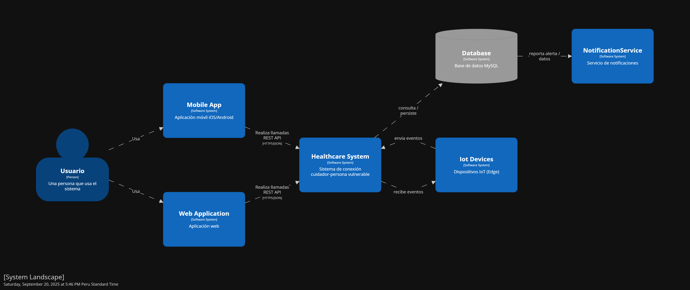
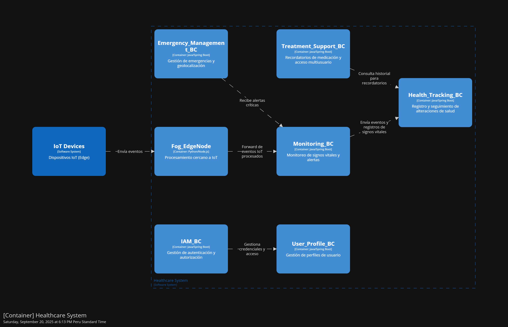

<h1 style="text-align: center;"> Informe del Trabajo Final </h1>
<h3 style="text-align: center;"> Universidad Peruana de Ciencias Aplicadas </h3>

<h5 style="text-align: center"> Área: Ingeniería de Software </h5>

<h5 style="text-align: center"> Curso: Desarrollo de Soluciones IoT </h5>
<h5 style="text-align: center"> NRC: 3428 </h5>

<h5 style="text-align: center"> Docente: Marco Antonio León Baca</h5>

<h5 style="text-align: center"> Startup: ??? </h5>

<h5 style="text-align: center"> Producto: AlertaVital </h5>

## Team members:

  
|                Nombre                 |   Código   |
| :-----------------------------------: | :--------: |
| Bohorquez Lerzundi, Gerardo Sebastián | u202224149 |
|  Huanaco Huayta, Elizabeth Lucero   | u20211g522 |
|  Huapaya Cuevas, Anthony       | u202220235 |
|  Silva Tirado, Sebastian Valentino         | u20211g296 |
|     Uribe Quispe, Jesús Guillermo     | u202221876 |

<h5 style="text-align: center"> Ciclo 2025-02 </h5>

# Registro de Versiones del Informe

El objetivo de esta sección es resumir las modificaciones relevantes que se realizan al informe durante el ciclo de vida del proyecto. Esta sección inicia en una página nueva y se incluye un cuadro con la siguiente estructura:

| Versión | Fecha | Autor | Descripción de modificación |
| :-----: | :---: | :---: | --------------------------- |
|    TB1    |   21/09   |   a   | z                           |

# Project Report Collaboration Insights

URL del repositorio para el reporte del proyecto:

**TB1**

  

  

Para el desarrollo del informe perteneciente a la entrega TF, se dividió la implementación de secciones de la siguiente forma para cada integrante del equipo:

| Integrante | Tareas Asignadas |
| ---------- | ---------------- |
| a          | a                |

**Github Collaboration Insights**

Github también presenta un timeline de las ramas principales y los procesos de merge a los que se han sometido. Todas las ramas se crearon tomando en cuenta el diseño de GitFlow para una buena organización cuando se usa un software de control de versiones.

Los integrantes son:

- Bohórquez Lerzundi, Gerardo Sebastián (Sebasbl562)
- Huanaco Huayta, Elizabeth Lucero (lucerohh)
- Huapaya Cuevas, Anthony (AnthonyHuapaya)
- Silva Tirado, Sebastián Valentino (SebasSilvaT)
- Uribe Quispe, Jesús Guillermo(JesusU27)

# Contenido

1. [**Capítulo I: Introducción.**](#1.)  
   1.1. [Startup Profile.](#1.1.)  
   1.1.1. [Descripción del startup.](#1.1.1.) 
   1.1.2.[Perfiles de los integrantes del equipo.](#1.1.2.) 
   1.2. [Solution Profile.](#1.2.) 
   1.2.1. [Antecedentes y Problemática.](#1.2.1.) 
   1.2.2. [Lean UX Process.](#1.2.2.) 
   1.2.2.1 [Lean UX Problem Statements.](#1.2.2.1.) 
   1.2.2.2. [Lean UX Assumptions.](#1.2.2.2.) 
   1.2.2.3 [Lean UX Hypothesis Statements.](#1.2.2.3.) 
   1.2.2.4 [Lean UX Canvas.](#1.2.2.4.) 
   1.3. [Segmentos objetivo.](#1.3.) 
2. [**Capítulo II: Requirements Elicitation & Analysis.**](#2.) 
   2.1. [Competidores.](#2.1.) 
   2.1.1. [Análisis competitivo.](#2.1.1.) 
   2.1.2. [Estrategias y tácticas frente a competidores.](#2.1.2.) 
   2.2. [Entrevistas.](#2.2.) 
   2.2.1. [Diseño de entrevistas.](#2.2.1.) 
   2.2.2. [Registro de entrevistas.](#2.2.2.) 
   2.2.3. [Análisis de entrevistas.](#2.2.3.) 
   2.3. [Needfinding.](#2.3.) 
   2.3.1. [User Personas.](#2.3.1.) 
   2.3.2. [User Task Matrix.](#2.3.2.) 
   2.3.3. [User Journey Mapping.](#2.3.3.) 
   2.3.4. [Empathy Mapping.](#2.3.4.) 
   2.4. [Big Picture EventStorming](#2.4.) 
   2.5. [Ubiquitous Language](#2.5.) 
3. [**Capítulo III: Requirements Specification.**](#3.) 
   3.1. [User Stories.](#3.1.) 
   3.2. [Impact Mapping.](#3.2.) 
   3.3. [Product Backlog.](#3.3.) 
4. [**Capítulo IV: Solution Software Design.**](#4.) 
   4.1. [Strategic-Level Domain-Driven Design.](#4.1.) 
   4.1.1. [Design-Level EventStorming.](#4.1.1.) 
   4.1.1.1. [Candidate Context Discovery.](#4.1.1.1.) 
   4.1.1.2. [Domain Message Flows Modeling.](#4.1.1.2.) 
   4.1.1.3. [Bounded Context Canvases.](#4.1.1.3.) 
   4.1.2. [Context Mapping.](#4.1.2.) 
   4.1.3. [Software Architecture.](#4.1.3.) 
   4.1.3.1. [Software Architecture System Landscape Diagram.](#4.1.3.1.) 
   4.1.3.2. [Software Architecture Context Level Diagrams.](#4.1.3.2.) 
   4.1.3.3. [Software Architecture Container Level Diagrams.](#4.1.3.3.) 
   4.1.3.4. [Software Architecture Deployment Diagrams.](#4.1.3.4.) 
   4.2. [Tactical-Level Domain-Driven Design.](#4.2.) 
   4.2.5. [Bounded Context: <Bounded Context Name>.](#4.2.5.) 
   4.2.5.1. [Domain Layer.](#4.2.5.1.) 
   4.2.5.2. [Interface Layer.](#4.2.5.2.) 
   4.2.5.3. [Application Layer.](#4.2.5.3.) 
   4.2.5.4. [Infrastructure Layer.](#4.2.5.4.) 
   4.2.5.5. [Bounded Context Software Architecture Component Level Diagrams.](#4.2.5.5.) 
   4.2.5.6. [Bounded Context Software Architecture Code Level Diagrams.](#4.2.5.6.) 
   4.2.5.6.1. [Bounded Context Domain Layer Class Diagrams.](#4.2.5.6.1.) 
   4.2.5.6.2. [Bounded Context Database Design Diagram.](#4.2.5.6.2.) 

5. [Conclusiones](#5.) 
6. [Bibliografía](#6.) 
7. [Anexo](#7.) 

# STUDENT OUTCOME

**ABET – EAC - Student Outcome 5**
La capacidad de funcionar efectivamente en un equipo cuyos miembros juntos proporcionan liderazgo, crean un entorno de colaboración e inclusivo, establecen objetivos, planifican tareas y cumplen objetivos.

<table>
  <thead>
    <tr>
      <th>Criterio específico</th>
      <th>Acciones realizadas</th>
      <th>Conclusiones</th>
    </tr>
  </thead>
  <tbody>
    <tr>
      <td>Trabaja en equipo para proporcionar liderazgo en forma conjunta</td>
      <td>
        Sebastian Silva:  
        TB1: Coordinó la distribución de responsabilidades entre los integrantes del equipo, 
        fomentando la toma de decisiones de manera consensuada. Propuso soluciones 
        ante dificultades técnicas y apoyó a sus compañeros en la comprensión de las tareas asignadas.
      </td>
      <td>
        TB1: Demostró liderazgo compartido, garantizando la participación equitativa de todos los 
        integrantes y promoviendo un ambiente de confianza que facilitó el avance del proyecto.
      </td>
    </tr>
    <tr>
      <td>Crea un entorno colaborativo e inclusivo, establece metas, planifica tareas y cumple objetivos.</td>
      <td>
        Sebastian Silva:  
        TB1: Promovió reuniones periódicas para definir objetivos y plazos, fomentó la 
        participación activa de cada miembro y aseguró que las ideas fueran valoradas por igual. 
        Elaboró un cronograma de actividades y dio seguimiento al cumplimiento de tareas.
      </td>
      <td>
        TB1: Contribuyó a un entorno inclusivo y organizado, donde la planificación permitió 
        alcanzar las metas planteadas en el tiempo previsto y fortaleció la cohesión del equipo.
      </td>
    </tr>
  </tbody>
</table>

<h2>1. Capítulo I: Introducción</h2>

<h3>1.1. Startup Profile</h3>

<h4>1.1.1. Descripción del startup</h4>

AlertaVital es una startup tecnológica dedicada a desarrollar soluciones innovadoras basadas en Internet de las Cosas (IoT) para mejorar la calidad de vida de las personas mayores y sus familias. Nuestra misión es proporcionar herramientas accesibles y confiables que permitan el monitoreo en tiempo real de signos vitales y la detección de caídas, brindando tranquilidad y seguridad tanto a los adultos mayores como a sus cuidadores. A través de un dispositivo portátil y una aplicación móvil intuitiva, AlertaVital busca transformar la manera en que se cuida a los adultos mayores, facilitando la prevención de emergencias y promoviendo un envejecimiento saludable y autónomo.

<h4>1.1.2. Perfiles de los integrantes del equipo</h4>

<table align="center"  border="1" width="70%" style="text-align:center;">
    <tr align="center">
        <td rowspan="3">
             
        </td>
        <td align="left">
            <b>Nombre y Apellido:</b>
             
            Bohorquez Lerzundi, Gerardo Sebastián
        </td>
    </tr>
    <tr>
        <td align="left">
        <b>Carrera:</b>
         
        Ingeniería de Software
        </td>
    </tr>
    <tr>
        <td align="left">
        <b>Acerca de:</b>
          
  Estoy cursando el séptimo semestre de Ingeniería de Software en la Universidad UPC. Me distingo por ser una persona 		ágil, comprometida, asertiva y profundamente ética. En este proyecto, me comprometo a aportar lo mejor de mí, no solo 		para alcanzar los objetivos del equipo, sino también para fomentar un ambiente de trabajo positivo y colaborativo.
        </td>
    </tr>
    <tr align="center">
        <td rowspan="3">
            
        </td>
        <td align="left">
            <b>Nombre y Apellido:</b>
             
            Huanaco Huayta, Elizabeth Lucero
        </td>
    </tr>
    <tr>
        <td align="left">
        <b>Carrera:</b>
         
          Ingeniería de Software 
        </td>
    </tr>
    <tr>
        <td align="left">
        <b>Acerca de:</b>
         
       Estoy en el séptimo ciclo de Ingeniería de Software en la Universidad Peruana de Ciencias Aplicadas. Me considero una persona organizada, resiliente y asertiva. Elegí enfocarme en esta carrera por el interés que tengo en el desarrollo de software, ya que considero que es un área clave para el futuro de la innovación tecnológica. En este proyecto, me comprometo a aplicar mis cualidades y contribuir al logro de los objetivos de mi equipo. 
        </td>
    </tr>
    <tr align="center">
        <td rowspan="3">
            
        </td>
        <td align="left">
            <b>Nombre y Apellido:</b>
             
            Huapaya Cuevas, Anthony Martin
        </td>
    </tr>
    <tr>
        <td align="left">
        <b>Carrera:</b>
         
        Ingeniería de Software
        </td>
    </tr>
    <tr>
        <td align="left">
        <b>Acerca de:</b>
         
        Me encuentro cursando el séptimo ciclo de la carrera de Ingeniería de Software en la Universidad Peruana de Ciencias Aplicadas. Me considero una persona perseverante, fácil de adaptarse con respecto al ambiente de trabajo y responsable. Elegí el desarrollo de esta carrera para los avances tecnológicos con respecto al software, por que es una parte fundamental para lograr ese objetivo. Me comprometo con este trabajo mantener un ambiente sano en el equipo y apoyar constantemente con el avance de este.
        </td>
    </tr>
    <tr align="center">
        <td rowspan="3">
            
        </td>
        <td align="left">
            <b>Nombre y Apellido: </b>
             
            Silva Tirado, Sebastián Valentino
        </td>
    </tr>
    <tr>
        <td align="left">
        <b>Carrera:</b>
         
        Ingenieria de Software
        </td>
    </tr>
    <tr>
        <td align="left">
        <b>Acerca de:</b>
         
         Soy estudiante del octavo ciclo de la carrera de Ingeniería de Software en UPC. Opté por estudiar esta carrera porque me gusta la idea de programar y crear algo que pueda llegar a funcionar y ser útil en el mundo. Por lo cual, la universidad me da la posibilidad de estudiar y ser un profesional exitoso. Deseo ser buen integrante para mi equipo y me comprometo en hacer el mejor trabajo posible, y poder superarme más que el ciclo anterior.
        </td>
    </tr>
    <tr align="center">
        <td rowspan="3">
            
        </td>
        <td align="left">
            <b>Nombre y Apellido:</b>
             
            Uribe Quispe, Jesús Guillermo
        </td>
    </tr>
    <tr>
        <td align="left">
        <b>Carrera:</b>
         
        Ingeniería de Software
        </td>
    </tr>
    <tr>
        <td align="left">
        <b>Acerca de:</b>
         
        Soy estudiante de Ingenieria de Software en la UPC y actualmente estoy en el 7to ciclo. Elegí esta carrera porque me interesó el campo del software y la matemáticas. Me comprometo a
    ayudar a mis compañeros con el trabajo asi como también fuera de este.
        </td>
    </tr>
   
</table>

<h3>1.2. Solution Profile</h3>

<h4>1.2.1. Antecedentes y Problemática</h4>

**Antecedentes:**

El envejecimiento poblacional es un fenómeno global y particularmente relevante en Latinoamérica. En Perú, según el INEI (2022), la población de adultos mayores supera el 13% del total, con proyecciones de crecimiento constante en las próximas décadas. Este grupo etario presenta un incremento en la prevalencia de enfermedades crónicas no transmisibles (hipertensión, diabetes, enfermedades cardiovasculares), las cuales requieren un monitoreo continuo de signos vitales. 

Paralelamente, la Organización Mundial de la Salud (OMS, 2021) advierte que las caídas son la segunda causa mundial de muertes por lesiones accidentales, afectando principalmente a adultos mayores. Los dispositivos IoT aplicados a la telemedicina se han convertido en una alternativa de apoyo para la prevención y respuesta temprana, ya que permiten el registro en tiempo real de parámetros fisiológicos y eventos de riesgo, brindando a los cuidadores o familiares alertas inmediatas. 

Sin embargo, en el contexto peruano y de Lima Metropolitana, el acceso a estas tecnologías aún es limitado, con soluciones costosas o poco adaptadas a la realidad socioeconómica local. Esto abre la necesidad de investigar y desarrollar herramientas accesibles que permitan mejorar la calidad de vida de las personas mayores y la tranquilidad de sus familias. 

**Problemática:**

La población adulta mayor enfrenta riesgos significativos relacionados con el deterioro de la salud y la vulnerabilidad a caídas. Actualmente, el monitoreo de sus signos vitales suele ser esporádico y depende de consultas médicas presenciales, lo que retrasa la detección de anomalías. Asimismo, muchas caídas ocurren en el hogar sin supervisión inmediata, aumentando la probabilidad de complicaciones graves. 

Si bien existen dispositivos en el mercado, su alto costo, falta de personalización y limitada integración con sistemas de alerta dificultan su adopción en el entorno local. Esto genera un vacío tecnológico que afecta tanto a los adultos mayores como a sus familiares y cuidadores, quienes requieren herramientas eficaces para prevenir riesgos y actuar con rapidez ante emergencias. 

**WHAT (Qué): ¿Cuál es el problema?**

El problema es la falta de monitoreo continuo y accesible de signos vitales y detección de caídas en adultos mayores, lo que ocasiona diagnósticos tardíos, complicaciones y aumento del riesgo de mortalidad.

**WHEN (Cuándo): ¿Cuándo sucede el problema?**

El problema ocurre de manera cotidiana, especialmente durante los momentos en que la persona mayor se encuentra sola en casa o sin supervisión médica inmediata.

**WHERE (Dónde): ¿Dónde surge el problema?**

Surge principalmente en el hogar y en entornos donde no existe personal de salud presente de forma constante, siendo un problema frecuente en zonas urbanas con alta población adulta mayor, como Lima Metropolitana.

**WHO (Quién): ¿A quiénes les sucede el problema?**

Afecta directamente a los adultos mayores, y de manera indirecta a sus familiares, cuidadores y al sistema de salud, que enfrenta mayores costos por hospitalizaciones derivadas de caídas o descompensaciones no detectadas a tiempo.

**WHY (Por qué): ¿Cuál es la causa del problema?**

Las causas principales son:

- Falta de acceso a herramientas tecnológicas de monitoreo.

- Alto costo de los dispositivos especializados.

- Limitada cultura de prevención en salud geriátrica.

- Ausencia de soluciones adaptadas al contexto local.

**HOW (Cómo): ¿Cómo llevó a los involucrados a llegar a esta situación?**

La combinación de factores económicos, tecnológicos y sociales ha llevado a que los adultos mayores permanezcan sin supervisión adecuada de sus parámetros vitales, exponiéndose a eventos de riesgo sin respuesta inmediata, lo que incrementa la carga emocional y económica de las familias.

**HOW MUCH (Cuánto): ¿Cuánto afecta el problema?**

El problema afecta a más del 13% de la población peruana (adultos mayores), y las caídas representan aproximadamente el 30% de las consultas de emergencia en este grupo etario (OPS, 2020). Además, los costos hospitalarios derivados de caídas y complicaciones médicas son elevados, impactando tanto a los hogares como al sistema de salud nacional.

<h4>1.2.2. Lean UX Process</h4>

<h5>1.2.2.1. Lean UX Problem Statements</h5>

En la actualidad, el cuidado de los adultos mayores representa un gran reto debido a la falta de mecanismos accesibles y confiables para monitorear su estado de salud y seguridad en tiempo real. Este desafío se acentúa en contextos donde muchos adultos mayores viven solos o pasan gran parte del día sin supervisión constante, lo que incrementa el riesgo ante emergencias como caídas o alteraciones en sus signos vitales. Garantizar una atención oportuna en este entorno es fundamental para prevenir complicaciones, mejorar la calidad de vida y ofrecer tranquilidad tanto a los adultos mayores como a sus familias.

Actualmente, las familias y cuidadores aún dependen de visitas presenciales o llamadas telefónicas para conocer el estado de sus seres queridos, lo que genera incertidumbre, tiempos de respuesta lentos y, en ocasiones, falta de información médica precisa para la toma de decisiones. La ausencia de una solución tecnológica integral limita la capacidad de detectar emergencias de manera inmediata y de contar con un registro histórico de la salud del adulto mayor, dificultando así la prevención y el seguimiento adecuado de su bienestar.

¿Cómo podemos desarrollar una solución integral basada en dispositivos IoT y una aplicación móvil que permita a los cuidadores o familiares monitorizar en tiempo real los signos vitales y posibles caídas de los adultos mayores, generando alertas inmediatas y un historial accesible, de manera que se incremente la seguridad, se optimice el cuidado y se brinde mayor tranquilidad a todos los involucrados?

<h5>1.2.2.2. Lean UX Assumptions</h5>

**Business Assumptions** 

* Creemos que nuestros clientes necesitan una mejor forma de monitorear el estado de salud y seguridad de los adultos mayores, especialmente en lo relacionado con el registro de signos vitales, la detección de caídas y la generación de alertas inmediatas para familiares o cuidadores.

* Estas necesidades se pueden resolver mediante el uso de un dispositivo IoT portátil conectado a una aplicación móvil, que permita la recolección de datos en tiempo real, la centralización de información de salud y el envío de notificaciones en caso de emergencia.

* Los clientes principales son los tutores de los adultos mayores, quienes buscan 
tranquilidad y rapidez en la respuesta ante emergencias. Sin embargo, la solución también está diseñada para beneficiar directamente a los adultos mayores, al ofrecerles mayor seguridad en su vida cotidiana.

* El valor #1 que busca el cliente es contar con un sistema accesible y confiable que incremente la seguridad y bienestar de los adultos mayores, a la vez que brinde tranquilidad a los tutores mediante la detección temprana de emergencias y un monitoreo continuo de la salud.

* El cliente también puede obtener beneficios adicionales gracias a la flexibilidad y escalabilidad de la solución, que permitirá integrar nuevas métricas de salud como oxigenación, presión arterial y frecuencia cardíaca, además de incluir la capacidad de realizar llamadas a los servicios de emergencia y a los contactos registrados. Asimismo, se podrán generar reportes sobre posibles alteraciones detectadas en el estado de salud.

* Vamos a adquirir la mayoría de los clientes mediante el uso de marketing digital dirigido a familias y asociaciones de adultos mayores, además de alianzas con centros de salud, hogares geriátricos y ONGs, lo que permitirá ampliar la red de usuarios y aumentar la visibilidad de la solución.

* Se hará dinero a través de la venta del dispositivo IoT acompañado de un pago único por el acceso de la aplicación, aplicando cuotas bajas por el soporte y mantenimiento de la aplicación y el dispositivo.

* Nuestra competencia principal en el mercado son las aplicaciones y dispositivos de monitoreo de salud y caídas ya existentes, aunque muchos presentan precios elevados, falta de integración de funciones o interfaces poco intuitivas para adultos mayores.

* Los venceremos gracias al uso de tecnología accesible, un enfoque integral en seguridad y salud, y una experiencia de usuario optimizada tanto para los adultos mayores como para sus cuidadores. Además, ofreceremos soporte técnico cercano y constantes mejoras de la aplicación.

* Nuestro mayor riesgo es que los adultos mayores y sus familias desconfíen o sean reacios al uso de nuevas tecnologías.

* Resolveremos esto a través de demostraciones claras, interfaces simples y un soporte al cliente enfocado en la capacitación, de modo que la adaptación al sistema sea rápida, amigable y sin complicaciones.

**Assumptions Worksheet** 

**¿Quién es el usuario?**
Los usuarios son los adultos mayores y sus tutores, quienes necesitan una solución confiable para monitorear la salud y la seguridad en tiempo real. El usuario principal son los tutores, quienes toman decisiones sobre herramientas tecnológicas y buscan soluciones que ofrezcan tranquilidad, respuesta rápida ante emergencias y un mejor cuidado para sus seres queridos.

**¿Dónde encaja nuestro producto en su trabajo o vida?**
Nuestra aplicación móvil junto con el dispositivo IoT se integra en la vida diaria del adulto mayor y su entorno familiar. El dispositivo acompaña al adulto mayor durante todo el día, mientras que la aplicación permite a los tutores monitorear signos vitales, recibir alertas ante caídas y acceder a un historial de salud, convirtiéndose en una herramienta esencial para incrementar la seguridad, optimizar el cuidado y brindar confianza.

**¿Qué problemas tiene nuestro producto? ¿Resolver?**
El desafío que enfrentan los usuarios es la falta de monitoreo constante cuando los adultos mayores están solos, el riesgo de caídas sin asistencia inmediata y la ausencia de información médica histórica que dificulta el seguimiento de la salud. También puede existir resistencia por parte de algunos adultos mayores al uso de nuevas tecnologías o la desconfianza inicial de las familias hacia la precisión del sistema.

**¿Cuándo y cómo es nuestro producto usado?**
La aplicación y el dispositivo IoT tienen un uso diario. El adulto mayor porta el dispositivo durante sus actividades cotidianas, mientras que los tutores utilizan la aplicación para monitorear en tiempo real, recibir notificaciones ante emergencias y consultar el historial de eventos o signos vitales.

**¿Qué características son importantes?**
Las principales características son el monitoreo en tiempo real de signos vitales y caídas, el envío de alertas automáticas inmediatas, un historial accesible con reportes de salud y una interfaz simple e intuitiva.

**¿Cómo debe verse nuestro producto y cómo comportarse?**
Debe verse limpio, amigable y confiable, transmitiendo seguridad y accesibilidad para el ámbito de salud y cuidado. La aplicación debe responder rápidamente a las acciones del usuario con una navegación sencilla presentar paneles claros con información organizada y notificaciones inmediatas.

<h5>1.2.2.3. Lean UX Hypothesis Statements</h5>

**Creemos que**, al incorporar un módulo de monitoreo en tiempo real de signos vitales y caídas, se incrementará la seguridad y tranquilidad de los adultos mayores y sus familias. Sabremos que tenemos éxito cuando logremos una reducción del 70% en incidentes no atendidos a tiempo y una respuesta más rápida por parte de los tutores.

**Creemos que**, al ofrecer reportes resumidos sobre los signos vitales y eventos de caídas, los tutores podrán tomar decisiones más informadas para el cuidado del adulto mayor. Sabremos que estamos cumpliendo este objetivo cuando los cuidadores consulten regularmente los reportes y se observe una mejora del 50% en la prevención y seguimiento de la salud.

**Creemos que**, al incorporar un sistema de alertas automáticas y notificaciones inmediatas a los servicios de emergencia y números registrados, se mejorará la capacidad de respuesta ante emergencias. Sabremos que estamos cumpliendo este objetivo cuando el 80% de las alertas generadas reciban una atención oportuna.

<h5>1.2.2.4. Lean UX Canvas</h5>

El Lean UX Canvas permitió estructurar y validar las hipótesis del proyecto, que busca ofrecer un dispositivo IoT con aplicación móvil para el monitoreo de adultos mayores. Con esta herramienta se identificaron los principales problemas, como la falta de monitoreo constante y el riesgo de caídas, los usuarios clave, como los adultos mayores y los tutores, así como los supuestos críticos y riesgos, como la resistencia a nuevas tecnologías. Además, el canvas ayudó a priorizar las funcionalidades esenciales y una interfaz simple, garantizando que la solución se enfoque en generar seguridad, confianza y valor real para los usuarios.  

<h3>1.3. Segmentos objetivo</h3>

En esta sección, definiremos los perfiles específicos del público objetivo para nuestro brazalete inteligente. Estos grupos comparten características demográficas, comportamientos o necesidades similares, lo que les diferencia de otros segmentos del mercado y permite ajustar estrategias para satisfacer sus necesidades de una mejor manera.

### 1. Personas de edad avanzada o individuos con enfermedades cardiovasculares
- **Segmento demográfico:**  
  Personas mayores de 60 años en Perú, que representan cerca del 12,4 % de la población total (aproximadamente 4,1 millones en 2023), con una prevalencia de hipertensión arterial del 29,7 % y un 66 % con enfermedades crónicas como diabetes o patologías cardiovasculares (INEI, 2023; MINSA, 2023).  
- **Segmento geográfico:**  
  Residentes en áreas urbanas, especialmente en Lima Metropolitana, donde el 43,2 % de los hogares incluye al menos un adulto mayor (INEI, 2023).  
- **Segmento psicográfico:**  
  Individuos preocupados por su salud y seguridad, que valoran la tranquilidad de contar con monitoreo continuo para prevenir o manejar emergencias médicas como desmayos, arritmias o crisis hipertensivas.  
- **Segmento conductual:**  
  Personas que necesitan monitoreo constante de signos vitales (pulso, respiración, saturación) y alertas automáticas ante condiciones críticas. El brazalete inteligente satisface esta necesidad al proporcionar monitoreo en tiempo real y notificaciones inmediatas.

### 2. Cuidadores o contactos de emergencia de los usuarios
- **Segmento demográfico:**  
  Cuidadores familiares, mayormente sin capacitación formal, que conviven en más de 4,4 millones de hogares con un adulto mayor o paciente crónico. Aproximadamente el 31 % presenta síntomas depresivos, y el 44 % ha dejado su empleo para dedicarse al cuidado (OPS, 2023).  
- **Segmento geográfico:**  
  Principalmente en áreas urbanas de Perú, con alta concentración en Lima Metropolitana, donde la convivencia con adultos mayores o pacientes crónicos es común (OPS, 2023).  
- **Segmento psicográfico:**  
  Cuidadores que enfrentan alto estrés, sobrecarga emocional y mental (más del 70 % reporta sobrecarga intensa), y buscan herramientas que les brinden seguridad y reduzcan la incertidumbre al cuidar de sus seres queridos.  
- **Segmento conductual:**  
  Cuidadores que necesitan recibir alertas inmediatas ante emergencias de salud para intervenir rápidamente. El brazalete inteligente les ofrece monitoreo continuo del paciente y notificaciones automáticas, aliviando su carga emocional y mejorando su capacidad de respuesta.  

<h2>2. Capítulo II: Requirements Elicitation & Analysis</h2>

<h3>2.1. Competidores</h3>

<h4>2.1.1. Análisis competitivo</h4>

<h4>2.1.2. Estrategias y tácticas frente a competidores</h4>

- Diseñaremos un sistema de monitoreo accesible y fácil de usar, con una interfaz pensada tanto para adultos mayores como para familiares y cuidadores. La navegación será intuitiva, con alertas visuales y auditivas claras, además de un soporte técnico adaptado al usuario final, garantizando la confianza y la rápida adopción de la herramienta.

- Diferenciaremos nuestra propuesta con la integración del sensor de caídas, que no solo enviará alertas automáticas, sino que también permitirá confirmar el estado del paciente a través de la aplicación móvil. Esta característica clave nos permitirá superar a competidores que solo ofrecen monitoreo de signos vitales sin una respuesta integral frente a emergencias.

- Fortaleceremos la credibilidad de nuestra solución a través de experiencias reales, incorporando testimonios de familiares, cuidadores y profesionales de la salud que validen la utilidad del sistema. Estas historias de éxito serán empleadas en nuestras campañas de marketing y materiales informativos para generar confianza en nuevos usuarios.

<h3>2.2. Entrevistas</h3>

Esta sección recopila la información obtenida a partir de entrevistas realizadas a adultos mayores y cuidadores responsables de su atención. Se incluyen las preguntas formuladas, las entrevistas realizadas y un análisis comparativo. El objetivo es comprender sus necesidades, hábitos actuales y percepciones para fundamentar el desarrollo de una solución IoT adecuada a su entorno real.

<h4>2.2.1. Diseño de entrevistas</h4>

### Preguntas para Adultos Mayores

1. ¿Cuál es su nombre y edad?
2. ¿Con quién vive actualmente (solo, con familia, en residencia)?
3. ¿Qué enfermedades o condiciones de salud crónicas le han diagnosticado (ej. hipertensión, diabetes, problemas cardíacos)?
4. ¿Con qué frecuencia acude a controles médicos o revisiones de rutina?
5. ¿Ha sufrido caídas en el último año? ¿Podría contarme qué pasó y cómo reaccionaron sus familiares?
6. ¿En qué momentos del día suele estar solo(a) en casa?
7. ¿Qué tanta confianza tiene en el uso de dispositivos electrónicos (celulares, relojes inteligentes, pulseras, etc.)?
8. ¿Ha usado antes algún aparato o dispositivo para medir su presión, ritmo cardíaco u otros signos vitales? ¿Cómo fue su experiencia?
9. ¿Qué tan cómodo se sentiría utilizando un dispositivo pequeño (ej. pulsera, reloj o colgante) que monitoree su salud y detecte caídas?
10. ¿Le resultaría útil que sus familiares reciban alertas inmediatas si sufre una caída o alguna alteración de sus signos vitales?
11. ¿Qué aspectos le generarían desconfianza o preocupación (precio, privacidad, dificultad de uso, batería, etc.)?
12. ¿Qué características considera más importantes en un dispositivo de este tipo (ej. fácil de usar, discreto, resistente, económico)?

### Preguntas para Cuidadores / Familiares

1. ¿Cuál es su relación con el adulto mayor (hijo/a, nieto/a, cuidador contratado, etc.)?
2. ¿Con qué frecuencia se encuentra a cargo de su cuidado (diariamente, algunas horas, solo en emergencias)?
3. ¿Qué actividades cotidianas le generan mayor preocupación respecto al adulto mayor (movilidad, alimentación, medicación, caídas, etc.)?
4. ¿Ha tenido alguna experiencia previa con caídas o emergencias médicas de su familiar? ¿Cómo fue el proceso de atención?
5. ¿Actualmente utilizan algún dispositivo o aplicación para monitorear su salud? ¿Cuál y cómo lo valoran?
6. ¿Qué tan importante considera tener información en tiempo real sobre signos vitales (ej. presión, pulso, oxigenación)?
7. ¿Cómo preferiría recibir alertas en caso de emergencias (notificación en app, llamada, SMS, correo)?
8. ¿Cuáles serían las principales barreras para implementar un dispositivo de este tipo en su hogar (costo, conectividad, resistencia del adulto mayor a usarlo)?
9. ¿Qué tan dispuesto estaría a invertir en un sistema IoT de monitoreo? ¿Qué rango de precio considera accesible?
10. Si pudiera diseñar este sistema, ¿qué funciones serían prioritarias para usted (ej. botón de emergencia, historial de datos, geolocalización, recordatorio de medicación)?
11. ¿Qué expectativas tendría en términos de seguridad y confiabilidad del dispositivo?
12. ¿Cómo cree que un sistema de este tipo impactaría en su tranquilidad y en la calidad de vida del adulto mayor?

<h4>2.2.2. Registro de entrevistas</h4>

### Segmento 1: Adultos Mayores

<table style="width: 100%; border-collapse: collapse;">
    <tr>
        <td>Entrevistado N°1</td>
        <td>Rosa Valera</td>
    </tr> 
    <tr>
        <td>Edad</td>
        <td>65</td>
    </tr> 
    <tr>
        <td>Distrito de residencia</td>
        <td>San Luis</td>
    </tr> 
    <tr>
        <td></td>
        <td>Rosa Valera es una mujer de 65 años que vive en San Luis. Ella ha tenido resbalones en el último año y se siente insegura al estar sola en casa. Rosa tiene confianza en el uso de dispositivos electrónicos, pero no ha utilizado dispositivos para medir su salud. Le gustaría un dispositivo que monitoree su salud y alerte a sus familiares en caso de emergencia.</td>
    </tr> 
    <tr>
        <td>Timing: 0:00 - 03:55</td>
        <td>URL: <a href="https://upcedupe-my.sharepoint.com/:v:/g/personal/u20211g296_upc_edu_pe/ESKRjQ6V36JEqGVMCOh_FykB88evkHckHIWId9gACrKSiQ?e=IguKBR" target="_blank">Link del Video</a></td>
    </tr> 
    <tr>
        <td>Entrevistado N°2</td>
        <td>XXX</td>
    </tr> 
    <tr>
        <td>Edad</td>
        <td>XX</td>
    </tr> 
    <tr>
        <td>Distrito de residencia</td>
        <td>XXX</td>
    </tr> 
    <tr>
        <td></td>
        <td>XXX</td>
    </tr> 
    <tr>
        <td>Timing: XX:XX - XX:XX</td>
        <td>URL: <a href="Link" target="_blank">Link del Video</a></td>
    </tr> 
    <tr>
        <td>Entrevistado N°3</td>
        <td>XXX</td>
    </tr> 
    <tr>
        <td>Edad</td>
        <td>XX</td>
    </tr> 
    <tr>
        <td>Distrito de residencia</td>
        <td>XXX</td>
    </tr> 
    <tr>
        <td></td>
        <td>XXX</td>
    </tr> 
    <tr>
        <td>Timing: XX:XX - XX:XX</td>
        <td>URL: <a href="Link" target="_blank">Link del Video</a></td>
    </tr> 
</table>

### Segmento 2: Cuidadores / Familiares

<table style="width: 100%; border-collapse: collapse;">
    <tr>
        <td>Entrevistado N°1</td>
        <td>Marcia Rea Gamboa</td>
    </tr> 
    <tr>
        <td>Edad</td>
        <td>21</td>
    </tr> 
    <tr>
        <td>Distrito de residencia</td>
        <td>Comas</td>
    </tr> 
    <tr>
        <td></td>
        <td>Marcia Rea es una joven que cuida de su abuela, que no se puede cuidar por si misma. Ella busca constantemente herramientas que le permitan monitorear la salud de su abuela a distancia.</td>
    </tr> 
    <tr>
        <td>Timing: 0:00 - 07:47</td>
        <td>URL: <a href="https://upcedupe-my.sharepoint.com/:v:/g/personal/u20211g296_upc_edu_pe/ETxQdwbt6H5Kj1H0uXgnM6oBMbe7RCKMEzGafqzc-72-Rw?e=cauX0q" target="_blank">Link del Video</a></td>
    </tr> 
    <tr>
        <td>Entrevistado N°2</td>
        <td>XXX</td>
    </tr> 
    <tr>
        <td>Edad</td>
        <td>XX</td>
    </tr> 
    <tr>
        <td>Distrito de residencia</td>
        <td>XXX</td>
    </tr> 
    <tr>
        <td></td>
        <td>XXX</td>
    </tr> 
    <tr>
        <td>Timing: XX:XX - XX:XX</td>
        <td>URL: <a href="Link" target="_blank">Link del Video</a></td>
    </tr> 
    <tr>
        <td>Entrevistado N°3</td>
        <td>XXX</td>
    </tr> 
    <tr>
        <td>Edad</td>
        <td>XX</td>
    </tr> 
    <tr>
        <td>Distrito de residencia</td>
        <td>XXX</td>
    </tr> 
    <tr>
        <td></td>
        <td>XXX</td>
    </tr> 
    <tr>
        <td>Timing: XX:XX - XX:XX</td>
        <td>URL: <a href="Link" target="_blank">Link del Video</a></td>
    </tr> 
</table>

<h4>2.2.3. Análisis de entrevistas</h4>

### Análisis del segmento de adultos mayores

Los adultos mayores entrevistados valoran la posibilidad de contar con un dispositivo IoT que les brinde seguridad dentro de su propio hogar, especialmente en relación con la detección de caídas y el monitoreo de signos vitales. El 100% coincidió en que la principal ventaja sería la tranquilidad de sentirse acompañados incluso cuando están solos, reduciendo el miedo a sufrir un accidente sin asistencia. Asimismo, la mayoría destacó que un dispositivo ligero, cómodo y fácil de usar es esencial para garantizar la adopción.

En general, los adultos mayores consideran que esta solución IoT puede mejorar su autonomía y calidad de vida, siempre que se prioricen el diseño ergonómico, la facilidad de uso y el acompañamiento inicial en el aprendizaje.

### Análisis del segmento de cuidadores/familiares

Los cuidadores entrevistados valoran de manera significativa la posibilidad de recibir alertas inmediatas en sus celulares en caso de caídas o alteraciones en los signos vitales de sus familiares. El 100% consideró que la función más importante es la respuesta rápida en emergencias, ya que actualmente dependen de llamadas telefónicas o visitas presenciales que no siempre son oportunas. Un 70% resaltó la utilidad de contar con un historial digital de signos vitales, que facilite la comunicación con médicos en controles regulares.

En general, los cuidadores perciben el sistema IoT como una herramienta clave para reducir la ansiedad y garantizar la seguridad de los adultos mayores, aunque insisten en la necesidad de optimizar la precisión, la usabilidad de la aplicación y el costo de implementación.

<h3>2.3. Needfinding</h3>

<h4>2.3.1. User Personas</h4>

 
**a. User Persona de un adulto mayor**

**b. User Persona de un Cuidador**

<h4>2.3.2. User Task Matrix</h4>

**a. User Task Matriz a un adulto mayor**

A continuación, se presenta una matriz de tareas enfocada en María Luisa Ramírez, una adulta mayor que representa al segmento de usuarios principales de la pulsera inteligente. Esta herramienta permite identificar y clasificar las actividades clave que realiza en su día a día, considerando la frecuencia con la que las lleva a cabo y el nivel de importancia que representan dentro de su vida cotidiana.  

<table border="1">
  <thead>
    <tr>
      <th rowspan="2">Tarea</th>
      <th colspan="2">María Luisa Ramírez</th>
    </tr>
    <tr>
      <th>Frecuencia</th>
      <th>Importancia</th>
    </tr>
  </thead>
  <tbody>
    <tr>
      <td>Medirse la presión arterial o pulso</td>
      <td>Media</td>
      <td>Alta</td>
    </tr>
    <tr>
      <td>Asistir a controles médicos</td>
      <td>Baja</td>
      <td>Alta</td>
    </tr>
    <tr>
      <td>Recordar tomar medicinas</td>
      <td>Alta</td>
      <td>Alta</td>
    </tr>
    <tr>
      <td>Pedir ayuda en caso de mareos/caída</td>
      <td>Baja</td>
      <td>Muy Alta</td>
    </tr>
    <tr>
      <td>Caminar dentro de casa o salir a comprar</td>
      <td>Alta</td>
      <td>Media</td>
    </tr>
    <tr>
      <td>Comunicarse con su hija por teléfono</td>
      <td>Media</td>
      <td>Alta</td>
    </tr>
    <tr>
      <td>Usar un dispositivo digital (celular/tensiómetro)</td>
      <td>Baja</td>
      <td>Media</td>
    </tr>
  </tbody>
</table>
 

 Del análisis de la matriz de tareas de María Luisa Ramírez, se destaca que las actividades más críticas son recordar tomar medicinas, controlar signos vitales y pedir ayuda en caso de emergencia. Aunque no todas son frecuentes, tienen alta o muy alta importancia, ya que afectan directamente a su salud y seguridad. Una solución digital debe priorizar la automatización de alertas y la simplicidad de uso, garantizando que no dependa de interacciones complejas para mantenerse protegida.

 **b. User Task Matriz a un Cuidador**

 A continuación, se presenta una matriz de tareas enfocada en Juan Carlos Herrera, cuidador principal de su madre adulta mayor. Esta herramienta permite identificar y clasificar las actividades clave que realiza en su rol de cuidador, considerando la frecuencia con la que las lleva a cabo y el nivel de importancia que representan dentro de su rutina diaria.  

<table border="1">
  <thead>
    <tr>
      <th rowspan="2">Tarea</th>
      <th colspan="2">Juan Carlos Herrera</th>
    </tr>
    <tr>
      <th>Frecuencia</th>
      <th>Importancia</th>
    </tr>
  </thead>
  <tbody>
    <tr>
      <td>Supervisar la salud de su madre</td>
      <td>Alta</td>
      <td>Muy Alta</td>
    </tr>
    <tr>
      <td>Recibir alertas de emergencias</td>
      <td>Baja (eventual)</td>
      <td>Muy Alta</td>
    </tr>
    <tr>
      <td>Organizar citas médicas y transporte</td>
      <td>Media</td>
      <td>Alta</td>
    </tr>
    <tr>
      <td>Recordar y controlar medicación</td>
      <td>Alta</td>
      <td>Alta</td>
    </tr>
    <tr>
      <td>Revisar reportes de signos vitales</td>
      <td>Media</td>
      <td>Alta</td>
    </tr>
    <tr>
      <td>Coordinar con otros familiares el cuidado</td>
      <td>Media</td>
      <td>Media</td>
    </tr>
    <tr>
      <td>Trabajar de manera remota (equilibrio trabajo-cuidado)</td>
      <td>Alta</td>
      <td>Alta</td>
    </tr>
  </tbody>
</table>
 

 Del análisis de la matriz de tareas de Juan Carlos Herrera, se evidencia que las tareas de mayor relevancia son supervisar la salud, recibir alertas de emergencias y controlar la medicación. Aunque algunas (como emergencias) no son frecuentes, su impacto es crítico. Un sistema de monitoreo que brinde alertas inmediatas, reportes confiables y funciones de seguimiento en tiempo real es clave para brindarle tranquilidad, optimizar su tiempo y reducir la sobrecarga emocional asociada al cuidado.

<h4>2.3.3. User Journey Mapping</h4>

### User Journey Map – Adulto Mayor

</img>

### User Journey Map – Cuidador/Familiar

</img>

<h4>2.3.4. Empathy Mapping</h4>

### User Journey Map – Adulto Mayor

</img>

### User Journey Map – Cuidador/Familiar

</img>

<h3>2.4. Big Picture EventStorming</h3>

<h3>2.5. Ubiquitous Language</h3>

<h2>3. Capítulo III: Requirements Specification</h2>

<h3>3.1. User Stories</h3>

<table class="tg"><thead>
  <tr>
    <th class="tg-0pky">Epic / Story ID</th>
    <th class="tg-0pky">Título</th>
    <th class="tg-0pky">Descripción</th>
    <th class="tg-0pky">Criterios de Aceptación</th>
    <th class="tg-0pky">Relacionado con (Epic ID)</th>
  </tr></thead>
<tbody>
  <tr style="background-color:#f2f2f2;">
  <td>EP001</td>
  <td>Autenticación y Gestión de Cuenta</td>
  <td>Este Epic reúne todas las funcionalidades relacionadas con el acceso inicial del usuario a la aplicación, incluyendo el registro, inicio de sesión y recuperación de credenciales en caso de olvido.</td>
  <td></td>
  <td></td>
</tr>
  <tr>
    <td class="tg-0pky">US01</td>
    <td class="tg-lboi">Registrar usuario</td>
    <td class="tg-lboi">Como adulto mayor o cuidador, quiero registrarme en la aplicación para acceder a los servicios de monitoreo.</td>
    <td class="tg-0pky">Escenario 1: El usuario ingresa al registro. Dado que el usuario desea crear una cuenta Cuando complete los datos solicitados en el formulario de registro Y seleccione el botón Registrarme Entonces la aplicación confirmará el registro y redirigirá al inicio de sesión.</td>
    <td class="tg-lboi">EP001</td>
  </tr>
  <tr>
    <td class="tg-0pky">US02</td>
    <td class="tg-lboi">Iniciar sesión</td>
    <td class="tg-lboi">Como usuario, quiero iniciar sesión para acceder a mi perfil y datos de salud.</td>
    <td class="tg-0pky">Escenario 1: Inicio de sesión válido. Dado que el usuario tiene una cuenta registrada Cuando ingrese correo y contraseña correctos Entonces accederá a la pantalla principal.</td>
    <td class="tg-lboi">EP001</td>
  </tr>
  <tr>
    <td class="tg-0pky">US03</td>
    <td class="tg-lboi">Recuperar cuenta</td>
    <td class="tg-lboi">Como usuario, quiero recuperar mi cuenta en caso de olvidar mis credenciales.</td>
    <td class="tg-0pky">Escenario 1: Recuperación de contraseña. Dado que el usuario olvidó su contraseña Cuando solicite recuperación e ingrese su correo Entonces recibirá un enlace de restablecimiento.</td>
    <td class="tg-lboi">EP001</td>
  </tr>
  <tr style="background-color:#f2f2f2;">
  <td>EP002</td>
  <td>Gestión de Perfil de Usuario</td>
  <td>Agrupa las funcionalidades orientadas a la administración de los datos personales del usuario. Incluye la visualización del perfil y la actualización de credenciales (contraseña y correo).</td>
  <td></td>
  <td></td>
</tr>
  <tr>
    <td class="tg-0pky">US04</td>
    <td class="tg-lboi">Ver perfil</td>
    <td class="tg-lboi">Como usuario, quiero visualizar mi información personal registrada en la aplicación.</td>
    <td class="tg-0pky">Escenario 1: Visualización correcta. Dado que el usuario está autenticado Cuando acceda a la sección Perfil Entonces podrá ver sus datos registrados. </td>
    <td class="tg-lboi">EP002</td>
  </tr>
  <tr>
    <td class="tg-0pky">US05</td>
    <td class="tg-lboi">Cambiar datos personales</td>
    <td class="tg-lboi">Como usuario, quiero actualizar mis datos personales para mantener mi información al día.</td>
    <td class="tg-0pky">Escenario 1: Actualización exitosa. Dado que el usuario está autenticado Cuando modifique sus datos y guarde cambios Entonces la aplicación confirmará la actualización.</td>
    <td class="tg-lboi">EP002</td>
  </tr>
  <tr>
    <td class="tg-0pky">US06</td>
    <td class="tg-lboi">Cambiar contraseña</td>
    <td class="tg-lboi">Como usuario, quiero cambiar mi contraseña para mantener mi cuenta segura.</td>
    <td class="tg-0pky">Escenario 1: Cambio exitoso. Dado que el usuario está en su perfil Cuando solicite cambiar contraseña e ingrese la nueva Entonces el sistema actualizará la credencial.</td>
    <td class="tg-lboi">EP002</td>
  </tr>
  <tr>
    <td class="tg-0pky">US07</td>
    <td class="tg-lboi">Cambiar correo</td>
    <td class="tg-lboi">Como usuario, quiero actualizar mi correo electrónico para recibir notificaciones en la cuenta correcta.</td>
    <td class="tg-0pky">Escenario 1: Cambio de correo. Dado que el usuario está autenticado Cuando ingrese un nuevo correo válido Entonces el sistema lo registrará como nuevo correo de contacto.</td>
    <td class="tg-lboi">EP002</td>
  </tr>
  <tr style="background-color:#f2f2f2;">
  <td>EP003</td>
  <td>Monitoreo de Signos Vitales</td>
  <td>Este epic abarca la visualización de parámetros fisiológicos captados en tiempo real por el dispositivo IoT, permitiendo al usuario consultar su frecuencia cardiaca, presión arterial y niveles de oxigenación.</td>
  <td></td>
  <td></td>
</tr>
  <tr>
    <td class="tg-0pky">US08</td>
    <td class="tg-lboi">Ver frecuencia cardiaca</td>
    <td class="tg-lboi">Como usuario, quiero ver mi frecuencia cardiaca en tiempo real para monitorear mi salud.</td>
    <td class="tg-0pky">Escenario 1: Visualización en dashboard. Dado que el dispositivo IoT está conectado Cuando acceda al panel de signos vitales Entonces la aplicación mostrará la frecuencia cardiaca en BPM.</td>
    <td class="tg-lboi">EP003</td>
  </tr>
  <tr>
    <td class="tg-0pky">US09</td>
    <td class="tg-lboi">Ver presión arterial</td>
    <td class="tg-lboi">Como usuario, quiero consultar mis valores de presión arterial para detectar posibles anomalías.</td>
    <td class="tg-0pky">Escenario 1: Lectura correcta. Dado que el dispositivo IoT envía datos Cuando acceda al panel de signos vitales Entonces podrá visualizar la presión sistólica y diastólica.</td>
    <td class="tg-lboi">EP003</td>
  </tr>
  <tr>
    <td class="tg-0pky">US10</td>
    <td class="tg-lboi">Ver oxigenación</td>
    <td class="tg-lboi">Como usuario, quiero ver mis niveles de oxigenación (SpO₂) para prevenir riesgos respiratorios.</td>
    <td class="tg-0pky">Escenario 1: Consulta de oxigenación. Dado que el sensor está funcionando Cuando acceda al panel Entonces visualizará el nivel de SpO₂ en %.</td>
    <td class="tg-lboi">EP003</td>
  </tr>
  <tr>
    <td class="tg-0pky">US11</td> 
    <td class="tg-lboi">Alertas inteligentes</td> 
    <td class="tg-lboi">Como usuario, quiero recibir notificaciones automáticas cuando mis signos vitales salgan de los rangos normales, para actuar a tiempo.</td> 
    <td class="tg-0pky">
      ES1: Dado que el dispositivo IoT está transmitiendo datos 
      Cuando la frecuencia cardiaca, presión arterial u oxigenación estén fuera de rango 
      Entonces el sistema enviará una notificación inmediata al usuario.  
      ES2: Dado que el usuario tiene contactos de emergencia registrados 
      Cuando ocurra una alteración grave 
      Entonces se enviará también la alerta a los contactos autorizados.
    </td> 
    <td class="tg-lboi">EP003</td> 
</tr>
<tr>
    <td class="tg-0pky">US12</td> 
    <td class="tg-lboi">Tendencias gráficas</td> 
    <td class="tg-lboi">Como usuario, quiero ver gráficos históricos de mis signos vitales para entender la evolución de mi salud.</td> 
    <td class="tg-0pky">
      ES1: Dado que el usuario está autenticado 
      Cuando acceda al panel de tendencias 
      Entonces visualizará gráficos de frecuencia cardiaca, presión y oxigenación por día, semana o mes.
    </td> 
    <td class="tg-lboi">EP003</td> 
</tr>
<tr style="background-color:#f2f2f2;">
  <td>EP004</td>
  <td>Registro y Seguimiento de alteraciones</td>
  <td>Incluye las funcionalidades que permiten registrar, consultar y dar seguimiento a alteraciones de salud, ya sean detectadas automáticamente o reportadas manualmente por el usuario o cuidador.</td>
  <td></td>
  <td></td>
</tr>
  <tr>
    <td class="tg-0pky">US13</td>
    <td class="tg-lboi">Reportar una alteración</td>
    <td class="tg-lboi">Como usuario o cuidador, quiero reportar manualmente una alteración en la salud para que quede registrada.</td>
    <td class="tg-0pky">Escenario 1: Reporte exitoso. Dado que el usuario detecta una anomalía Cuando ingrese el reporte en la aplicación Entonces quedará almacenado en el sistema.</td>
    <td class="tg-lboi">EP004</td>
  </tr>
  <tr>
    <td class="tg-0pky">US14</td>
    <td class="tg-lboi">Log de alteraciones</td>
    <td class="tg-lboi">Como usuario o cuidador, quiero consultar el historial de alteraciones registradas para tener un seguimiento.</td>
    <td class="tg-0pky">Escenario 1: Consulta del log. Dado que existen reportes previos Cuando acceda a la sección de alteraciones Entonces verá una lista con fecha, hora y detalle.</td>
    <td class="tg-lboi">EP004</td>
  </tr>
  <tr>
    <td class="tg-0pky">US15</td> 
    <td class="tg-lboi">Registro de síntomas</td> 
    <td class="tg-lboi">Como usuario, quiero registrar manualmente síntomas adicionales para complementar mis datos de salud.</td> 
    <td class="tg-0pky">
      ES1: Dado que el usuario detecta un síntoma 
      Cuando acceda a la sección de síntomas y lo registre 
      Entonces el sistema lo guardará con fecha y hora.  
      ES2: Dado que existen síntomas previos registrados 
      Cuando el usuario consulte el historial 
      Entonces podrá verlos listados en orden cronológico.
    </td> 
    <td class="tg-lboi">EP004</td> 
</tr>
<tr style="background-color:#f2f2f2;">
  <td>EP005</td>
  <td>Emergencias y Alerta</td>
  <td>Este epic integra todas las acciones orientadas a la respuesta rápida ante situaciones críticas, como llamadas directas a números de emergencia y la gestión de contactos adicionales de alerta.</td>
  <td></td>
  <td></td>
</tr>
  <tr>
    <td class="tg-0pky">US16</td>
    <td class="tg-lboi">Mandar llamado a emergencia 106</td>
    <td class="tg-lboi">Como usuario, quiero que la aplicación móvil realice un llamado directo al 106 en caso de emergencia.</td>
    <td class="tg-0pky">Escenario 1: Llamada automática. Dado que el usuario activa la opción de emergencia Cuando presione el botón SOS Entonces el sistema realizará automáticamente la llamada al 106.</td>
    <td class="tg-lboi">EP005</td>
  </tr>
  <tr>
    <td class="tg-0pky">US17</td>
    <td class="tg-lboi">Registrar números de emergencia adicionales</td>
    <td class="tg-lboi">Como usuario, quiero registrar números de contacto de emergencia además del 106, para notificar a familiares o cuidadores.</td>
    <td class="tg-0pky">Escenario 1: Registro de contactos. Dado que el usuario desea añadir contactos Cuando ingrese los números en la sección de emergencia Entonces quedarán registrados para llamadas o alertas.</td>
    <td class="tg-lboi">EP005</td>
  </tr>
  <tr>
    <td class="tg-0pky">US18</td> 
    <td class="tg-lboi">Geolocalización en emergencias</td> 
    <td class="tg-lboi">Como usuario, quiero que la aplicación envíe mi ubicación en tiempo real al presionar el botón SOS para agilizar la atención.</td> 
    <td class="tg-0pky">
      ES1: Dado que el usuario presiona el botón SOS 
      Cuando el sistema realice la llamada al 106 
      Entonces enviará también la ubicación en tiempo real al contacto autorizado.  
      ES2: Dado que el usuario tiene contactos de emergencia registrados 
      Cuando se active la alerta SOS 
      Entonces cada contacto recibirá un SMS/WhatsApp con la ubicación.
    </td> 
    <td class="tg-lboi">EP005</td> 
</tr>
<tr style="background-color:#f2f2f2;">
  <td>EP006</td>
  <td>Soporte al Tratamiento</td>
  <td>Incluye las funcionalidades que permite facilitar cuestiones sociales o el entendimiento de situaciones médicas.</td>
  <td></td>
  <td></td>
</tr>
<tr>
    <td class="tg-0pky">US19</td> 
    <td class="tg-lboi">Recordatorios de medicamentos</td> 
    <td class="tg-lboi">Como usuario, quiero programar recordatorios de medicación para no olvidar tomarlos en el horario correcto.</td> 
    <td class="tg-0pky">
      ES1: Dado que el usuario ingresó un medicamento y horario 
      Cuando llegue la hora programada 
      Entonces la aplicación enviará una notificación recordatoria.  
      ES2: Dado que el medicamento está marcado como "tomado" 
      Cuando el usuario confirme la acción 
      Entonces quedará registrado en el historial de medicación.
    </td> 
    <td class="tg-lboi">EP006</td> 
</tr>
<tr>
    <td class="tg-0pky">US20</td> 
    <td class="tg-lboi">Acceso multiusuario</td> 
    <td class="tg-lboi">Como usuario, quiero autorizar a familiares o cuidadores para que puedan ver mi estado de salud en tiempo real.</td> 
    <td class="tg-0pky">
      ES1: Dado que el usuario desea compartir sus datos 
      Cuando registre un familiar/cuidor en la sección de autorizaciones 
      Entonces el sistema permitirá que dicho contacto acceda al panel de salud.  
      ES2: Dado que un familiar tiene acceso 
      Cuando consulte los signos vitales 
      Entonces visualizará los mismos datos que el usuario en tiempo real.
    </td> 
    <td class="tg-lboi">EP006</td> 
</tr>
</tbody></table>

<h3>3.2. Impact Mapping</h3>

### User Journey Map – Adulto Mayor

</img>

### User Journey Map – Cuidador/Familiar

</img>

<h3>3.3. Product Backlog</h3>

<table border="1" cellspacing="0" cellpadding="5">
  <thead>
    <tr>
      <th>Orden</th>
      <th>User Story ID</th>
      <th>Título</th>
      <th>Descripción</th>
      <th>Story Points (1/2/3/5/8)</th>
    </tr>
  </thead>
  <tbody>
    <tr>
      <td>1</td>
      <td>US11</td>
      <td>Alertas inteligentes</td>
      <td>Recibir notificaciones automáticas cuando los signos vitales salgan de los rangos normales.</td>
      <td>5</td>
    </tr>
    <tr>
      <td>2</td>
      <td>US18</td>
      <td>Geolocalización en emergencias</td>
      <td>Enviar ubicación en tiempo real al activar el botón SOS.</td>
      <td>5</td>
    </tr>
    <tr>
      <td>3</td>
      <td>US12</td>
      <td>Tendencias gráficas</td>
      <td>Visualizar gráficos históricos de los signos vitales por día, semana o mes.</td>
      <td>5</td>
    </tr>
    <tr>
      <td>4</td>
      <td>US20</td>
      <td>Acceso multiusuario</td>
      <td>Autorizar a familiares o cuidadores para ver el estado de salud en tiempo real.</td>
      <td>5</td>
    </tr>
    <tr>
      <td>5</td>
      <td>US19</td>
      <td>Recordatorios de medicamentos</td>
      <td>Programar notificaciones para recordar la toma de medicamentos.</td>
      <td>3</td>
    </tr>
    <tr>
      <td>6</td>
      <td>US16</td>
      <td>Mandar llamado a emergencia 106</td>
      <td>Llamar automáticamente al 106 desde la app en caso de emergencia.</td>
      <td>3</td>
    </tr>
    <tr>
      <td>7</td>
      <td>US17</td>
      <td>Registrar números de emergencia adicionales</td>
      <td>Añadir contactos de emergencia adicionales para notificación en caso de SOS.</td>
      <td>3</td>
    </tr>
    <tr>
      <td>8</td>
      <td>US15</td>
      <td>Registro de síntomas</td>
      <td>Registrar manualmente síntomas adicionales y consultarlos en un historial.</td>
      <td>3</td>
    </tr>
    <tr>
      <td>9</td>
      <td>US13</td>
      <td>Reportar una alteración</td>
      <td>Reportar manualmente una alteración en la salud.</td>
      <td>2</td>
    </tr>
    <tr>
      <td>10</td>
      <td>US14</td>
      <td>Log de alteraciones</td>
      <td>Consultar el historial de alteraciones registradas.</td>
      <td>2</td>
    </tr>
    <tr>
      <td>11</td>
      <td>US05</td>
      <td>Cambiar datos personales</td>
      <td>Actualizar datos personales en el perfil.</td>
      <td>2</td>
    </tr>
    <tr>
      <td>12</td>
      <td>US06</td>
      <td>Cambiar contraseña</td>
      <td>Actualizar la contraseña desde el perfil.</td>
      <td>2</td>
    </tr>
    <tr>
      <td>13</td>
      <td>US07</td>
      <td>Cambiar correo</td>
      <td>Actualizar el correo electrónico para recibir notificaciones correctas.</td>
      <td>2</td>
    </tr>
    <tr>
      <td>14</td>
      <td>US08</td>
      <td>Ver frecuencia cardiaca</td>
      <td>Visualizar la frecuencia cardiaca en tiempo real.</td>
      <td>2</td>
    </tr>
    <tr>
      <td>15</td>
      <td>US09</td>
      <td>Ver presión arterial</td>
      <td>Consultar los valores de presión arterial en el panel de signos vitales.</td>
      <td>2</td>
    </tr>
    <tr>
      <td>16</td>
      <td>US10</td>
      <td>Ver oxigenación</td>
      <td>Consultar el nivel de oxigenación (SpO₂) en tiempo real.</td>
      <td>2</td>
    </tr>
    <tr>
      <td>17</td>
      <td>US01</td>
      <td>Registrar usuario</td>
      <td>Registrarse en la aplicación para acceder a los servicios de monitoreo.</td>
      <td>1</td>
    </tr>
    <tr>
      <td>18</td>
      <td>US02</td>
      <td>Iniciar sesión</td>
      <td>Acceder al perfil y datos de salud con usuario y contraseña.</td>
      <td>1</td>
    </tr>
    <tr>
      <td>19</td>
      <td>US03</td>
      <td>Recuperar cuenta</td>
      <td>Recuperar la cuenta en caso de olvidar las credenciales.</td>
      <td>1</td>
    </tr>
    <tr>
      <td>20</td>
      <td>US04</td>
      <td>Ver perfil</td>
      <td>Visualizar información personal registrada en la aplicación.</td>
      <td>1</td>
    </tr>
  </tbody>
</table>

<h2>4. Capítulo IV: Solution Software Design</h2>

<h3>4.1. Strategic-Level Domain-Driven Design</h3>

<h4>4.1.1. Design-Level EventStorming</h4>

Primero identificamos los eventos y trazamos mediante una línea imaginaria que va de izquierda a derecha.

Algunos eventos estan en la misma columna, ya que, el orden no es consecutivo por parte de estos. identificamos a los eventos con un post-it de color anaranjado.

Como segundo paso, identificamos los comandos que llevan a acabo el evento. Identificamos a estos con un post-it de color azul.

Como tercer paso, identificamos los actores que realizan los comandos anteriormente establecidos.

Como cuarto paso, identificamos las políticas o reglas de negocio ligadas a los eventos.

Como quinto paso enlazamos una pequeña descripción de lo que seria la representación de los datos al usuario final.

Como sexto paso identificamos los servicios externos y los segmentamos por Bounded Context.

Como séptimo paso, identificamos los agregados de cada bounded context

Como último paso determinamos las conexiones entre diferentes bounded context. Dichas relaciones se representan con una flecha punteada.

<h5>4.1.1.1. Candidate Context Discovery</h5>

En este segmento, identificamos y fundamentamos la elección de los bounded context mediante "start-with-value", "start-with-simple" y "look-for-pivotal-evens".

| **Técnica**                | **Cómo se aplica**                                                                                       | **Bounded Contexts Identificados**                                                                 |
|-----------------------------|----------------------------------------------------------------------------------------------------------|-----------------------------------------------------------------------------------------------------|
| **Start-with-Value**        | Se parte de lo más crítico para el negocio (seguridad, continuidad del servicio, confianza del usuario). | - **IAM** (login, registro, recuperación de cuenta) - **Emergency Management** (SOS, alertas)   |
| **Start-with-Simple**       | Se descomponen procesos en pasos secuenciales y fáciles de aislar.                                      | - **User Profile** (datos personales, multiusuario) - **Treatment Support** (medicación, agenda) |
| **Look-for-Pivotal-Events** | Se detectan eventos clave que cambian estados de negocio.                                               | - **Monitoring** (datos IoT que generan alertas) - **Health Tracking** (síntomas → historial)   |

<h5>4.1.1.2. Domain Message Flows Modeling</h5>

A continuación representaremos las conexiones entre bounded context mediante Domain Storytelling para comprender como funcionan los procesos de negocios en las diferentes partes interesadas, incluyendo expertos del negocio y equipos técnicos.

**Escenario 1: Autenticación de un usuario general en el aplicativo**

 

**Escenario 2: Detección en una anomalía de los signos vitales**

<h5>4.1.1.3. Bounded Context Canvases</h5>

<h4>4.1.2. Context Mapping</h4>

#### IAM BC

- Rol: provee identidad/autenticación/autorización.

- Patrón: Customer/Supplier → todos los demás consumen.

##### Relaciones:
 upstream común, no guarda lógica de negocio.

#### UserProfile BC

- Rol: perfil de usuario, datos demográficos, médicos base.

- Patrón: Shared Kernel → comparte atributos con Monitoring y HealthTracking.

##### Relaciones:

- Enlaza con IAM para identidad.

- Alimenta Monitoring (edad, sexo, condiciones para thresholds).

- Alimenta HealthTracking (historial médico y datos base).

#### Monitoring BC

- Rol: ingestión de datos de IoT, almacenamiento temporal, publicación de eventos.

- Patrón: Publica en EventBus → Customer/Supplier. Integra con dispositivos → Anti-Corruption Layer.

##### Relaciones:

- Depende de UserProfile para contexto del paciente.

- Interactúa con RulesService para thresholds básicos.

- Si RulesService cae, aplica thresholds locales como fallback.

##### HealthTracking BC

- Rol: historial clínico, tendencias, analítica de datos a largo plazo.

- Patrón: Consume EventBus → Customer/Supplier. Comparte datos clínicos con UserProfile (Shared Kernel).

##### Relaciones:

- Interactúa con RulesService para análisis más fino.

- Expone datos a TreatmentSupport.

#### TreatmentSupport BC

- Rol: recordatorios de medicación, adherencia, soporte al tratamiento.

- Patrón: Consume EventBus → Customer/Supplier. Usa NotificationService para enviar alertas al paciente.

##### Relaciones:
- depende de datos de HealthTracking para tendencias de adherencia.

#### EmergencyManagement BC

- Rol: gestión de emergencias (contactos, ubicación, llamadas 106).

- Patrón: Consume EventBus (cuando se generan alertas).

- Se integra con NotificationService para avisos.

- Integra con sistemas externos (106, SMS, WhatsApp) vía Anti-Corruption Layer.

### Shared Services
#### EventBus

- Rol: desacoplar productores (Monitoring) y consumidores (HT, Emergencias, Tratamiento).

- Beneficio: bajo acoplamiento, facilita nuevos consumidores.

- Riesgo: complejidad infraestructura → requiere monitoreo y escalabilidad.

#### RulesService

- Rol: centralizar reglas de negocio y thresholds clínicos.

- Relación: Monitoring y HealthTracking lo consultan para validar datos.

- Beneficio: consistencia, un solo lugar para reglas.

- Riesgo: SPOF si no se diseña redundante → requiere fallback en Monitoring.

#### NotificationService

- Rol: unificar envío de notificaciones (push, SMS, WhatsApp).

- Beneficio: evita duplicación de lógica en Emergency y Treatment.

- Riesgo: debe soportar alta disponibilidad y multi-canal.

<h4>4.1.3. Software Architecture</h4>

<h5>4.1.3.1. Software Architecture System Landscape Diagram</h5>

<h5>4.1.3.2. Software Architecture Context Level Diagrams</h5>

<h5>4.1.3.3. Software Architecture Container Level Diagrams</h5>

<h5>4.1.3.4. Software Architecture Deployment Diagrams</h5>

<h3>4.2. Tactical-Level Domain-Driven Design</h3>

<h4>4.2.5. Bounded Context: &lt;Emergency Management&gt;</h4>

<h5>4.2.5.1. Domain Layer</h5>

**Sub-capa Model:**

| Tipo      | Nombre                    | Descripción                    | Responsabilidad principal                          | Relación                                                                         |
| --------- | ------------------------- | ------------------------------ | -------------------------------------------------- | -------------------------------------------------------------------------------- |
| Aggregate | Emergencia                | Evento crítico (caída/SOS/SV). | Crear/validar/actualizar/cerrar emergencias.       | Con **Alerta** y **LlamadaSOS**; insumos de Monitoring; publica a Notifications. |
| Command   | TriggerSOSCommand         | Disparar SOS manual.           | Crear emergencia (SOS) y disparar alertas/llamada. | App paciente.                                                                    |
| Command   | DetectEmergencyCommand    | Alta automática.               | Crear emergencia con severidad/ubicación.          | Desde Monitoring.                                                                |
| Command   | ConfirmEmergencyCommand   | Confirmar/descartar.           | Cambiar estado (seguir/cancelar flujo).            | App cuidador/paciente.                                                           |
| Command   | DispatchAlertsCommand     | Enviar alertas.                | Generar alertas por canal y marcar estado.         | Notifications.                                                                   |
| Command   | PlaceSOSCallCommand       | Llamar 106/contactos.          | Ejecutar llamada y registrar resultado.            | Telco/API voz.                                                                   |
| Query     | GetActiveEmergenciesQuery | Emergencias abiertas.          | Listar en curso con severidad/ubicación.           | Dashboard.                                                                       |
| Query     | GetEmergencyByIdQuery     | Detalle.                       | Recuperar emergencia + alertas + llamada.          | —                                                                                |

**Sub-capa Services:**

| Tipo      | Nombre                    | Descripción             | Responsabilidad principal       | Relación                        |
| --------- | ------------------------- | ----------------------- | ------------------------------- | ------------------------------- |
| Interface | EmergencyCommandService   | Comandos de emergencia. | Trigger/Detect/Confirm/Close.   | Repos de Emergencia/LlamadaSOS. |
| Interface | EmergencyQueryService     | Lecturas.               | Active/ById.                    | Vistas CQRS.                    |
| Interface | AlertCommandService       | Envío de alertas.       | Dispatch + ConsentPolicy.       | Notifications.                  |
| Interface | AlertQueryService         | Lecturas alertas.       | Historial/estados.              | Auditoría.                      |
| Interface | SOSCallService            | Llamadas.               | Ejecutar/reintentos.            | Telco.                          |
| Interface | ContactCommandService     | ABM contactos.          | Add/Update/Remove + validación. | ContactoEmergencia.             |
| Interface | ContactQueryService       | Lecturas contactos.     | Listado/consentimientos.        | —                               |
| Interface | GeoLocationService        | Ubicación.              | Actualizar/normalizar.          | GPS/VO Ubicación.               |
| Interface | SeverityAssessmentService | Regla.                  | Calcular severidad.             | Monitoring.                     |

<h5>4.2.5.2. Interface Layer</h5>

**Sub-capa REST:**

| Tipo       | Nombre                     | Descripción               | Responsabilidad                   | Relación                       |
| ---------- | -------------------------- | ------------------------- | --------------------------------- | ------------------------------ |
| Controller | EmergencyController        | Endpoints de emergencias. | TriggerSOS, Detect, Active, ById. | EmergencyCommand/QueryService. |
| Request    | TriggerSOSRequest          | Payload disparo SOS.      | pacienteId, ubicación.            | → TriggerSOSCommand.           |
| Request    | DetectEmergencyRequest     | Payload automática.       | pacienteId, tipo, severidad.      | → DetectEmergencyCommand.      |
| Response   | EmergencyResponse          | Resumen de emergencia.    | id, tipo, estado, ubicación.      | Desde entidad Emergencia.      |
| Assembler  | EmergencyCommandAssembler  | Request → Command.        | Mapear Trigger/Detect.            | Usado en Controller.           |
| Assembler  | EmergencyResponseAssembler | Entity → Response.        | Formato consistente de salida.    | Usado en Controller.           |

<h5>4.2.5.3. Application Layer</h5>

**Sub-capa Internal:**

| Tipo         | Nombre                      | Descripción                          | Relación                             |
| ------------ | --------------------------- | ------------------------------------ | ------------------------------------ |
| CmdHandler   | EmergencyCommandServiceImpl | Ejecuta TriggerSOS, DetectEmergency. | Usa EmergenciaRepo, SeverityService. |
| CmdHandler   | AlertCommandServiceImpl     | Manejo de alertas.                   | Usa AlertaRepo, NotificationACL.     |
| CmdHandler   | SOSCallServiceImpl          | Llamadas SOS y reintentos.           | Usa LlamadaSOSRepo, TelephonyACL.    |
| QueryHandler | EmergencyQueryServiceImpl   | Consultas de emergencias.            | Usa vistas CQRS.                     |
| QueryHandler | AlertQueryServiceImpl       | Consultas de alertas.                | Usa AlertaReadModel.                 |
| QueryHandler | ContactQueryServiceImpl     | Consultas de contactos.              | Usa ContactoReadModel.               |

**Sub-capa External:**

| Tipo      | Nombre          | Descripción                       | Relación              |
| --------- | --------------- | --------------------------------- | --------------------- |
| ACL       | NotificationACL | Envío SMS/WhatsApp/Push.          | AlertService.         |
| ACL       | TelephonyACL    | Llamadas 106/contactos.           | SOSCallService.       |
| ACL       | GeoProviderACL  | Ubicación/GPS.                    | GeoLocationService.   |
| ACL       | MonitoringACL   | Eventos de signos vitales/caídas. | EmergencyService.     |
| Messaging | EventBus        | Transporte de eventos.            | Notif. + Emergencies. |

<h5>4.2.5.4. Infrastructure Layer</h5>

**Sub-capa Repository:**

| Tipo       | Nombre               | Descripción                                 | Relación            |
| ---------- | -------------------- | ------------------------------------------- | ------------------- |
| Repository | EmergenciaRepository | Persistir emergencias y estado.             | EmergencyService.   |
| Repository | AlertaRepository     | Persistir alertas y estados de entrega.     | AlertService.       |
| Repository | LlamadaSOSRepository | Guardar llamadas y resultados.              | SOSCallService.     |
| Repository | ContactoRepository   | Gestionar contactos de emergencia.          | ContactService.     |
| Repository | ConsentRepository    | Consentimientos por canal/contacto.         | ConsentPolicy.      |
| Repository | UbicacionRepository  | Guardar ubicación histórica en emergencias. | GeoLocationService. |

<h5>4.2.5.5. Bounded Context Software Architecture Component Level Diagrams</h5>

A continuación se ilustra la descomposición interna del contenedor Emergency Management Application, responsable de orquestar el ciclo de vida de una emergencia (SOS manual o automática por caída/umbral de signos vitales), coordinar notificaciones multicanal, llamadas al 106/contactos y el tracking de ubicación en tiempo real. El diseño refleja la separación por capas (Interface → Application → Domain → Infrastructure) y la integración con contextos/sistemas externos.

<h5>4.2.5.6. Bounded Context Software Architecture Code Level Diagrams</h5>

<h6>4.2.5.6.1. Bounded Context Domain Layer Class Diagrams</h6>

Emergencia es un Aggregate Root del dominio que modela un evento crítico asociado a un paciente (p. ej., caída detectada, signos vitales críticos o SOS manual). Contiene los atributos esenciales para gestionar el ciclo de vida de la emergencia (tipo, severidad, estado, ubicación, marca de llamada) y define comportamientos de negocio para disparar, confirmar/cancelar, cerrar y actualizar la ubicación durante el incidente. Esta clase actúa como objeto de dominio y es el punto de entrada para coordinar Alertas y Llamadas SOS.

Usa la interface/base AuditableAbstractAggregateRoot para heredar metadatos de auditoría (p. ej., createdAt, createdBy, updatedAt, updatedBy) y la publicación de eventos de dominio.

  

<h6>4.2.5.6.2. Bounded Context Database Design Diagram</h6>

  

<h2>5. Conclusiones</h2>

<h2>6. Bibliografía</h2>

Instituto Nacional de Estadística e Informática. (2023). *Perú: Estimaciones y proyecciones de población, 1950-2070*. https://www.inei.gob.pe/media/MenuRecursivo/publicaciones_digitales/Est/Lib1743/Libro.pdf  
   
Ministerio de Salud. (2023). *Enfermedades no transmisibles y transmisibles - ENDES 2023*. Instituto Nacional de Estadística e Informática. https://proyectos.inei.gob.pe/endes/2023/SALUD/ENFERMEDADES_ENDES_2023.pdf  
   
Organización Panamericana de la Salud. (2023). *La situación de los cuidados a largo plazo en América Latina y el Caribe*. https://iris.paho.org/bitstream/handle/10665.2/57356/9789275326879_spa.pdf?sequence=1

<h2>7. Anexo</h2>

